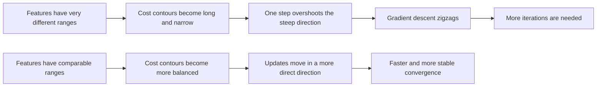
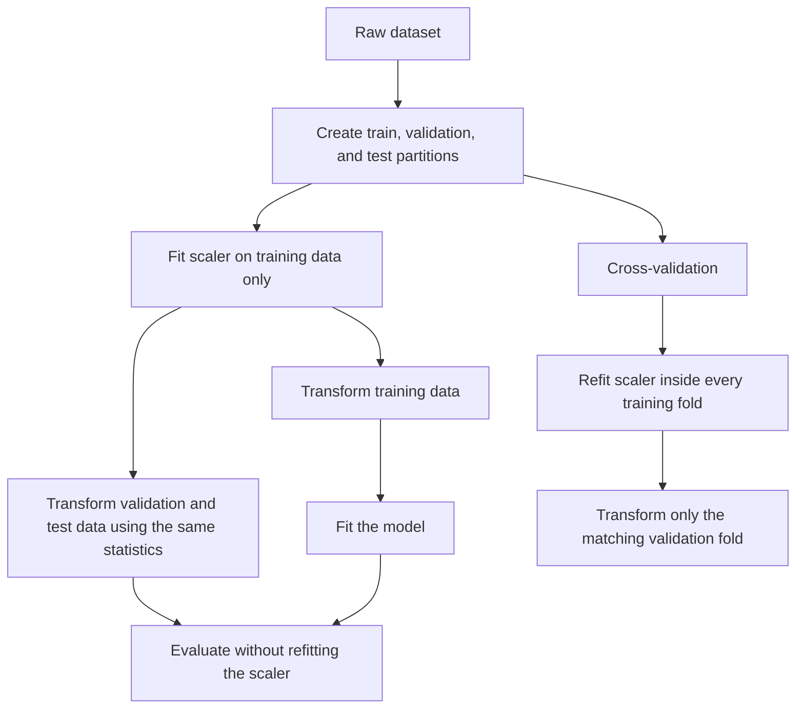

# Feature Scaling

> Distilled notes from the source transcript. Repeated transcript fragments and player-interface text were removed.

## Core idea

Feature scaling changes the numerical range of input features without changing the information they represent. Its main purpose is to make features comparable so that one large-valued feature does not dominate an optimisation objective or a distance calculation.

For a multiple linear regression model:

```text
f(x) = w1*x1 + w2*x2 + b
```

- A feature with large numeric values usually needs a smaller coefficient.
- A feature with small numeric values may need a larger coefficient.
- This coefficient pattern is not itself a problem; the optimisation geometry is the problem.

House-price example from the transcript:

| Feature | Original range | Example value | Plausible coefficient | Contribution |
|---|---:|---:|---:|---:|
| House size `x1` | 300–2000 ft² | 2000 | `w1 = 0.1` | 200 |
| Bedrooms `x2` | 0–5 | 5 | `w2 = 50` | 250 |
| Bias | — | — | `b = 50` | 50 |

The prediction is `200 + 250 + 50 = 500`, interpreted as \$500,000 in the example.

## Why scaling speeds up gradient descent



Without scaling, a small change in the coefficient attached to a large-valued feature can change the prediction and cost dramatically. Gradient descent therefore moves through a narrow valley and may bounce from side to side. Scaling makes the optimisation surface better conditioned, so a single learning rate works more evenly across parameters.

Scaling does not change the location of the best prediction function when the transformation is handled consistently. It changes the coordinate system used to find that function.

## Three methods from the transcript

| Method | Formula for one feature | Result | Transcript example |
|---|---|---|---|
| Divide by maximum | `x_scaled = x / max(x)` | Usually puts a positive feature near `[0, 1]`; not centred | `x1: 300–2000 -> 0.15–1`; `x2: 0–5 -> 0–1` |
| Mean normalisation | `x_scaled = (x - μ) / (max - min)` | Centres values near zero and scales by the observed range | `x1 -> about -0.18–0.82`; `x2 -> about -0.46–0.54` |
| Z-score standardisation | `z = (x - μ) / σ` | Training feature has mean near `0` and standard deviation near `1` | `x1 -> about -0.67–3.1`; `x2 -> about -1.6–1.9` |

`μ` is the training-set mean and `σ` is the training-set standard deviation. Values do not need to stay strictly inside `[-1, 1]`; comparable scales are the goal.

## Choosing a scaler

| Situation | Typical choice | scikit-learn keyword |
|---|---|---|
| General numeric features; gradient-based or regularised models | Z-score standardisation | `StandardScaler` |
| A fixed output range such as `[0, 1]` is useful | Min–max scaling | `MinMaxScaler` |
| Strong outliers make mean and standard deviation unstable | Median and interquartile-range scaling | `RobustScaler` |
| Sparse matrices where centring would destroy sparsity | Scale without centring | `StandardScaler(with_mean=False)` or `MaxAbsScaler` |

Important distinction: `Normalizer` scales each row/sample to unit norm. It is not the same operation as feature-wise scaling with `StandardScaler`.

## Leakage-safe workflow

Scaling statistics are model parameters learned from data. Therefore, split the data before fitting the scaler.



Never calculate `μ`, `σ`, minimum, or maximum from the complete dataset before splitting. Doing so lets validation/test information influence training and causes data leakage.

## Safe scikit-learn example

```python
from sklearn.linear_model import SGDRegressor
from sklearn.model_selection import train_test_split
from sklearn.pipeline import make_pipeline
from sklearn.preprocessing import StandardScaler

X_train, X_test, y_train, y_test = train_test_split(
    X, y, test_size=0.2, random_state=42
)

model = make_pipeline(
    StandardScaler(),
    SGDRegressor(random_state=42)
)

# Pipeline fits the scaler only on X_train, then fits the estimator.
model.fit(X_train, y_train)

# The stored training statistics are reused; the test set is not refitted.
test_score = model.score(X_test, y_test)
```

During cross-validation or hyperparameter tuning, pass the complete `Pipeline` to the CV/search function. The scaler will then be fitted independently inside each training fold.

## When scaling matters

Scaling is usually important for:

- gradient-descent estimators such as `SGDRegressor` and `SGDClassifier`;
- regularised linear and logistic models, because penalties act on coefficient sizes;
- distance-based methods such as K-nearest neighbours and K-means;
- support-vector machines, especially kernels based on distances;
- PCA and other variance/distance-sensitive transformations;
- neural networks.

Scaling is usually unnecessary for:

- decision trees;
- random forests and extremely randomised trees;
- most tree-based gradient-boosting models.

Tree models split on feature thresholds and are therefore almost invariant to monotonic rescaling.

## Practical decision rules

- Scale when feature ranges differ substantially, such as `0.001` versus `1000`.
- A narrow-looking feature around a large offset, such as temperature `98.6–105`, can still benefit from centring.
- Inspect outliers before selecting the scaler; `StandardScaler` is sensitive to them.
- Use exactly the same fitted transformation during training, validation, testing, and production inference.
- Do not scale the target `y` unless it is a deliberate modelling choice and predictions are converted back to the original units.
- Scaling may make optimisation faster, but it does not repair bad data, leakage, incorrect features, or an unsuitable model.

## Where this belongs in the ML lifecycle

**Primary phase: Phase 05 — Preprocessing and Feature Engineering.** Feature scaling is a learned preprocessing transformation.

It connects to nearby phases as follows:

1. **Phase 03 — Data Understanding and Validation:** inspect ranges, units, distributions, sparsity, and outliers.
2. **Phase 04 — Data Splitting:** create the data partitions before learning scaling statistics.
3. **Phase 05 — Preprocessing and Feature Engineering:** choose the scaler and place it in a reproducible pipeline.
4. **Phase 07 — Model Training:** fit the scaler and estimator together on training data.
5. **Phase 08 — Validation and Hyperparameter Tuning:** refit the complete pipeline inside every cross-validation fold.
6. **Phases 12–13 — Packaging and Deployment:** save and serve the scaler with the model so inference uses the same transformation.

Feature scaling is therefore not a separate lifecycle phase. It is mainly a Phase 05 task whose fitted state must travel with the model through training, evaluation, packaging, and deployment.

## Common mistakes

- Scaling before the train/test split.
- Calling `fit_transform` separately on validation or test data.
- Using different scalers during training and inference.
- Scaling all columns blindly, including categorical identifiers.
- Assuming every scaled value must lie inside `[-1, 1]`.
- Believing scaling changes the underlying relationship between features and target.
- Expecting scaling to improve tree models in the same way it improves distance- or gradient-based models.

## Official references

- [scikit-learn: StandardScaler](https://scikit-learn.org/stable/modules/generated/sklearn.preprocessing.StandardScaler.html)
- [scikit-learn: preprocessing API](https://scikit-learn.org/stable/api/sklearn.preprocessing.html)
- [scikit-learn: importance of feature scaling](https://scikit-learn.org/stable/auto_examples/preprocessing/plot_scaling_importance.html)
- [scikit-learn: common pitfalls and data leakage](https://scikit-learn.org/stable/common_pitfalls.html)
- [scikit-learn: Pipeline and composite estimators](https://scikit-learn.org/stable/modules/compose.html)

