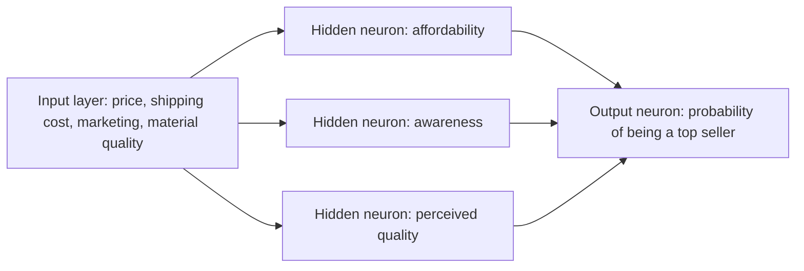

# Demand Prediction with a Neural Network

## A single-neuron model

Suppose a retailer wants to predict whether a T-shirt will become a top seller. This prediction can guide inventory and marketing decisions, such as purchasing more stock in advance for a likely top seller.

Start with one input feature:

- $x$: the price of the T-shirt

A logistic regression unit fits a sigmoid function and produces

$$
a=\frac{1}{1+e^{-(wx+b)}}.
$$

The output is denoted by $a$, rather than $f(x)$, because $a$ stands for **activation**. Here, $a$ is the predicted probability that the T-shirt will be a top seller.

A logistic regression unit can be viewed as a highly simplified artificial neuron: a small computational unit that receives one or more numbers, performs a computation, and produces a number.

## A network for a more complex prediction

Now use four input features:

$$
\mathbf{x}=
\begin{bmatrix}
\text{price}\\
\text{shipping cost}\\
\text{marketing}\\
\text{material quality}
\end{bmatrix}.
$$

Several factors may influence whether the product becomes a top seller:

| Intermediate factor | Most relevant original features | Interpretation |
|---|---|---|
| Affordability | Price and shipping cost | The buyer's total cost depends largely on these two values. |
| Awareness | Marketing | Marketing affects how many potential buyers know about the product. |
| Perceived quality | Price and material quality | Buyers may use both the material and the price as signals of quality. |

One neuron can estimate each intermediate factor. Their three outputs then become inputs to another logistic regression unit, which produces the probability that the T-shirt is a top seller.

## Layers and activations

A **layer** is a group of neurons that receives the same or similar inputs and produces a collection of outputs.

- The list of original features is the **input layer**.
- The three intermediate neurons form a **hidden layer**.
- The final neuron forms the **output layer**.

The outputs of neurons are called **activations**. Thus, the estimates of affordability, awareness, and perceived quality are the hidden layer's activation values, while the final predicted probability is the output neuron's activation.

The computation proceeds layer by layer:

1. The input layer supplies four numbers.
2. The hidden layer maps those four numbers to three activation values.
3. The output layer maps the three activations to one final prediction.

## Fully connected layers

The illustrative interpretation above assigns selected inputs to particular neurons—for example, price and shipping cost to affordability. Manually deciding these connections would be impractical in a large network.

In a practical neural network, each neuron in a layer receives every value from the previous layer. A neuron can learn, through its parameters, to ignore inputs that are not useful and focus on the relevant ones. Therefore, the hidden layer receives the full vector $\mathbf{x}$, and its output is another vector of activations.

In general, each layer:

$$
\text{inputs a vector} \longrightarrow \text{outputs another vector}.
$$

## Why the middle layer is “hidden”

A labeled training set provides the observed inputs $\mathbf{x}$ and correct outputs $y$. It does not provide target values for the intermediate activations, such as affordability, awareness, or perceived quality. Because these internal values are not observed in the training data, the layer that computes them is called a **hidden layer**.

The descriptive names above are only an intuition. During training, no one has to tell the network explicitly to compute these particular factors. The network learns for itself which hidden features are useful.

## Neural networks as learned feature engineering

If only the output part of the example is considered, it is logistic regression using affordability, awareness, and perceived quality to predict a top seller. These intermediate values may be more predictive than the original features.

Previously, a useful feature might have been created manually—for example, multiplying a lot's frontage $x_1$ by its depth $x_2$ to construct a lawn-size feature:

$$
x_1x_2.
$$

That is manual feature engineering. A neural network instead learns its own useful internal features from data, making the final prediction problem easier.

## Deeper networks and architecture

A network can contain multiple hidden layers. For example:

- the input vector $\mathbf{x}$ enters a first hidden layer with three neurons, producing three activations;
- those activations enter a second hidden layer with two neurons, producing two activations;
- those two values enter the output layer, which produces the final prediction.

Networks may contain still more hidden layers. A neural network with multiple layers may also be called a **multilayer perceptron**.

The network's **architecture** is determined by choices such as:

- the number of hidden layers;
- the number of neurons in each hidden layer.

These choices can affect learning performance. Regardless of architecture, the central pattern remains the same: each layer takes a vector as input and produces a new vector of activations, ending with the output layer's prediction.
