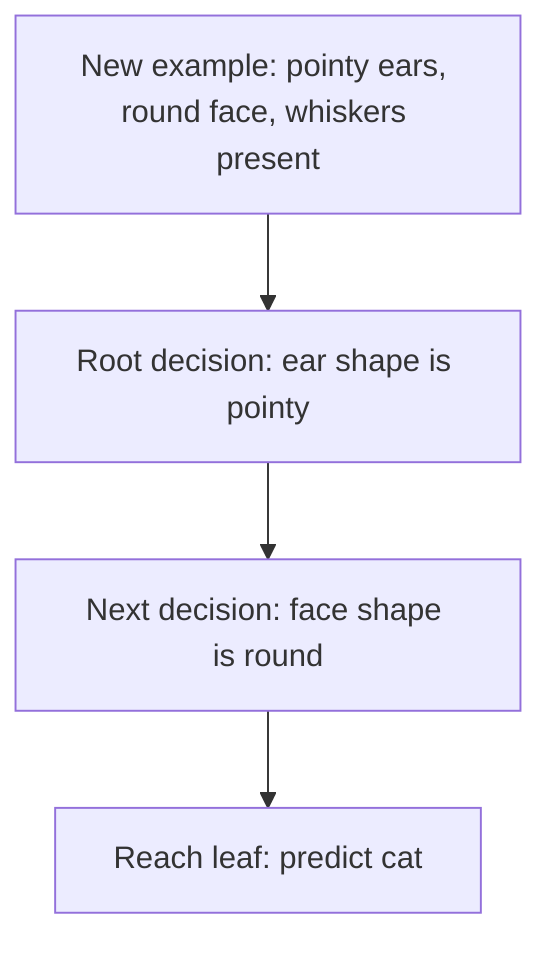

# Decision Tree Model

Decision trees and tree ensembles are powerful, widely used learning algorithms. They are used in many applications and have also been successful in machine-learning competitions. This week develops the ideas needed to make them work in practice.

## Running example: cat classification

Suppose a cat-adoption center wants to classify an animal as a cat or not a cat from three input features:

| Feature | Possible values |
|---|---|
| Ear shape, $x_1$ | pointy or floppy |
| Face shape, $x_2$ | round or not round |
| Whiskers, $x_3$ | present or absent |

The training set contains 10 examples: five cats and five dogs. The three feature columns form the input $X$, and the final column—whether the animal is a cat—is the target $Y$.

These inputs are **categorical features** because each takes one of a small number of discrete values. In this example, every feature has only two possible values. The target also has two possible values, $0$ or $1$, so this is a **binary classification** task. Features with more than two categories and continuous-valued features are considered later.

## Structure of a decision tree

A trained decision-tree model is represented as a tree made of nodes and branches:

- **Root node:** the topmost node, where prediction begins.
- **Decision node:** examines one feature and directs the example along one branch or another according to that feature's value.
- **Leaf node:** makes the final prediction, such as “cat” or “not cat.”

The root is drawn at the top, while the leaves are drawn at the bottom.

## How inference works

For a new animal with pointy ears, a round face, and whiskers present, one possible tree makes a prediction as follows:

The example starts at the root. Because its ears are pointy, it follows the left branch to the face-shape decision node. Because its face is round, it follows the corresponding branch to a leaf that predicts **cat**.

## Many trees can fit the same task

The same training set can produce many possible decision trees. For example:

- one tree may test ear shape and then face shape;
- another may test ear shape and then whiskers;
- other trees may use different features at the root or arrange the decisions differently.

Some candidate trees will perform better than others on the training set, and some will generalize better to the cross-validation and test sets. The job of the decision-tree learning algorithm is therefore to choose, from the possible trees, one that fits the training data and ideally generalizes well to new examples.

## Key idea

A decision tree predicts by repeatedly testing feature values from the root through decision nodes until it reaches a leaf. Learning the model means deciding which features to test and how to arrange those tests into a tree that performs well.
