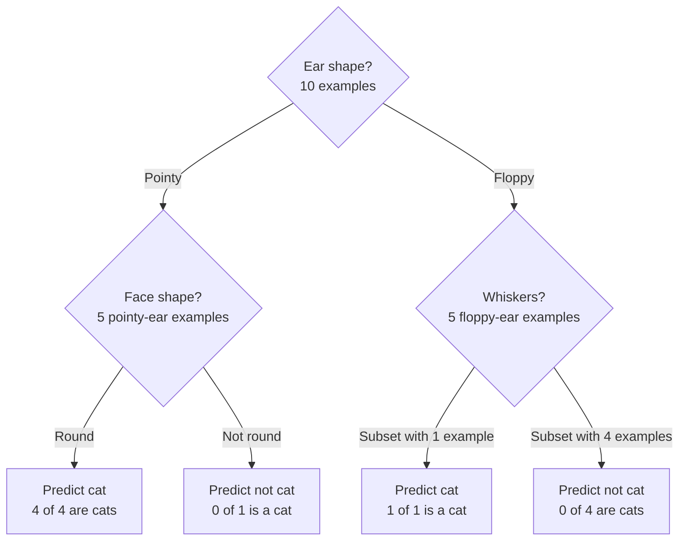
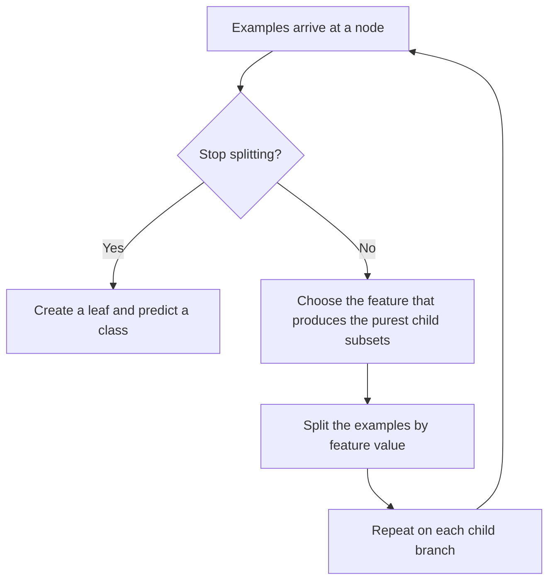

# The Decision-Tree Learning Process

Building a decision tree from a training set is a recursive process: choose a feature, split the examples by that feature, and then repeat the procedure on each resulting branch.

## Worked example

The running training set contains 10 animals described by ear shape, face shape, and whiskers, together with the label “cat” or “not cat.”

### 1. Choose the root feature

Suppose the algorithm selects **ear shape** for the root node. Splitting all 10 examples gives:

- **Pointy ears:** 5 examples.
- **Floppy ears:** 5 examples.

### 2. Grow the left branch

Focus only on the five pointy-ear examples and choose another feature. Suppose the algorithm selects **face shape**:

- **Round face:** 4 examples, all cats. Create a leaf that predicts **cat**.
- **Not-round face:** 1 example, not a cat. Create a leaf that predicts **not cat**.

Both subsets are pure, so no further split is needed.

### 3. Grow the right branch

Now focus only on the five floppy-ear examples, containing one cat and four dogs. Suppose the algorithm selects **whiskers**:

- one branch receives 1 example, which is a cat;
- the other branch receives 4 examples, none of which are cats.

These subsets are also pure, so they become leaves predicting **cat** and **not cat**, respectively.

## Key decision 1: which feature should a node split on?

At every non-leaf node, the algorithm must choose among the available features. The aim is to create child subsets whose labels are as **pure** as possible:

- a completely pure subset contains only cats or only non-cats;
- an impure subset contains a mixture of both classes.

A hypothetical “has cat DNA” feature would be ideal in this example: it would put all five cats in one branch and all five non-cats in the other. That feature is not available, so the algorithm must compare the actual candidates.

| Candidate root feature | Left branch | Right branch |
|---|---:|---:|
| Ear shape | $4/5$ cats | $1/5$ cats |
| Face shape | $4/7$ cats | $1/3$ cats |
| Whiskers | $3/4$ cats | $2/6$ cats |

The learning algorithm needs a quantitative way to decide which split gives the purest children. Entropy measures impurity, and the reduction in impurity will later be used to choose the feature.

## Key decision 2: when should splitting stop?

Several stopping criteria are possible.

### The node is pure

Stop when all examples at the node belong to one class. The node can become a leaf that predicts that class.

### The tree has reached a maximum depth

The **depth** of a node is the number of branches, or hops, from the root to that node:

- root node: depth $0$;
- its children: depth $1$;
- their children: depth $2$.

If the maximum permitted depth is $2$, the algorithm does not split nodes in a way that creates nodes at depth $3$. Limiting depth keeps the tree smaller and makes it less prone to overfitting.

### The improvement in purity is too small

If a proposed split produces only a very small purity improvement—or, equivalently, only a very small reduction in impurity—the extra split may not be worthwhile. Stopping keeps the tree smaller and reduces overfitting risk.

### The node contains too few examples

If the number of examples at a node is below a chosen threshold, the algorithm may stop instead of creating still smaller subsets. For example, after a face-shape split, a branch with three examples—one cat and two dogs—could become a leaf that predicts **not cat**, the majority class.

## Why the algorithm has several parts

Decision-tree algorithms accumulated refinements over time: different splitting criteria, maximum-depth rules, minimum-purity improvements, and minimum node sizes. This makes the full procedure appear to have many pieces, but together they form an effective learning algorithm. In practice, open-source packages can handle these implementation choices.

## Process summary

The two central problems in learning a decision tree are therefore:

1. choosing the feature used at each split;
2. deciding when further splitting should stop.
