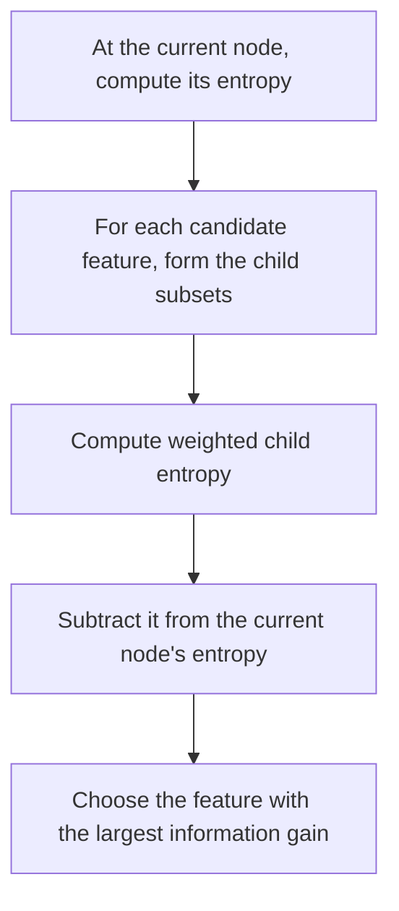

# Choosing a Split with Information Gain

At each decision-tree node, choose the feature that reduces entropy the most. This reduction in entropy is called **information gain**.

## Why child entropy must be weighted

A binary split produces a left child and a right child, each with its own entropy. Their importance depends on how many training examples reach each branch: high entropy in a large child is more significant than the same entropy in a very small child.

Define:

- $p_1^{\text{root}}$: fraction of positive examples at the current node;
- $p_1^{\text{left}}$: fraction of positive examples in the left child;
- $p_1^{\text{right}}$: fraction of positive examples in the right child;
- $w^{\text{left}}$: fraction of the current node's examples sent left;
- $w^{\text{right}}$: fraction sent right.

The weighted entropy after the split is

$$
w^{\text{left}}H\!\left(p_1^{\text{left}}\right)
+w^{\text{right}}H\!\left(p_1^{\text{right}}\right).
$$

## Information-gain formula

Information gain subtracts the weighted child entropy from the entropy before splitting:

$$
\operatorname{IG}
=H\!\left(p_1^{\text{root}}\right)
-\left[
w^{\text{left}}H\!\left(p_1^{\text{left}}\right)
+w^{\text{right}}H\!\left(p_1^{\text{right}}\right)
\right].
$$

The best feature is the one with the **largest information gain**.

## Cat-classification example

At the root there are five cats and five non-cats, so

$$
p_1^{\text{root}}=\frac{5}{10}=0.5,
\qquad
H\!\left(p_1^{\text{root}}\right)=1.
$$

Three candidate features are available.

### Split on ear shape

- Left: $5/10$ of the examples, of which $4/5$ are cats.
- Right: $5/10$ of the examples, of which $1/5$ are cats.

$$
\operatorname{IG}_{\text{ears}}
=H(0.5)-\left[\frac{5}{10}H(0.8)+\frac{5}{10}H(0.2)\right]
\approx 0.28.
$$

Both child entropies are approximately $0.72$.

### Split on face shape

- Left: $7/10$ of the examples, of which $4/7$ are cats.
- Right: $3/10$ of the examples, of which $1/3$ are cats.

$$
\operatorname{IG}_{\text{face}}
=H(0.5)-\left[\frac{7}{10}H\!\left(\frac47\right)+\frac{3}{10}H\!\left(\frac13\right)\right]
\approx 0.03.
$$

The child entropies are approximately $0.99$ and $0.92$.

### Split on whiskers

- Left: $4/10$ of the examples, of which $3/4$ are cats.
- Right: $6/10$ of the examples, of which $2/6$ are cats.

$$
\operatorname{IG}_{\text{whiskers}}
=H(0.5)-\left[\frac{4}{10}H\!\left(\frac34\right)+\frac{6}{10}H\!\left(\frac26\right)\right]
\approx 0.12.
$$

## Comparing the candidates

| Feature | Information gain |
|---|---:|
| Ear shape | $0.28$ |
| Face shape | $0.03$ |
| Whiskers | $0.12$ |

Splitting on **ear shape** produces the largest entropy reduction, so the algorithm selects it at the root.

## Why use the reduction rather than only child entropy?

For a single node, maximizing information gain gives the same feature choice as minimizing weighted child entropy because the parent entropy is fixed. Expressing the score as a reduction is useful for stopping: if every possible split has information gain below a chosen threshold, the tree can avoid an unnecessary split that increases its size and overfitting risk.

## Split-selection procedure

Information gain therefore provides both a feature-selection score and a way to judge whether a proposed split improves purity enough to be worthwhile.
