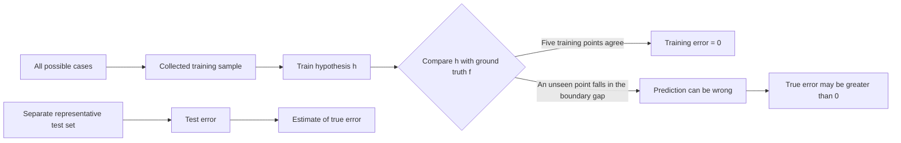

# Course objectives -slide 6
Lecture: theory of ML
Tutorial: apply theory
## Important: How to analyze:What the algorithms are doingData sets & outputs from the applications
why do you choose that models? anlyze output and fitness
# Asm - slide 8
A2-A3 group

# Foundations of ML
some companies use ML/AI, but maybe not when we look carefully into their code

## Parameters fine tuning slide 16
- An important stage in machine learning is parameter fine-tuning, which occurs during training.
- During training, the algorithm adjusts the model's parameter values based on the input data.
- The model learns by finding parameter values that improve its predictions or decisions.
- Unlike traditional rule-based programs, developers do not manually define every fixed rule, such as "if the value is greater than 500."
- Instead, developers provide a learning algorithm, initial settings, and training data; the program learns suitable parameter values automatically.
- In short, machine learning learns patterns and model parameters from data rather than relying only on manually written rules.

## What is Machine Learning? slide 17
- Based on T, E, P we have different types of ML

## Slide 18
- Task: f unknown target function
- It's really difficult to find the f function, so we use h (hypothesis) function to estimate f

## Classes and model outputs Slide 28

- A **class** is a category that a classification model can predict.
- An **output** is the prediction produced by the model, such as a class label or a set of probabilities.
- **Binary classification** has two possible classes, such as spam and not spam. The model often outputs one probability and uses a threshold to choose the class.
- **Multiclass classification** has more than two possible classes, but each example belongs to only one class. The model usually outputs one probability for each class and selects the class with the highest probability.
- **Multiple-output or multilabel classification** allows several classes to be predicted at the same time. For example, an image may contain both a person and a car.

### Easy examples

- **Binary classification:** Decide whether a fruit image is an apple or not an apple. The two classes are `apple` and `not apple`. An output of `0.90` can mean a 90% probability of apple, so the predicted class is `apple`.
- **Multiclass classification:** Decide whether a fruit image shows an apple, banana, or orange. There are three classes, but the model chooses only one. For example, the output probabilities `[0.10, 0.80, 0.10]` produce the class `banana`.
- **Multilabel classification:** Identify everything present in an image. The available labels may be `person`, `car`, and `tree`, and more than one can be correct. The output `[1, 1, 0]` means `person` and `car` are present, but `tree` is not.

**Remember:** classes or labels are the possible answers; the output is the value produced by the model to represent its prediction.

## True error and generalization

- The **ground-truth function** $f$ represents the correct classification rule.
- The machine-learning model learns a **hypothesis** $h$ that approximates $f$.
- In the example, the training dataset contains five points: three negative and two positive.
- Both $f$ and $h$ classify all five training points correctly, so the **training error is zero**.
- However, $f$ and $h$ have different decision boundaries. They can disagree on unseen points that fall in the gap between the two boundaries.
- Therefore, **zero training error does not guarantee zero true error**.

### Visual explanation

```text
Known training points              Gap with no training points

  -    -    -          | f |       ?       | h |          +    +
                       ^                     ^
                 true boundary        learned boundary

On the five known points: f(x) = h(x)  -> training error = 0
For a new point in the gap: f(x) != h(x) -> prediction error
```



### Types of error

- **Training error** $E_{in}$: the error measured on the examples used to train the model.

  $$E_{in}(h)=\frac{1}{N}\sum_{n=1}^{N}\mathbb{1}\left[h(x_n)\ne y_n\right]$$

- **True error** $E_{out}$, also called **generalization error**: the probability that $h$ disagrees with $f$ on a new example drawn from the real data distribution.

  $$E_{out}(h)=P_{x\sim D}\left[h(x)\ne f(x)\right]$$

- **Test error**: the error measured on a separate test set. It is used as an estimate of the true error because we normally cannot evaluate every possible case.

### Why split the dataset?

- Use the **training set** to learn $h$.
- Use a separate **test set** to evaluate $h$ on unseen data.
- A low test error suggests that the true error is low only when the test set is sufficiently large, representative of real data, and not used during training.
- Collecting more data helps when the additional examples are diverse and representative; simply collecting many similar examples may not cover the missing cases.

**Main idea:** A model may memorize or perfectly fit its training examples but still fail on new data. A good model must **generalize** beyond its training set.
