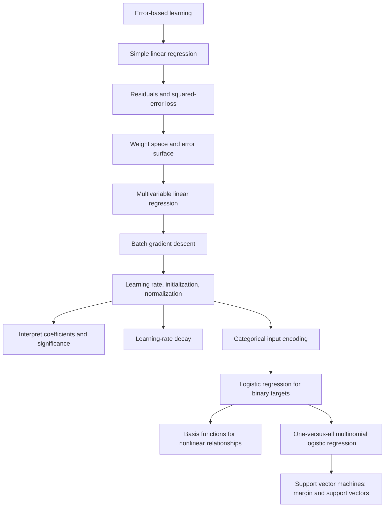
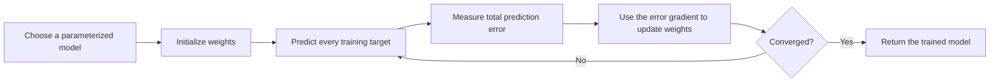
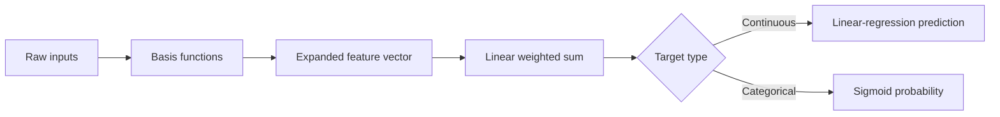
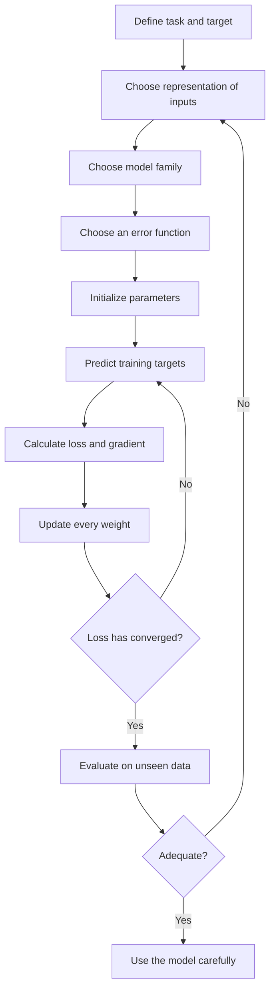

# Chapter 7 - Error-based Learning

> Complete study notes for `mlpda_Chp7.pdf` (60 PDF pages), contextualized with the other materials in `W2_Regression`.
>
> Language convention: explanations are in Vietnamese, while important technical terms are kept in English so they match the lecture slides and exam terminology.

## How to use these notes

This document is designed so that you can learn the full conceptual content of the supplied PDF without repeatedly reopening it. It covers every section present in the file, all major equations, algorithms, worked examples, figures, modelling choices, and caveats. Large raw-data tables are described rather than copied row-for-row when their individual rows add no new concept.

Important boundary: the supplied PDF ends on page 60 during Section 7.4.7, immediately after introducing support vector machines, margins, support vectors, and the separating hyperplane. Therefore, these notes also stop there; later SVM material from the original book is not present in this PDF.

## 1. Context from the whole `W2_Regression` folder

The folder contains several materials that serve different purposes:

| File | Role in Week 2 | Connection to this chapter |
|---|---|---|
| `Regression_Slides.pdf` | Core RMIT lecture: regression, hypothesis, loss, gradient descent, feature scaling and outliers | Closely matches Sections 7.2-7.3 and part of 7.4 |
| `w2_lecture_notes.md` | Clarifications beyond the slides | Adds train/test separation, extrapolation, multicollinearity, robust-loss intuition and gradient-sign interpretation |
| `house_predicting.ipynb` | Lab preparation and exploratory data analysis on Boston Housing | Loads data, calculates descriptive statistics, histograms, box plots and correlations before later regression modelling |
| `housing-2.data.csv` | Boston Housing dataset, 506 rows and 14 columns | Provides a realistic multivariable continuous-target dataset |
| `bikeShareDay-1.csv` | Bike-sharing dataset used for the follow-up EDA exercise | Demonstrates continuous and categorical predictors, normalized weather features and a count target |
| `bikeShareDay_code_book.docx` | Definitions of the bike-sharing columns | Explains features such as season, weather, temperature, humidity, wind speed and rental counts |
| `mlpda_Chp7.pdf` | Broader textbook treatment of error-based learning | Extends beyond Week 2 regression into logistic regression, nonlinear basis functions, multinomial classification and SVM |

### 1.1 Terminology alignment

The book uses **multivariable linear regression** for many input features and one target. The RMIT materials sometimes use **multivariate regression** for the same setup. In these notes:

- univariate/simple regression = one input feature, one continuous target;
- multivariable regression = multiple input features, one continuous target;
- multiple-output regression = more than one target, which is a different setup.

### 1.2 Loss-function alignment

The chapter defines the squared-error objective as

$$
L_2(M_{\mathbf w},D)=\frac12\sum_{i=1}^{n}\left(t_i-M_{\mathbf w}(\mathbf d_i)\right)^2.
$$

The RMIT lecture notes use mean squared error:

$$
J(\theta)=\frac1n\sum_{i=1}^{n}\left(h_\theta(\mathbf x^{(i)})-y^{(i)}\right)^2.
$$

The factors $1/2$ and $1/n$ rescale the objective but do not change the weights that minimize it. The factor $1/2$ is especially convenient because it cancels the $2$ produced when differentiating a squared term.

---

## 2. Complete chapter map



The unifying idea is:



---

## 3. Section 7.1 - Big Idea

### 3.1 Error as feedback

The chapter begins with the idea that learning often proceeds through repeated failure and correction. Its surfing analogy works as follows:

- A novice surfer must find the right position on the board to catch a wave.
- Too far back creates drag and the wave passes underneath.
- Too far forward tips the nose into the water.
- The desired position is the **sweet spot** between the two extremes.
- Each failed attempt provides feedback about the direction and magnitude of the next correction.

Error-based machine learning applies the same principle:

1. Select a parameterized model.
2. Give its parameters initial, often random, values.
3. Use the model to predict known training targets.
4. Measure how wrong the predictions are using an error function.
5. Adjust the parameters to reduce error.
6. Repeat until further adjustments provide little or no improvement.

A **parameterized model** is a model completely determined by a finite set of numbers called parameters or weights. Learning means searching the parameter space for values that minimize the selected error function.

---

## 4. Section 7.2 - Fundamentals

The chapter assumes familiarity with continuous functions, derivatives, partial derivatives and the chain rule. These are needed because the learning algorithm uses the slope of an error function to decide how each weight should move.

### 4.1 Section 7.2.1 - Simple Linear Regression

#### Office-rental dataset

The main example predicts monthly office rent in Dublin city centre.

| ID | Size (ft²) | Floor | Broadband rate | Energy rating | Rental price (€) |
|---:|---:|---:|---:|:---:|---:|
| 1 | 500 | 4 | 8 | C | 320 |
| 2 | 550 | 7 | 50 | A | 380 |
| 3 | 620 | 9 | 7 | A | 400 |
| 4 | 630 | 5 | 24 | B | 390 |
| 5 | 665 | 8 | 100 | C | 385 |
| 6 | 700 | 4 | 8 | B | 410 |
| 7 | 770 | 10 | 7 | B | 480 |
| 8 | 880 | 12 | 50 | A | 600 |
| 9 | 920 | 14 | 8 | C | 570 |
| 10 | 1000 | 9 | 24 | B | 620 |

The first simplified problem uses only `SIZE` to predict `RENTAL PRICE`. The scatter plot shows a strong, approximately linear positive relationship.

#### Equation of a line

Equation 7.1:

$$
y=mx+b,
$$

where $m$ is the slope and $b$ is the y-intercept.

The example best-fit line is Equation 7.2:

$$
\text{Rental Price}=6.47+0.62\times\text{Size}.
$$

Interpretation:

- The intercept is €6.47, the model's prediction when size is zero. It is mathematically required to position the line, even if a zero-size office is not meaningful.
- Each additional square foot increases predicted monthly rent by €0.62.
- The model can fill gaps between observed sizes and can extrapolate beyond them, although extrapolation may be unreliable.

For a 730 ft² office:

$$
6.47+0.62(730)=459.07,
$$

so the predicted monthly rent is about €460.

#### Book notation

Equation 7.3 rewrites the model as:

$$
M_{\mathbf w}(\mathbf d)=w[0]+w[1]d[1].
$$

- $\mathbf d$ is an input instance.
- $d[1]$ is its size feature.
- $\mathbf w=\langle w[0],w[1]\rangle$ is the weight vector.
- $M_{\mathbf w}(\mathbf d)$ is the model prediction.
- Fitting the model means finding weights that capture the relationship in the training data.

### 4.2 Section 7.2.2 - Measuring Error

Visual inspection suggests that slope $0.62$ is better than slopes $0.4$, $0.5$, $0.7$ or $0.8$, but training requires a numerical measure.

For instance $i$, the chapter defines the residual as:

$$
e_i=t_i-M_{\mathbf w}(\mathbf d_i),
$$

where $t_i$ is the true target.

Some residuals are positive and others negative. Directly summing them would allow over-predictions and under-predictions to cancel, so the residuals are squared.

Equation 7.4 defines the chapter's $L_2$ or half-sum-of-squared-errors objective:

$$
L_2(M_{\mathbf w},D)=\frac12\sum_{i=1}^{n}\left(t_i-M_{\mathbf w}(\mathbf d_i)\right)^2.
$$

For simple linear regression, Equation 7.5 is:

$$
L_2(M_{\mathbf w},D)=\frac12\sum_{i=1}^{n}\left(t_i-\left(w[0]+w[1]d_i[1]\right)\right)^2.
$$

#### Full error calculation for the candidate $w[0]=6.47$, $w[1]=0.62$

| ID | Size | Actual | Prediction | Residual $t-\hat t$ | Squared residual |
|---:|---:|---:|---:|---:|---:|
| 1 | 500 | 320 | 316.47 | 3.53 | 12.46 |
| 2 | 550 | 380 | 347.47 | 32.53 | 1,058.20 |
| 3 | 620 | 400 | 390.87 | 9.13 | 83.36 |
| 4 | 630 | 390 | 397.07 | -7.07 | 49.98 |
| 5 | 665 | 385 | 418.77 | -33.77 | 1,140.41 |
| 6 | 700 | 410 | 440.47 | -30.47 | 928.42 |
| 7 | 770 | 480 | 483.87 | -3.87 | 14.98 |
| 8 | 880 | 600 | 552.07 | 47.93 | 2,297.28 |
| 9 | 920 | 570 | 576.87 | -6.87 | 47.20 |
| 10 | 1000 | 620 | 626.47 | -6.47 | 41.86 |

The squared residuals sum to 5,674.15, so the chapter's loss is:

$$
L_2=\frac{5674.15}{2}=2837.08.
$$

For the alternative slopes $0.4$, $0.5$, $0.7$ and $0.8$, with the intercept still fixed at $6.47$, the losses are 136,218; 42,712; 20,092; and 90,978 respectively. The much smaller loss at slope $0.62$ confirms the visual judgment.

> Squared loss emphasizes large errors. This is why the RMIT notes warn that outliers can pull the fitted line strongly. An error of 10 contributes 100, whereas an error of 2 contributes only 4.

### 4.3 Section 7.2.3 - Error Surfaces

Every possible pair $(w[0],w[1])$ specifies a model and therefore produces a loss value.

- The horizontal coordinates form the **weight space**.
- The vertical coordinate is the loss.
- Connecting all loss values produces an **error surface**.
- Contour lines are a bird's-eye view: each contour represents equal loss.
- The lowest point is the best-fitting model under the chosen loss.

The chapter plots $w[0]\in[-10,20]$ and $w[1]\in[-2,3]$. Brute-force testing is possible for this toy two-weight case, but becomes infeasible as the number of features and weights grows.

For ordinary linear regression with squared loss, the surface is **convex**, like a bowl, and has a single **global minimum**. The shape follows from the linear model and squared loss rather than from a lucky dataset.

At the bottom of the bowl, the slope with respect to every weight is zero. Equations 7.6 and 7.7 express this as:

$$
\frac{\partial L_2}{\partial w[0]}=0,
\qquad
\frac{\partial L_2}{\partial w[1]}=0.
$$

Finding weights that minimize squared error is **least-squares optimization**. Direct analytic solutions exist for some problems, but the chapter focuses on the guided search method called gradient descent.

---

## 5. Section 7.3 - Multivariable Linear Regression with Gradient Descent

### 5.1 Section 7.3.1 - Multivariable Linear Regression

With $m$ descriptive features, Equation 7.8 is:

$$
M_{\mathbf w}(\mathbf d)
=w[0]+\sum_{j=1}^{m}w[j]d[j].
$$

Introduce a dummy feature $d[0]=1$ to absorb the intercept. Equation 7.9 becomes:

$$
M_{\mathbf w}(\mathbf d)
=\sum_{j=0}^{m}w[j]d[j]
=\mathbf w\cdot\mathbf d.
$$

The dot product is the sum of products of corresponding vector elements.

Equation 7.10 gives the multivariable squared-error objective:

$$
L_2(M_{\mathbf w},D)
=\frac12\sum_{i=1}^{n}\left(t_i-\mathbf w\cdot\mathbf d_i\right)^2.
$$

For the office data, initially excluding categorical `ENERGY RATING`:

$$
\text{Rental Price}
=w[0]+w[1]\text{Size}+w[2]\text{Floor}+w[3]\text{Broadband Rate}.
$$

The fitted model is:

$$
\text{Rental Price}
=-0.1513+0.6270\text{Size}-0.1781\text{Floor}+0.0714\text{Broadband Rate}.
$$

For a 690 ft² office on floor 11 with broadband rate 50:

$$
-0.1513+0.6270(690)-0.1781(11)+0.0714(50)=434.0896.
$$

### 5.2 Section 7.3.2 - Gradient Descent

#### Intuition

Imagine a hiker in a foggy convex valley. The hiker cannot see the whole landscape, but can measure the local slope. Repeatedly stepping in the steepest downward direction eventually reaches the bottom. Gradient descent uses the same local information on an error surface.

Different starting points on a convex squared-error surface follow different paths but end at the same global minimum. During training, the candidate regression line moves closer to the data and the loss decreases.

#### Algorithm 7.1

Required inputs:

- training set $D$;
- learning rate $\alpha$;
- an `errorDelta` function that specifies an update direction;
- a convergence criterion.

Pseudocode:

```text
w <- random starting point in the weight space
repeat
    for each weight w[j]
        w[j] <- w[j] + alpha * errorDelta(D, w[j])
until convergence
```

In a correct implementation, all components of the new weight vector should be calculated from the same old weight vector before replacing it. This is a simultaneous batch update.

#### Deriving the gradient for one instance

For one training pair $(\mathbf d,t)$, Equations 7.11-7.14 apply the chain rule:

$$
\frac{\partial}{\partial w[j]}\frac12(t-M_{\mathbf w}(\mathbf d))^2
=(t-M_{\mathbf w}(\mathbf d))(-d[j]).
$$

Why $-d[j]$? Since

$$
M_{\mathbf w}(\mathbf d)=\mathbf w\cdot\mathbf d,
$$

we have

$$
\frac{\partial}{\partial w[j]}(\mathbf w\cdot\mathbf d)=d[j]
$$

and therefore

$$
\frac{\partial}{\partial w[j]}(t-\mathbf w\cdot\mathbf d)=-d[j].
$$

For all $n$ training instances, Equation 7.15 is:

$$
\frac{\partial L_2}{\partial w[j]}
=-\sum_{i=1}^{n}\left(t_i-M_{\mathbf w}(\mathbf d_i)\right)d_i[j].
$$

The negative gradient points downhill, so Equation 7.16 defines:

$$
\operatorname{errorDelta}(D,w[j])
=-\frac{\partial L_2}{\partial w[j]}
=\sum_{i=1}^{n}\left(t_i-M_{\mathbf w}(\mathbf d_i)\right)d_i[j].
$$

Equation 7.17 is the batch weight update:

$$
w[j]\leftarrow w[j]
+\alpha\sum_{i=1}^{n}\left(t_i-M_{\mathbf w}(\mathbf d_i)\right)d_i[j].
$$

Equivalent familiar notation is:

$$
\mathbf w\leftarrow\mathbf w-\alpha\nabla L_2(\mathbf w).
$$

#### Reading the update direction

- If predictions are generally too high and $d_i[j]>0$, decrease $w[j]$.
- If predictions are generally too low and $d_i[j]>0$, increase $w[j]$.
- A negative feature value reverses those effects.
- The gradient combines direction and magnitude; the learning rate scales the movement.

#### Batch gradient descent and inductive bias

This is **batch gradient descent** because each weight is updated once per iteration using a sum over the full training set.

The algorithm contains:

- a **preference bias** toward models with low squared error;
- a **restriction bias** toward linear combinations of the selected descriptive features;
- a search bias arising from following a path from an initial point through weight space.

### 5.3 Section 7.3.3 - Choosing Learning Rates and Initial Weights

There is no universal theoretically optimal choice. The chapter recommends experience, rules of thumb and trial and error.

For the simple office-size model, Figure 7.7 compares:

| Learning rate | Behaviour |
|---:|---|
| 0.002 | Converges, but needs roughly hundreds of iterations |
| 0.08 | Good balance; reaches the minimum quickly |
| 0.18 | Large zig-zag steps; may cross the minimum repeatedly or fail to converge |

General lesson:

- too small: safe but slow;
- too large: overshooting, oscillation or divergence;
- suitable: rapid and stable descent.

The chapter gives $[0.00001,10]$ as a broad range practitioners might explore, not as a guarantee.

Initial weights also affect convergence speed. Normalized features make sensible initialization ranges easier to choose. The empirical recommendation in the chapter is to sample initial weights uniformly from approximately $[-0.2,0.2]$ for normalized data.

### 5.4 Section 7.3.4 - Worked Linear-Regression Example

Model:

$$
\text{Rental Price}
=w[0]+w[1]\text{Size}+w[2]\text{Floor}+w[3]\text{Broadband Rate}.
$$

Setup:

- learning rate $\alpha=0.00000002$;
- initial weights $w[0]=-0.146$, $w[1]=0.185$, $w[2]=-0.044$, $w[3]=0.119$.

For iteration 1:

- first-instance prediction: 93.26;
- first residual: $320-93.26=226.74$;
- first contribution to the size-weight delta: $226.74\times500=113{,}370.05$;
- full-data deltas: approximately 3,185.61; 2,412,073.90; 27,888.65; and 88,727.43;
- half-SSE: 533,785.80;
- updated weights: about $[-0.146,0.233,-0.043,0.121]$.

At iteration 2, the half-SSE falls to 443,361.52 and weights become approximately $[-0.145,0.277,-0.043,0.123]$.

After 100 iterations, the model converges to:

$$
[-0.1513,\ 0.6270,\ -0.1781,\ 0.0714]
$$

with loss about 2,913.5.

Why is the learning rate extremely small? Raw sizes and targets are in the hundreds, so residuals, squared residuals and delta terms can become enormous. Normalization puts features on comparable scales, makes optimization less sensitive and permits a larger practical learning rate.

---

## 6. Section 7.4 - Extensions and Variations

### 6.1 Section 7.4.1 - Interpreting Multivariable Linear Regression

#### Coefficient signs and units

Holding all other features constant:

- positive weight: prediction increases as the feature increases;
- negative weight: prediction decreases as the feature increases;
- magnitude: change in predicted target per one-unit feature change.

For the office model:

- one extra ft² predicts +€0.6270/month;
- one floor higher predicts -€0.1781/month;
- one extra broadband unit predicts +€0.0714/month.

Do not compare raw coefficient magnitudes as feature importance when feature scales differ. `SIZE` ranges roughly 500-1000, whereas `FLOOR` ranges 4-14.

#### Statistical significance test

The chapter tests the null hypothesis that a feature has no significant linear impact.

1. Compute a test statistic.
2. Calculate its p-value under the null hypothesis.
3. Compare the p-value with a threshold such as 0.05 or 0.01.
4. Reject the null when the p-value is no greater than the threshold.

Equation 7.18 gives the overall standard error for the simple test used in the chapter:

$$
se=\sqrt{\frac{\sum_{i=1}^{n}\left(t_i-M_{\mathbf w}(\mathbf d_i)\right)^2}{n-2}}.
$$

Equation 7.19 gives the standard error of feature $d[j]$:

$$
se(d[j])=
\frac{se}{\sqrt{\sum_{i=1}^{n}\left(d_i[j]-\overline{d[j]}\right)^2}}.
$$

Equation 7.20 gives the t-statistic:

$$
t=\frac{w[j]}{se(d[j])}.
$$

The chapter uses a two-tailed t-test with $n-2$ degrees of freedom.

| Feature | Weight | Standard error | t-statistic | p-value | Conclusion at 0.05 |
|---|---:|---:|---:|---:|---|
| Size | 0.6270 | 0.0545 | 11.504 | < 0.0001 | Significant |
| Floor | -0.178 | 12.7042 | -0.066 | 0.949 | Not significant |
| Broadband rate | 0.071396 | 0.2969 | 0.240 | 0.816 | Not significant |

Only size shows a statistically significant linear relationship with rental price in this small dataset.

> Caution for modern statistical practice: coefficient standard errors in a general multiple-regression model are normally calculated from the full design matrix and assumptions about residuals. The equations above reproduce the simplified treatment in this chapter.

### 6.2 Section 7.4.2 - Learning-Rate Decay

The section title calls this “weight decay,” but the actual mechanism is **learning-rate decay**, not L2 regularization of weights.

Equation 7.21:

$$
\alpha_\tau=\alpha_0\frac{c}{c+\tau},
$$

where:

- $\alpha_0$ is the initial learning rate;
- $c$ controls how rapidly it decays;
- $\tau$ is the current iteration.

This produces large early steps and smaller late steps.

- With $\alpha_0=0.18$, $c=10$, the office example converges faster than fixed-rate alternatives and shows less back-and-forth movement.
- With $\alpha_0=0.25$, $c=100$, the early loss initially increases because steps are too large, but the decay eventually reduces the rate and the path turns downward to the minimum.

Decay generally improves behaviour over a large fixed learning rate, but $\alpha_0$ and $c$ remain problem-dependent hyperparameters.

### 6.3 Section 7.4.3 - Categorical Descriptive Features

It is not meaningful to multiply a numeric weight directly by category labels such as A, B and C. Convert each level into a binary indicator.

For energy rating:

| Original | Rating A | Rating B | Rating C |
|:---:|---:|---:|---:|
| A | 1 | 0 | 0 |
| B | 0 | 1 | 0 |
| C | 0 | 0 | 1 |

Then the model becomes:

$$
\begin{aligned}
\text{Rental Price}={}&w[0]+w[1]\text{Size}+w[2]\text{Floor}
+w[3]\text{Broadband}\\
&+w[4]I(A)+w[5]I(B)+w[6]I(C).
\end{aligned}
$$

This adds weights and expands the search space. A more compact encoding drops one indicator and treats it as the reference category. For example, retain A and B; when both are zero, infer C. This is also the standard way to avoid perfect redundancy with an intercept.

### 6.4 Section 7.4.4 - Logistic Regression for Categorical Targets

#### 6.4.1 From a linear boundary to a classifier

The generator dataset contains 56 observations with:

- RPM;
- vibration;
- status: `good` or `faulty`.

The data are initially linearly separable. A separating line is Equation 7.22:

$$
\text{Vibration}=830-0.667\text{RPM},
$$

or Equation 7.23:

$$
830-0.667\text{RPM}-\text{Vibration}=0.
$$

Above the boundary, the expression is negative; below it, positive. Examples:

- RPM 810 and vibration 495: $830-0.667(810)-495=-205.27$;
- RPM 650 and vibration 240: $830-0.667(650)-240=156.45$.

A hard-threshold model, Equation 7.24, is:

$$
M_{\mathbf w}(\mathbf d)=
\begin{cases}
1,&\mathbf w\cdot\mathbf d\ge0,\\
0,&\text{otherwise}.
\end{cases}
$$

The book codes faulty as 1 and good as 0 for this discussion.

Problems with a hard threshold:

- it is discontinuous and therefore not differentiable at the boundary;
- it outputs only absolute 0/1 confidence;
- it cannot express uncertainty for points near the boundary.

#### 6.4.2 Logistic function and model

Equation 7.25 defines the logistic or sigmoid function:

$$
\operatorname{logistic}(x)=\frac{1}{1+e^{-x}}.
$$

It smoothly maps real numbers to $(0,1)$, approaches 0 for large negative input, equals 0.5 at zero and approaches 1 for large positive input.

Equation 7.26 defines logistic regression:

$$
M_{\mathbf w}(\mathbf d)
=\operatorname{logistic}(\mathbf w\cdot\mathbf d)
=\frac{1}{1+e^{-\mathbf w\cdot\mathbf d}}.
$$

For normalized generator features, the trained Equation 7.27 is:

$$
M(\text{RPM},\text{Vibration})=
\frac{1}{1+e^{-(-0.4077+4.1697\text{RPM}+6.0460\text{Vibration})}}.
$$

The output has a gradual transition and is interpreted as:

$$
P(t=\text{faulty}\mid\mathbf d)=M_{\mathbf w}(\mathbf d),
$$

$$
P(t=\text{good}\mid\mathbf d)=1-M_{\mathbf w}(\mathbf d).
$$

#### Logistic gradient under the chapter's squared loss

Equation 7.28:

$$
\frac{d}{dx}\operatorname{logistic}(x)
=\operatorname{logistic}(x)(1-\operatorname{logistic}(x)).
$$

Applying the chain rule gives Equations 7.29-7.31 for one instance:

$$
\frac{\partial L_2}{\partial w[j]}
=-(t-M_{\mathbf w}(\mathbf d))
M_{\mathbf w}(\mathbf d)(1-M_{\mathbf w}(\mathbf d))d[j].
$$

Equation 7.32 updates one instance:

$$
w[j]\leftarrow w[j]+\alpha(t-M)M(1-M)d[j].
$$

Equation 7.33 gives the full batch update:

$$
w[j]\leftarrow w[j]+\alpha\sum_{i=1}^{n}
\left(t_i-M_{\mathbf w}(\mathbf d_i)\right)
M_{\mathbf w}(\mathbf d_i)
\left(1-M_{\mathbf w}(\mathbf d_i)\right)d_i[j].
$$

The rest of the batch gradient-descent procedure is unchanged.

> Course-context note: modern implementations usually train logistic regression with cross-entropy/log loss because its optimization and probabilistic interpretation are especially natural. The chapter deliberately derives logistic regression using its existing squared-error framework.

#### 6.4.3 Worked logistic-regression example

The expanded generator dataset contains 68 examples whose classes overlap, making perfect separation impossible. Both descriptive features are normalized to $[-1,1]$.

Normalization trade-off:

- disadvantage: coefficients are harder to express in original physical units;
- advantages: coefficients are comparable, and gradient descent becomes much less sensitive to learning rate and initialization;
- chapter recommendation: always normalize for logistic regression.

Setup:

- initial weights sampled from $[-3,3]$;
- $w[0]=-2.9465$, $w[1]=-1.0147$, $w[2]=-2.1610$;
- learning rate $\alpha=0.02$.

Iteration 1:

- half-SSE 12.2369;
- summed deltas approximately $[2.7031,-0.7015,-1.6493]$;
- new weights approximately $[-2.8924,-1.0287,-2.1940]$.

Iteration 2:

- half-SSE 12.0262;
- new weights approximately $[-2.8380,-1.0416,-2.2271]$.

The final model is again:

$$
M(\text{RPM},\text{Vibration})=
\frac{1}{1+e^{-(-0.4077+4.1697\text{RPM}+6.0460\text{Vibration})}},
$$

with half-SSE 1.8804. Because the two classes overlap, no classifier can perfectly separate all examples; the model balances the two kinds of misclassification.

### 6.5 Section 7.4.5 - Modelling Nonlinear Relationships

#### Grass-growth example

Rainfall and grass growth have an inverted-U relationship:

- too little rain gives low growth;
- growth peaks near 2.5 mm/day;
- too much rain again gives low growth.

A straight-line fit is poor:

$$
\text{Growth}=13.510-0.667\text{Rain}.
$$

#### Basis functions

Transform the raw inputs into new features while keeping the model linear in its weights. Equation 7.34:

$$
M_{\mathbf w}(\mathbf d)=\sum_{k=0}^{b}w[k]\phi_k(\mathbf d),
$$

where $\phi_k$ are basis functions. The number of basis functions need not equal the number of original descriptive features.

For quadratic grass growth:

$$
\phi_0(\text{Rain})=1,
\quad
\phi_1(\text{Rain})=\text{Rain},
\quad
\phi_2(\text{Rain})=\text{Rain}^2.
$$

The final fitted model is:

$$
\text{Growth}
=3.707\phi_0+8.475\phi_1-1.717\phi_2.
$$

Although the curve is nonlinear in rainfall, it is linear in the weights, so the same gradient-descent algorithm applies.

#### Nonlinear logistic regression with EEG data

The EEG dataset uses P20 and P45 neural-response potentials to classify whether participants viewed positive or negative images. The classes are not linearly separable.

Equation 7.35 passes a basis-function expansion through the logistic function:

$$
M_{\mathbf w}(\mathbf d)=
\frac{1}{1+e^{-\left(\sum_{j=0}^{b}w[j]\phi_j(\mathbf d)\right)}}.
$$

The selected basis set is:

$$
\begin{aligned}
\phi_0&=1, & \phi_4&=P45^2,\\
\phi_1&=P20, & \phi_5&=P20^3,\\
\phi_2&=P45, & \phi_6&=P45^3,\\
\phi_3&=P20^2, & \phi_7&=P20\times P45.
\end{aligned}
$$

Gradient descent learns a curved decision boundary while preserving the smooth sigmoid-shaped decision surface.

Basis-function advantages:

- use familiar linear/logistic machinery for nonlinear relationships;
- map a low-dimensional input into a richer feature space;
- allow polynomials, interactions and many other transformations.

Disadvantages:

- the analyst must choose the basis set;
- more basis functions create more weights and a larger search space;
- unnecessary complexity raises overfitting risk;
- the chosen functions alter the model's restriction bias.



### 6.6 Section 7.4.6 - Multinomial Logistic Regression

Binary logistic regression handles two target levels. With $r>2$ levels, the chapter uses **one-versus-all**:

- train one binary logistic model per class;
- model $k$ distinguishes class $k$ from all other classes;
- train all $r$ models in parallel;
- normalize their scores so they sum to 1;
- choose the class with the largest normalized score.

Equation 7.36:

$$
M_{\mathbf w_k}(\mathbf d)=\operatorname{logistic}(\mathbf w_k\cdot\mathbf d),
\qquad k=1,\ldots,r.
$$

Equation 7.37 normalizes a class score:

$$
M'_{\mathbf w_k}(\mathbf d)=
\frac{M_{\mathbf w_k}(\mathbf d)}
{\sum_{l\in\operatorname{levels}(t)}M_{\mathbf w_l}(\mathbf d)}.
$$

Equation 7.38 uses the normalized score in the class-specific squared-error calculation:

$$
L_2(M_{\mathbf w_k},D)=
\frac12\sum_{i=1}^{n}\left(t_i-M'_{\mathbf w_k}(\mathbf d_i)\right)^2.
$$

Equation 7.39 predicts:

$$
M(\mathbf q)=\arg\max_{l\in\operatorname{levels}(t)}M'_{\mathbf w_l}(\mathbf q).
$$

#### Customer-type example

Features:

- average weekly spending (`SPEND`);
- average weekly visit frequency (`FREQ`).

Classes:

- `single`;
- `business`;
- `family`.

The data are normalized to $[-1,1]`. Three interconnected one-versus-all boundaries are trained in parallel. Their combination partitions the plane into the three class regions.

Final class models:

$$
M_{single}(q)=\operatorname{logistic}(0.7993-15.9030\,SPEND+9.5974\,FREQ),
$$

$$
M_{family}(q)=\operatorname{logistic}(3.6526-0.5809\,SPEND-17.5886\,FREQ),
$$

$$
M_{business}(q)=\operatorname{logistic}(4.6419+14.9401\,SPEND-6.9457\,FREQ).
$$

For original `SPEND = 25.67`, `FREQ = 6.12`, the normalized inputs are $-0.7279$ and $0.4789$. Raw scores:

$$
M_{single}=0.9999,\qquad
M_{family}=0.01278,\qquad
M_{business}=0.0518.
$$

Normalized scores:

$$
M'_{single}=0.9393,\qquad
M'_{family}=0.0120,\qquad
M'_{business}=0.0487.
$$

Therefore, the predicted class is `single`.

### 6.7 Section 7.4.7 - Support Vector Machines

This PDF contains only the opening of the SVM section.

Core terms introduced:

- **decision boundary / separating hyperplane**: the line, plane or higher-dimensional hyperplane separating classes;
- **margin**: perpendicular distance from the decision boundary to the nearest training instance;
- **margin extents**: parallel boundaries marking the margin on each side;
- **support vectors**: training instances lying on the margin extents and therefore determining the boundary.

SVM intuition:

- Many boundaries may separate the same two classes.
- A boundary with a tiny margin is fragile.
- SVM searches for the boundary with the maximum margin because it is expected to separate unseen instances more reliably.
- There is at least one support vector from each class, with no fixed upper limit.
- Logistic regression and SVM may pursue the same broad classification goal but encode different inductive biases, so they can choose different boundaries.

```text
class +      +       +
          +       +
----------- margin extent
=========== maximum-margin boundary
----------- margin extent
       △       △
class △    △        △
```

The supplied PDF ends just as it says the separating hyperplane will be defined in the same way as at the beginning of the logistic-regression discussion. No later SVM equations or training derivation are included in this file.

---

## 7. What the chapter's figures are teaching

| Figure | Main lesson |
|---|---|
| 7.1 | A line captures the positive size-rent relationship |
| 7.2 | Residual bars quantify prediction error; slope 0.62 fits best among candidates |
| 7.3 | Weight combinations generate a convex error surface and contour map |
| 7.4 | Different initial weights can follow different paths to one global minimum |
| 7.5-7.6 | Gradient descent gradually improves the line while loss falls |
| 7.7 | Small, good and overly large learning rates create very different trajectories |
| 7.8-7.9 | Learning-rate decay allows large early moves and fine later moves |
| 7.10-7.11 | A linear expression becomes a hard decision boundary and decision surface |
| 7.12 | Sigmoid replaces a hard jump with a smooth probability transition |
| 7.13-7.15 | Logistic boundaries evolve during gradient descent; overlapping classes cannot be perfectly separated |
| 7.16-7.17 | Polynomial basis functions capture curved grass-growth behaviour |
| 7.18-7.19 | Basis functions allow a curved logistic boundary for EEG data |
| 7.20-7.21 | One-versus-all models combine into a multiclass partition |
| 7.22 | A maximum-margin separator is preferred over a fragile small-margin separator |

---

## 8. Formula sheet

### Linear regression

$$
\hat t=\mathbf w\cdot\mathbf d
$$

$$
e_i=t_i-\hat t_i
$$

$$
L_2=\frac12\sum_i e_i^2
$$

$$
\frac{\partial L_2}{\partial w[j]}=-\sum_i e_i d_i[j]
$$

$$
w[j]\leftarrow w[j]+\alpha\sum_i e_i d_i[j]
$$

### Learning-rate decay

$$
\alpha_\tau=\alpha_0\frac{c}{c+\tau}
$$

### Logistic regression under squared loss

$$
M(\mathbf d)=\sigma(\mathbf w\cdot\mathbf d)
$$

$$
\sigma(x)=\frac1{1+e^{-x}}
$$

$$
\sigma'(x)=\sigma(x)(1-\sigma(x))
$$

$$
w[j]\leftarrow w[j]+\alpha\sum_i(t_i-M_i)M_i(1-M_i)d_i[j]
$$

### Basis functions

$$
M(\mathbf d)=\sum_k w[k]\phi_k(\mathbf d)
$$

### Multinomial one-versus-all

$$
M'_k(\mathbf d)=\frac{M_k(\mathbf d)}{\sum_l M_l(\mathbf d)}
$$

$$
\hat t=\arg\max_k M'_k(\mathbf d)
$$

---

## 9. High-value distinctions and common exam traps

### Parameter vs hyperparameter

- **Parameters**: learned weights $w[j]$.
- **Hyperparameters**: learning rate, decay constant, initialization range, convergence tolerance, polynomial degree and selected basis functions.

### Residual vs loss

- Residual: error for one prediction.
- Loss: aggregate measure across the training set.

### Training fit vs generalization

Minimizing training loss only proves that the model fits the training data under the chosen loss. It does not guarantee good performance on unseen examples. The RMIT notes therefore require separate non-overlapping training and test sets.

### Interpolation vs extrapolation

- Interpolation: predict within the observed feature region.
- Extrapolation: predict outside it. Linear regression is unbounded and may output values far beyond the training target range.

### Coefficient magnitude vs importance

Raw weights cannot be compared as importance scores when features use different units and scales. Normalize first or use statistical/evaluation methods.

### Categorical input vs categorical target

- Categorical input: encode as indicator/dummy features, then use linear or logistic regression as appropriate.
- Categorical target: use logistic regression or another classifier.

### Linear model vs linear-looking relationship

A polynomial model such as

$$
w_0+w_1x+w_2x^2
$$

is nonlinear in $x$ but still linear in the weights. That is why ordinary gradient descent still works.

### Learning-rate decay vs regularization weight decay

Section 7.4.2 reduces the learning rate over time. It does not add a penalty such as $\lambda\|\mathbf w\|^2$ to shrink model weights.

### Convexity

For ordinary linear regression with squared loss, convexity means one global minimum. This guarantee does not automatically transfer to every model and every loss surface.

---

## 10. Connection to the Week 2 datasets and lab

### Boston Housing notebook

The notebook prepares a 506-row, 14-column dataset. `MEDV` is the continuous target; possible predictors include crime rate, rooms, pollution, distance, tax, pupil-teacher ratio and `LSTAT`.

The notebook performs:

1. loading with pandas;
2. `head`, `info`, maxima and `describe`;
3. histograms;
4. box plots;
5. a correlation matrix.

These steps precede the modelling loop in this chapter:


### Bike-sharing exercise

The bike dataset includes:

- date and calendar variables;
- categorical season and weather codes;
- normalized temperature, apparent temperature, humidity and wind speed;
- casual users, registered users and total count `cnt`.

It naturally illustrates several chapter ideas:

- `cnt` is a continuous/count target suitable for a regression exercise;
- season and weather need categorical encoding;
- weather variables already have normalized scales;
- `cnt = casual + registered`, so using both components to predict `cnt` would create target leakage and a nearly trivial model;
- correlations and time structure must be considered before random modelling choices.

---

## 11. Final mental model



The deepest idea of the chapter is not merely “use linear regression.” It is that a large family of predictive models can be understood as a search over parameters:

$$
\boxed{\text{model choice}+\text{error measure}+\text{optimization}=\text{learning procedure}}
$$

Linear regression, logistic regression, polynomial basis expansions, multinomial one-versus-all models and SVMs differ in representation, output interpretation and inductive bias, but they all choose a model by using training error as guidance.
