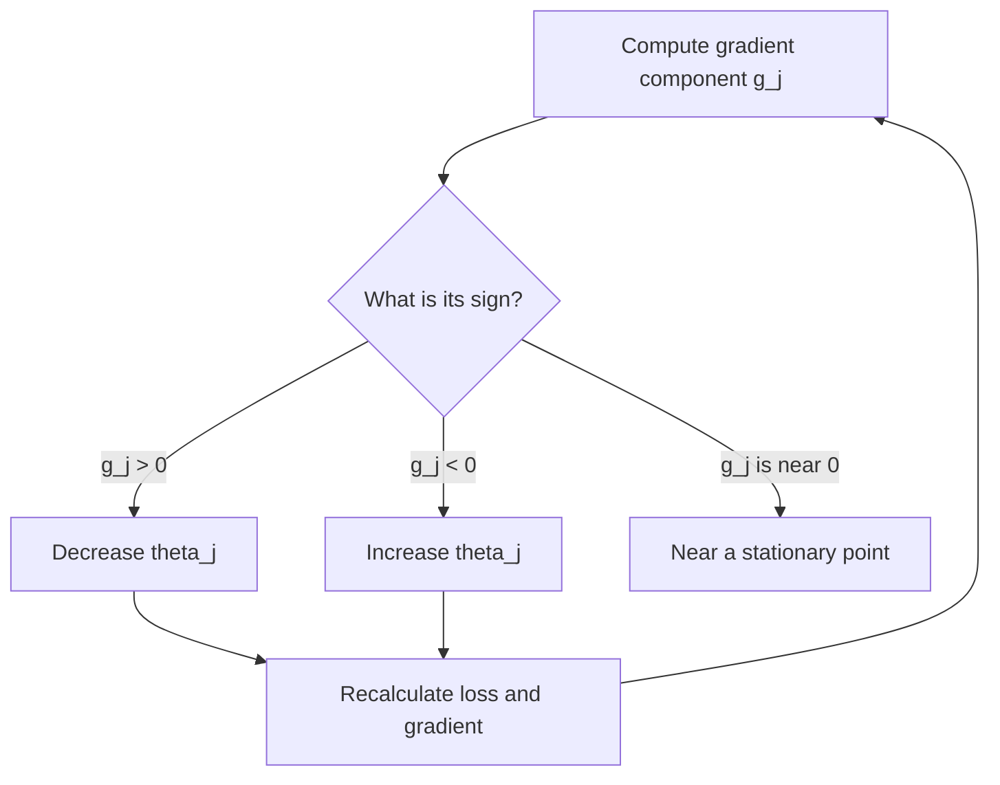

# Week 2 - Regression lecture additions

These notes contain explanations from the lecture that are not stated clearly in the slides. They intentionally do not repeat slide content that is already self-explanatory.

## Slide 6 - What can be an input to regression?

- The defining condition for a regression problem is that the **target/output** $y$ is a continuous real value.
- An input feature does not have to be continuous. It may be a continuous measurement, a discrete count, or an encoded category.
- Example: house price is continuous, while its predictors can include floor area, distance to the city centre, number of rooms, and encoded location.

## Slide 8 - Training experience and ground truth

- In the dataset $D=\{(\mathbf{x}^{(i)},y^{(i)})\}_{i=1}^{n}$, each training example needs both its features $\mathbf{x}^{(i)}$ and its known target $y^{(i)}$. The known target is the **ground truth** used to measure prediction error.

## Slide 9 - Univariate, multivariate, and multiple-output regression

- **Univariate regression** uses one input feature to predict one target.
- **Multivariate regression** uses multiple input features to predict one target. The word *multivariate* here refers to the number of inputs, not the number of outputs.
- Predicting several outputs is a different setup. Conceptually, it can be treated as several regression problems, with a separate target function for each output.

## Slide 10 - Task, experience, and performance for regression

- **Task $T$:** predict a continuous value for a new input.
- **Experience $E$:** labelled input-output pairs $(\mathbf{x}^{(i)},y^{(i)})$.
- **Performance $P$:** prediction error, such as mean squared error, measured on suitable data.

## Slide 13 - Choosing the number of input features

- More features do not automatically produce a better model. A sensible approach is to begin with relevant features and add others only when evaluation on unseen data shows an improvement.

### Easy distinction

- Predict energy use from temperature only: one input -> univariate regression.
- Predict energy use from temperature, humidity, pressure, and number of occupants: multiple inputs -> multivariate regression.
- Predict both energy use and indoor temperature: two targets -> two regression outputs, even if they share the same inputs.

## Slide 15 - Why include the intercept $\theta_0$?

For univariate linear regression,

$$
h_{\theta}(x)=\theta_0+\theta_1x
$$

- $\theta_1$ controls the slope or direction of the line.
- $\theta_0$ moves the line vertically without changing its slope.
- If $\theta_0$ is removed, every possible fitted line is forced to pass through the origin $(0,0)$. This is an unnecessarily strong assumption for most datasets.
- With $m$ input features, linear regression has $m+1$ parameters: one weight for every feature plus the intercept.

```text
Without an intercept                 With an intercept

y                                   y
|      /                            |        /
|    /   forced through (0,0)       |      /   free to move up/down
|  /                               |    /
+---------- x                      +---------- x
```

**Main idea:** training a linear-regression model means estimating the parameter values $\theta_0,\theta_1,\ldots,\theta_m$ that give the smallest loss. Different parameter values define different candidate models.

## Slide 20 - Why square the errors?

For example $i$, the **residual** is

$$
e_i=h_{\theta}(\mathbf{x}^{(i)})-y^{(i)}.
$$

If residuals were added directly, positive and negative errors could cancel. For example, errors $+2$ and $-2$ sum to zero even though both predictions are wrong. Squaring gives

$$
(+2)^2+(-2)^2=8,
$$

so both errors contribute positively to the loss.

The lecture uses mean squared error:

$$
J(\theta)=\frac{1}{n}\sum_{i=1}^{n}\left(h_{\theta}(\mathbf{x}^{(i)})-y^{(i)}\right)^2.
$$

## Slide 21 - Average loss and related terminology

- Dividing by $n$ reports the average error per example. Removing the factor $1/n$ rescales the loss but does not change which parameter values minimize it.
- **Loss function**, **cost function**, and **error function** were used with approximately the same meaning in this lecture.
- Squared error is a design choice, not the only possible loss. Absolute error is another option and is less sensitive to very large individual residuals.

## Slide 30 - Why random or brute-force search is impractical

- Parameters are continuous real values, so there are infinitely many candidate values.
- Trying a list of parameter combinations gives no guarantee that the list contains the minimum, and the number of combinations grows rapidly when more features are added.
- Gradient descent uses local slope information to choose a useful update direction instead of testing parameter values blindly.

## Slide 32 - Reading the gradient sign

For one parameter $\theta_j$, let

$$
g_j=\frac{\partial J}{\partial \theta_j}.
$$

- If $g_j>0$, the loss increases as $\theta_j$ increases, so gradient descent decreases $\theta_j$.
- If $g_j<0$, the loss decreases as $\theta_j$ increases, so gradient descent increases $\theta_j$.
- Both cases are handled by the same update:

$$
\theta_j \leftarrow \theta_j-\alpha g_j,
$$

where $\alpha$ is the learning rate.



## Slide 37 - Learning-rate strategy

- There is no single best learning rate for every dataset and problem.
- A useful intuition is to take larger steps when far from the minimum and smaller steps when close to it. Adaptive optimization methods automate versions of this idea.
- The learning rate is a **hyperparameter** of the learning algorithm; the weights $\theta$ are **model parameters** learned from data.

## Slide 42 - Updating multiple parameters with partial derivatives

For multivariate regression, calculate one partial derivative for each parameter. Each derivative updates its corresponding parameter; the partial derivatives are not added together into one parameter update. The gradient is the vector containing all these partial derivatives.

## Slide 45 - Good training predictions do not guarantee good unseen predictions

- The loss minimized during training only describes performance on the examples used to calculate that loss.
- A new input may come from a region that the model did not see during training, so good training fit cannot guarantee a good prediction for it.
- Keep a separate test set to estimate performance on unseen data.
- Training and test sets should not overlap. Otherwise, the test result is unfair because the model has already learned from some test examples.

```text
Complete collected dataset
        |
        +-- training set -> learn theta
        |
        +-- test set ----> evaluate the final learned model on unseen examples
```

## Slide 47 - Why feature scaling helps gradient descent

- Features can have very different numerical ranges, such as temperature from $0$ to $40$ and occupants from $1$ to $12$.
- Without scaling, the loss surface can be stretched into a long, narrow shape. Gradient descent then tends to zig-zag and may need many small updates.
- Scaling features to comparable ranges makes the optimization surface better conditioned, so gradient descent usually reaches the minimum more directly.
- A feature's larger numerical scale should not be confused with greater real-world importance.

## Slide 49 - Outliers and squared loss

- A point far from the general pattern of the data is called an **outlier**.
- Squared loss magnifies an outlier's residual. An error of $10$ contributes $100$, while an error of $2$ contributes only $4$.
- As a result, one unusual point can pull the fitted line away from the main group and make the total loss very large.
- Before training, investigate whether the point is a data error, a valid rare case, or evidence that the chosen model is unsuitable. Possible responses include correcting/cleaning invalid data or choosing a more robust loss.

## After Slide 51 - Lecture Q&A

### Regression can predict outside the training-output range

- Suppose all observed training targets are between $0$ and $100$. A linear-regression model can still predict $-20$ or $1000$ for a new input.
- The model learns a function, and a linear function is not bounded by the smallest and largest training targets. This is **extrapolation** beyond the observed region.
- If the application requires an output to remain within a fixed range, choose a hypothesis or output transformation that enforces that range; ordinary linear regression does not guarantee it.

### Clarification: "independent variable"

- In regression terminology, the inputs $x_1,\ldots,x_m$ are often called **independent variables**, predictors, or features, while $y$ is the **dependent variable** or target.
- The name does **not** automatically mean that all input features are statistically independent of one another.
- If two features contain almost the same information, the problem is called strong redundancy or multicollinearity. It can make individual coefficients unstable even when predictions remain reasonable.
- A perfectly redundant feature can often be removed because it adds no new information and creates another unnecessary parameter to estimate.

## Source

- [Machine Learning Lecture: Linear Regression & Gradient Descent transcript](https://app.notion.com/p/22d0060838be83a3b1b901ea4792755a?source=copy_link)
