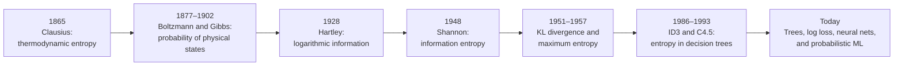
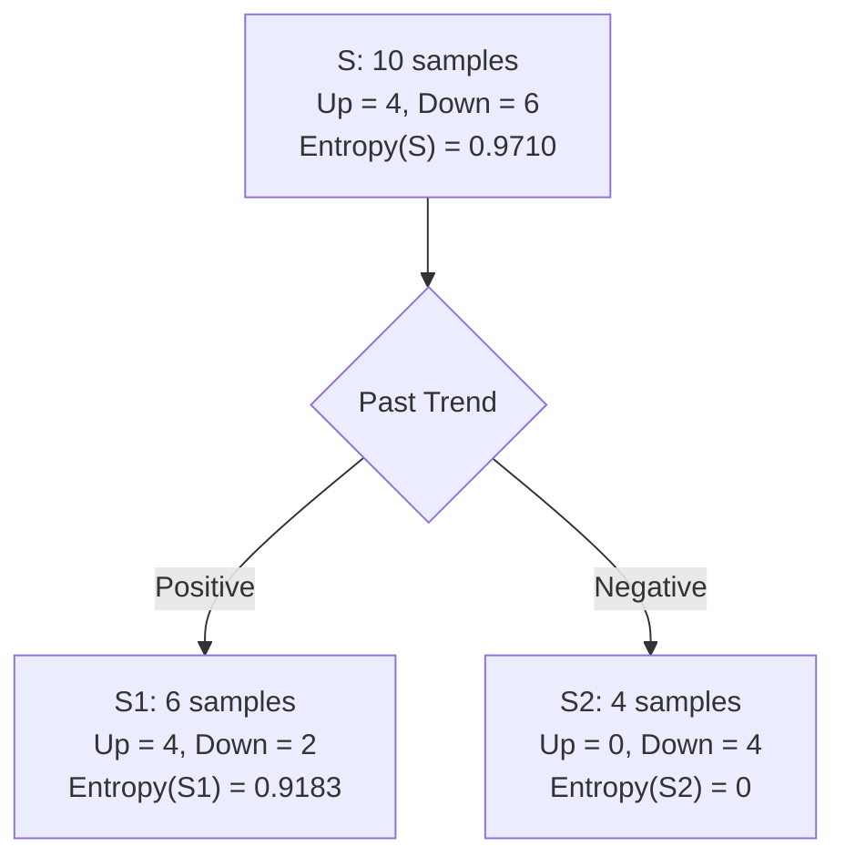

# Entropy: From Thermodynamics to Information Theory and Machine Learning

## 1. The central idea used in Week 5

In a classification data set or decision-tree node, entropy measures uncertainty in the
class label. Using the notation from the Week 5 lecture:

$$
\boxed{
\operatorname{Entropy}(S)
=-\sum_{c=1}^{C}p(c)\log_2 p(c)
}
$$

where:

- $S$ is the data set, or the samples that reach the current node;
- $C$ is the number of classes;
- $c$ denotes one class;
- $p(c)$ is the proportion of $S$ that has class $c$.

### How to read the formula

| Part | Meaning |
|---|---|
| $\log_2 p(c)$ | Logarithm of the probability of class $c$ |
| $-\log_2 p(c)$ | Information or “surprise” produced by observing class $c$ |
| $p(c)\left[-\log_2 p(c)\right]$ | Probability-weighted information from class $c$ |
| $\sum_{c=1}^{C}$ | Add the contribution of every class |
| Output | Average uncertainty in the class label, measured in bits |

The class proportions must satisfy

$$
\sum_{c=1}^{C}p(c)=1.
$$

The minus sign makes the result non-negative because
$\log_2 p(c)\leq0$ whenever $0<p(c)\leq1$.

The convention $0\log_2 0=0$ is used, justified by the limit
$\lim_{p\to0^+}p\log p=0$.

The interpretation is:

- $\operatorname{Entropy}(S)=0$ when $S$ is pure;
- entropy increases as the class distribution becomes more balanced;
- entropy is greatest when all $C$ classes are equally likely:

$$
\operatorname{Entropy}_{\max}(S)=\log_2 C.
$$

Here, $C$ is the number of classes. The maximum occurs when every class has proportion
$p(c)=1/C$.

For two equally represented classes, the maximum is $1$ bit.

The formula used in machine learning did not begin with decision trees. It is the result
of a long development from heat engines, through statistical mechanics and
communication theory, to algorithms that learn from data.

---

## 2. Historical origin and development

### 2.1 Thermodynamic entropy: Clausius, 1865

The scientific term **entropy** was introduced by the German physicist Rudolf Clausius
in 1865. His work concerned heat, work, reversible transformations, and the second law
of thermodynamics—not data classification.

For a reversible infinitesimal transfer of heat,

$$
dS=\frac{\delta Q_{\mathrm{rev}}}{T},
$$

where $dS$ is the change in thermodynamic entropy, $\delta Q_{\mathrm{rev}}$ is
reversible heat transfer, and $T$ is absolute temperature.

The subscript `rev` matters: the equality defines the entropy change by considering a
reversible path. In this historical physics formula, $S$ denotes physical entropy; it
is not the data set $S$ used later in the Week 5 machine-learning notation.

Clausius introduced the name in his 1865 paper “On Several Convenient Forms of the
Fundamental Equations of the Mechanical Theory of Heat”
([original publication record and DOI](https://doi.org/10.1002/andp.18652010702)).
An English edition of his collected memoirs is also available in the public domain
([*The Mechanical Theory of Heat*, 1867](https://commons.wikimedia.org/wiki/File:The_Mechanical_Theory_of_Heat-_With_Its_Applications_to_the_Steam-engine_and_..._%28IA_mechanicaltheor04claugoog%29.pdf)).

Thermodynamic entropy is a physical state quantity with physical units. It should not
be casually identified with “messiness.” Its origin was the quantitative analysis of
energy transformations and irreversibility.

### 2.2 Statistical entropy: Boltzmann, 1877

Ludwig Boltzmann connected macroscopic thermodynamic behaviour to microscopic
configurations. His 1877 work gave entropy a probabilistic and combinatorial basis.
A modern English translation describes it as the first establishment of the
probabilistic basis of entropy
([Entropy 17, 1971–2009](https://doi.org/10.3390/e17041971)).

The familiar relation is

$$
S=k_{\mathrm{B}}\ln W,
$$

where:

- $k_{\mathrm{B}}$ is Boltzmann's constant;
- $W$ is the number of microscopic configurations compatible with the observed
  macroscopic state.

The natural logarithm $\ln$ converts a multiplicative number of configurations into an
additive entropy. $k_{\mathrm{B}}$ supplies the physical scale and units.

More possible microstates mean greater entropy. This was the crucial conceptual bridge
from macroscopic heat to counting and probability.

### 2.3 Gibbs and probability distributions, 1902

Josiah Willard Gibbs developed statistical mechanics in terms of ensembles and
probability distributions. The discrete Gibbs entropy has the form

$$
S=-k_{\mathrm{B}}\sum_i p_i\ln p_i.
$$

Here, $i$ indexes a possible physical microstate and $p_i$ is its probability. If all
$W$ states are equally likely, then $p_i=1/W$ and the Gibbs expression reduces to
$S=k_{\mathrm{B}}\ln W$.

Gibbs's *Elementary Principles in Statistical Mechanics* was published in 1902 and is
available through
[Project Gutenberg](https://gutenberg.org/ebooks/50992).

Mathematically, this expression is already very close to Shannon entropy. The
interpretation and units are still physical because of $k_{\mathrm{B}}$ and the physical
meaning of the states.

### 2.4 Hartley and information, 1928

Ralph Hartley sought a quantitative measure of transmitted information independent of
the psychological meaning of a message. For $N$ equally possible alternatives, he used
a logarithmic measure:

$$
H=K\log N.
$$

In Hartley's formula, $N$ is the number of equally likely alternatives and $K$ is a
positive scaling constant that determines the unit.

The logarithm is important because independent choices multiply their numbers of
possibilities, while their information should add:

$$
\log(N_1N_2)=\log N_1+\log N_2.
$$

Hartley's paper “Transmission of Information” appeared in the *Bell System Technical
Journal* in 1928
([DOI and abstract](https://doi.org/10.1002/j.1538-7305.1928.tb01236.x)).

Hartley's measure handled equally likely alternatives. The next step was to handle
unequal probabilities.

### 2.5 Shannon entropy and information theory, 1948

Claude Shannon founded modern information theory in “A Mathematical Theory of
Communication,” published in two parts in 1948. Shannon sought a measure of uncertainty
for a source producing symbols with probabilities $p_1,\ldots,p_C$.

Under natural requirements such as continuity, symmetry, and additivity under
successive choices, the measure takes the form

$$
H=-K\sum_{c=1}^{C}p(c)\log p(c).
$$

Choosing $K=1$ and logarithm base 2 gives entropy in **bits**:

$$
H=-\sum_{c=1}^{C}p(c)\log_2p(c).
$$

Shannon's paper explicitly built on earlier work by Nyquist and Hartley. The original
paper is available as an IEEE primary source
([IEEE REACH](https://reach.ieee.org/primary-sources/a-mathematical-theory-of-communication/))
and through the
[Bell System Technical Journal record](https://doi.org/10.1002/j.1538-7305.1948.tb01338.x).

This is the entropy used in the Week 5 decision-tree formula. It has the same
probability-sum shape as Gibbs entropy, but its immediate subject is uncertainty and
communication rather than heat.

### 2.6 Relative entropy and cross-entropy, 1951 onward

Solomon Kullback and Richard Leibler formalised the information lost when one
probability distribution is used to approximate another. The Kullback–Leibler
divergence is

$$
D_{\mathrm{KL}}(P\|Q)
=\sum_c P(c)\log\frac{P(c)}{Q(c)}.
$$

### Relative-entropy notation

| Symbol | Meaning |
|---|---|
| $P$ | Reference or target probability distribution |
| $Q$ | Approximating or model probability distribution |
| $P(c)$ and $Q(c)$ | Probabilities assigned to class or outcome $c$ |
| $\log\frac{P(c)}{Q(c)}$ | Information difference for outcome $c$ |
| $D_{\mathrm{KL}}(P\|Q)$ | Expected information difference under $P$ |

The order matters: in general,
$D_{\mathrm{KL}}(P\|Q)\neq D_{\mathrm{KL}}(Q\|P)$.

Their paper “On Information and Sufficiency” appeared in 1951
([DOI: 10.1214/aoms/1177729694](https://doi.org/10.1214/aoms/1177729694)).

Cross-entropy is

$$
H(P,Q)=-\sum_c P(c)\log Q(c),
$$

and satisfies

$$
H(P,Q)=H(P)+D_{\mathrm{KL}}(P\|Q).
$$

In these formulas:

- $H(P,Q)$ is cross-entropy: outcomes are generated according to $P$ but encoded or
  predicted using $Q$;
- $H(P)$ is the irreducible entropy of the target distribution;
- $D_{\mathrm{KL}}(P\|Q)$ is the additional cost caused by the mismatch between $P$
  and $Q$.

Because $H(P)$ is fixed with respect to a model $Q$, minimising cross-entropy is
equivalent to minimising $D_{\mathrm{KL}}(P\|Q)$. This identity later became central to
probabilistic classification and neural-network training.

### 2.7 Maximum entropy: Jaynes, 1957

Edwin T. Jaynes reframed statistical mechanics as inference from incomplete
information. His maximum-entropy principle selects the probability distribution with
the greatest entropy among those satisfying known constraints—the distribution that
adds the least unsupported structure.

Jaynes introduced this approach in “Information Theory and Statistical Mechanics”
([Physical Review 106, 620–630](https://doi.org/10.1103/PhysRev.106.620)).

This development helped establish entropy not only as a descriptive measure but also as
an optimisation principle for probabilistic modelling.

### 2.8 Entropy enters machine learning through decision trees

Ross Quinlan's ID3 system made Shannon entropy and information gain central to
decision-tree induction. His 1986 paper describes ID3 in detail and places it explicitly
under the keywords “decision trees” and “information theory”
([Machine Learning 1, 81–106](https://doi.org/10.1007/BF00116251)).

ID3 greedily chooses the attribute that gives the largest decrease in class entropy.
Quinlan's later C4.5 system extended this family of methods and used gain ratio to reduce
information gain's preference for attributes with many values. C4.5 was documented in
his 1993 book *C4.5: Programs for Machine Learning*
([bibliographic record](https://openlibrary.org/books/OL1728394M/C4.5)).

### 2.9 Development at a glance



---

## 3. Why Shannon's formula makes sense

### 3.1 Information content of one event

If event or outcome $x$ occurs, its self-information is

$$
\boxed{I(x)=-\log_2P(x)}
$$

where:

- $x$ is the event or outcome that has occurred;
- $P(x)=p$ is the probability of that outcome;
- $I(x)$ is the information received after learning that $x$ occurred, measured in
  bits because the logarithm has base 2.

The shorthand $I(p)=-\log_2p$ is sometimes used to emphasise that the numerical amount
of information depends only on the event's probability. More precisely, however,
self-information belongs to the observation of an outcome $x$.

> **Key intuition:** self-information measures how much prior uncertainty is removed
> when a particular outcome is observed. It does not measure how many words or how much
> general knowledge the outcome contains.

Consequences:

- If $P(x)=1$, then $I(x)=-\log_2(1)=0$: a certain event tells us nothing unexpected.
- The smaller $P(x)$ is, the larger $I(x)$ becomes: a rare event removes more prior
  uncertainty when it occurs.
- Two different outcomes with the same probability have the same self-information,
  even though the outcomes themselves are different.

For example, the probability of obtaining ten heads in ten independent fair-coin tosses
is

$$
P(HHHHHHHHHH)=\left(\frac12\right)^{10}=\frac{1}{1024}.
$$

Observing this event provides

$$
I(HHHHHHHHHH)
=-\log_2\left(\frac{1}{1024}\right)
=10\text{ bits}.
$$

The logarithm is used because information from independent events should add. If $A$
and $B$ are independent, then

$$
\begin{aligned}
I(A\cap B)
&=-\log_2P(A\cap B)\\
&=-\log_2\bigl(P(A)P(B)\bigr)\\
&=-\log_2P(A)-\log_2P(B)\\
&=I(A)+I(B).
\end{aligned}
$$

Thus, one fair binary choice carries one bit, and $N$ equally likely outcomes require
$\log_2N$ bits to identify. Since $P(x)=1/N$,

$$
I(x)=\log_2N=\log_2\left(\frac{1}{P(x)}\right)=-\log_2P(x).
$$

**Do not confuse the two levels:**

- self-information $I(x)$ asks, “How surprising was the particular outcome that just
  occurred?”;
- entropy $H(X)=E[I(X)]$ asks, “Before observing the outcome, how uncertain is this
  random variable on average?”

### 3.2 Entropy is expected information

Let $Y$ be the unknown target label. Before observing $Y$, the outcome $Y=c$ occurs
with probability $p(c)$ and would provide
$I(Y=c)=-\log_2P(Y=c)=-\log_2p(c)$ bits of self-information. The expected information
is therefore

$$
\begin{aligned}
H(Y)=E[I(Y)]
&=\sum_{c=1}^{C}p(c)\bigl[-\log_2p(c)\bigr]\\
&=-\sum_{c=1}^{C}p(c)\log_2p(c)\\
&=\operatorname{Entropy}(S).
\end{aligned}
$$

Entropy can therefore be read as the expected surprise in the unknown class label.

### 3.3 The logarithm base controls the unit

| Logarithm | Unit |
|---|---|
| $\log_2$ | bits |
| $\ln$ | nats |
| $\log_{10}$ | hartleys or decimal digits |

Changing the base multiplies all entropy and information-gain values by a positive
constant. It changes their numerical scale but not the ranking of candidate splits.
The Week 5 lecture uses $\log_2$, so this file reports entropy in bits.

---

## 4. Entropy as a decision-tree split criterion

### 4.1 Information gain

Suppose attribute $A$ divides $S$ into subsets $S_v$, one for each value
$v\in\operatorname{Values}(A)$. Using the Week 5 notation:

$$
\boxed{\operatorname{Gain}(S,A)
=\operatorname{Entropy}(S)
-\sum_{v\in\operatorname{Values}(A)}
\frac{\lvert S_v\rvert}{\lvert S\rvert}
\operatorname{Entropy}(S_v)}
$$

### Information-gain notation

| Symbol | Meaning |
|---|---|
| $A$ | Candidate attribute used to split $S$ |
| $\operatorname{Values}(A)$ | All branches created by $A$ |
| $v$ | One branch value, such as `Positive` or `Negative` |
| $S_v$ | Subset of samples whose value of $A$ is $v$ |
| $\lvert S\rvert$ | Number of samples in the parent node |
| $\lvert S_v\rvert$ | Number of samples in child $S_v$ |
| $\frac{\lvert S_v\rvert}{\lvert S\rvert}$ | Probability that a sample from $S$ enters child $S_v$ |
| $\operatorname{Entropy}(S_v)$ | Uncertainty remaining inside child $S_v$ |
| $\sum_v\frac{\lvert S_v\rvert}{\lvert S\rvert}\operatorname{Entropy}(S_v)$ | Weighted entropy after the split |
| $\operatorname{Gain}(S,A)$ | Uncertainty removed by observing attribute $A$ |

Read the formula from right to left:

1. calculate the entropy of every child;
2. weight each child entropy by the fraction of samples sent to it;
3. add the weighted values to obtain the expected entropy after the split;
4. subtract that value from the parent entropy.

Higher information gain means that $A$ gives more information about the target class.

The second term is the expected entropy after observing the value of $A$. Information
gain is therefore the reduction in uncertainty about the class label.

In information-theoretic notation, this is empirical mutual information between the
class $Y$ and attribute $A$:

$$
\operatorname{Gain}(S,A)=H(Y)-H(Y\mid A)=I(Y;A).
$$

This equality explains why the criterion is called information gain rather than merely
entropy reduction.

### 4.2 Worked example using the Week 5 lecture data


*Lecture reference: splitting $S$ into $S_1$ and $S_2$ using `Past Trend`, including
the parent entropy, child entropies, branch weights, and final gain of $0.4200$.*

The lecture's data set $S$ contains:

- 10 samples;
- 4 positive/`Up` samples;
- 6 negative/`Down` samples.

The root entropy is

$$
\begin{aligned}
\operatorname{Entropy}(S)
&=-\frac{4}{10}\log_2\frac{4}{10}
  -\frac{6}{10}\log_2\frac{6}{10}\\
&\approx0.9710\text{ bits}.
\end{aligned}
$$

Splitting on `Past Trend` creates:

- $S_1$ (`Positive`): 6 samples, of which 4 are `Up` and 2 are `Down`;
- $S_2$ (`Negative`): 4 samples, all `Down`.

Therefore,

$$
\begin{aligned}
\operatorname{Entropy}(S_1)
&=-\frac{4}{6}\log_2\frac{4}{6}
  -\frac{2}{6}\log_2\frac{2}{6}\\
&\approx0.9183,
\\[6pt]
\operatorname{Entropy}(S_2)
&=-1\log_2 1\\
&=0.
\end{aligned}
$$

The information gain is

$$
\begin{aligned}
\operatorname{Gain}(S,\text{Past Trend})
&=0.9710
  -\frac{6}{10}(0.9183)
  -\frac{4}{10}(0)\\
&\approx\boxed{0.4200\text{ bits}}.
\end{aligned}
$$



The split removes $0.4200$ bits of uncertainty about the target. In the lecture's
comparison of the three attributes, `Past Trend` has the largest gain, so the greedy
algorithm selects it at the root.


*Lecture comparison: `Past Trend` gives gain $0.4200$, `Open Interest` gives $0.0200$,
and `Trading Volume` gives $0.2814$. The largest gain determines the greedy root split.*

### 4.3 Greedy recursion

After choosing the best attribute:

1. make that attribute the decision at the current node;
2. send samples to child subsets;
3. stop on a pure subset or another stopping condition;
4. otherwise repeat the entropy and gain calculation inside each child.

The criterion is local. The tree does not maximise one global information-gain formula
over all possible complete trees.

---

## 5. Applying entropy elsewhere in machine learning

### 5.1 Cross-entropy loss for probabilistic classification

Suppose a model predicts class probabilities $\hat p_{i,c}$ for sample $i$, while the
true one-hot label is $y_{i,c}$. Multiclass cross-entropy loss is

$$
\boxed{
\mathcal{L}_{\mathrm{CE}}
=-\frac{1}{n}\sum_{i=1}^{n}\sum_{c=1}^{C}
y_{i,c}\log \hat p_{i,c}
}
$$

### Cross-entropy-loss notation

| Symbol | Meaning |
|---|---|
| $n$ | Number of training or evaluation samples |
| $i$ | Index of one sample |
| $C$ | Number of classes |
| $c$ | Index of one class |
| $y_{i,c}$ | One-hot target: $1$ if sample $i$ belongs to class $c$, otherwise $0$ |
| $\hat p_{i,c}$ | Probability predicted by the model that sample $i$ belongs to class $c$ |
| $\mathcal{L}_{\mathrm{CE}}$ | Mean cross-entropy loss over all samples |

The inner sum selects the log probability of the true class because all incorrect
classes have $y_{i,c}=0$. The outer sum adds the losses for all samples, and $1/n$
converts the total into an average.

Because only the true class has $y_{i,c}=1$, the loss for one sample is simply

$$
-\log\bigl(\text{probability assigned to the true class}\bigr).
$$

This strongly penalises confident wrong predictions:

| Probability assigned to the true class | Natural-log loss |
|---:|---:|
| $0.9$ | $0.105$ |
| $0.5$ | $0.693$ |
| $0.1$ | $2.303$ |
| $0.01$ | $4.605$ |

Cross-entropy, log loss, and negative log-likelihood are the same objective in standard
logistic/softmax classification. Scikit-learn documents log loss as the loss used in
multinomial logistic regression and extensions such as neural networks
([official `log_loss` documentation](https://scikit-learn.org/stable/modules/generated/sklearn.metrics.log_loss.html)).

### 5.2 Why a tree's entropy criterion is related to log loss

At a tree leaf, predicted class probabilities are the class proportions in that leaf.
When each training sample is evaluated using those probabilities, the leaf's average
log loss is its Shannon entropy. The whole tree's training log loss is the
sample-weighted sum of leaf entropies.

Thus, selecting an entropy-reducing split also reduces the training log loss of the
piecewise-constant probability model. Scikit-learn gives this equivalence explicitly
([Decision Trees: classification criteria](https://scikit-learn.org/stable/modules/tree.html#classification-criteria)).

### 5.3 KL divergence in probabilistic ML

$D_{\mathrm{KL}}(P\|Q)$ measures the extra information cost of using model distribution
$Q$ when the relevant distribution is $P$. It appears in:

- variational inference;
- variational autoencoders;
- distribution matching;
- Bayesian approximation;
- knowledge distillation;
- regularisation of probability distributions.

KL divergence is not a true distance: it is asymmetric and does not satisfy the triangle
inequality.

### 5.4 Maximum-entropy modelling

When only partial constraints are known, maximum entropy selects the least committed
distribution consistent with those constraints. Maximum-entropy classifiers are closely
related to multinomial logistic regression: the exponential-form distribution arises
from maximising entropy subject to expected-feature constraints.

### 5.5 Entropy as an uncertainty measure

Given a model prediction

$$
\hat{\mathbf p}(x)
=\bigl(\hat p_1(x),\ldots,\hat p_C(x)\bigr),
$$

predictive entropy is

$$
H(\hat{\mathbf p}(x))
=-\sum_c\hat p_c(x)\log\hat p_c(x).
$$

Here, $x$ is one input, $\hat p_c(x)$ is the model's predicted probability for class
$c$, and $H(\hat{\mathbf p}(x))$ is the uncertainty of that prediction. A distribution
concentrated on one class has low predictive entropy; a nearly uniform distribution has
high predictive entropy.

It can help identify uncertain predictions and prioritise cases for human review or
active learning. However, entropy is meaningful only if the probability estimates are
reasonably calibrated. An overconfident model can have low predictive entropy while
still being wrong.

### 5.6 Entropy regularisation

Some learning objectives add an entropy term:

$$
\mathcal{L}_{\mathrm{total}}
=\mathcal{L}_{\mathrm{task}}-\lambda H(\pi).
$$

In this objective, $\mathcal{L}_{\mathrm{task}}$ is the original task loss, $H(\pi)$ is
the entropy of a learned distribution or policy $\pi$, and $\lambda\geq0$ controls the
strength of the entropy reward. When minimising the displayed loss, the minus sign
encourages larger entropy.

With $\lambda>0$, subtracting entropy rewards a broader distribution $\pi$, encouraging
exploration or preventing premature collapse to a single choice. This idea is common in
reinforcement learning, clustering, and semi-supervised learning. The exact sign must
always be checked: some authors maximise a reward objective, while others minimise a
loss.

---

## 6. Python applications

### 6.1 Calculate the Week 5 entropy

```python
from collections import Counter
from math import log2


def entropy(labels):
    """Return Entropy(S) = -sum_c p(c) log2 p(c)."""
    n = len(labels)
    if n == 0:
        return 0.0

    counts = Counter(labels)
    return -sum(
        (count / n) * log2(count / n)
        for count in counts.values()
    )


root = ["Down"] * 6 + ["Up"] * 4
print(entropy(root))  # approximately 0.9710
```

There is no need to calculate `log2(0)` because classes with count zero do not appear in
`Counter(labels)`.

### 6.2 Calculate information gain

```python
def information_gain(parent, children):
    total = len(parent)
    entropy_after_split = sum(
        (len(child) / total) * entropy(child)
        for child in children
    )
    return entropy(parent) - entropy_after_split


positive = ["Up"] * 4 + ["Down"] * 2
negative = ["Down"] * 4

gain = information_gain(root, [positive, negative])
print(gain)  # approximately 0.4200
```

### 6.3 Train an entropy-based decision tree

```python
from sklearn.tree import DecisionTreeClassifier

tree = DecisionTreeClassifier(
    criterion="entropy",
    max_depth=3,
    min_samples_leaf=5,
    random_state=42,
)

tree.fit(X_train, y_train)
predictions = tree.predict(X_test)
probabilities = tree.predict_proba(X_test)
```

Scikit-learn supports `"gini"`, `"entropy"`, and `"log_loss"` for classification trees.
Its documentation states that `"entropy"` and `"log_loss"` both use Shannon information
gain
([`DecisionTreeClassifier`](https://scikit-learn.org/stable/modules/generated/sklearn.tree.DecisionTreeClassifier.html)).

### 6.4 Evaluate predicted probabilities with log loss

```python
from sklearn.metrics import log_loss

test_loss = log_loss(y_test, probabilities)
print(test_loss)
```

Accuracy checks only whether the winning class is correct. Log loss also checks how much
probability the model assigned to the true class, so it evaluates the quality of
probabilistic predictions.

---

## 7. Entropy versus Gini impurity

| Property | Entropy | Gini impurity |
|---|---|---|
| Week 5 formula | $-\sum_c p(c)\log_2p(c)$ | $1-\sum_c p(c)^2$ |
| Binary maximum | $1$ bit | $0.5$ |
| $C$-class maximum | $\log_2C$ | $1-1/C$ |
| Minimum | $0$ at a pure node | $0$ at a pure node |
| Classical association | ID3, C4.5 | CART |
| Broader connection | Information, log loss, KL divergence | Pairwise disagreement, quadratic uncertainty |

For a binary class with positive proportion $p$:

| $p$ | Entropy (bits) | Gini impurity |
|---:|---:|---:|
| 0.0 | 0.000 | 0.000 |
| 0.1 | 0.469 | 0.180 |
| 0.2 | 0.722 | 0.320 |
| 0.3 | 0.881 | 0.420 |
| 0.4 | 0.971 | 0.480 |
| 0.5 | 1.000 | 0.500 |

Both criteria prefer pure child nodes and often produce similar trees. Entropy is more
sensitive to changes close to $p=0$ or $p=1$. Because the measures are not simple
constant multiples, they can rank two candidate splits differently.

---

## 8. Practical cautions and common misconceptions

### 8.1 Thermodynamic entropy and Shannon entropy are related, not identical

They share a probability-based mathematical structure, but their meanings and units
differ:

- thermodynamic entropy describes a physical system and carries physical units;
- Shannon entropy describes uncertainty in a probability distribution and is measured
  in bits when using $\log_2$.

The resemblance is mathematically deep, but a decision-tree entropy value is not heat.

### 8.2 Entropy is not always “disorder”

“Disorder” is a loose intuition that can be misleading. For the Week 5 context,
**uncertainty about the class label** is more precise. A balanced node has high entropy
because its label is difficult to predict before observing more information.

### 8.3 High entropy is not universally bad

Inside a classification-tree node, lower class entropy is desirable because the tree
wants pure leaves. In exploration, diversity, or maximum-entropy inference, higher
entropy may be deliberately encouraged. Whether entropy should rise or fall depends on
the objective.

### 8.4 Information gain can prefer high-cardinality attributes

An attribute with a distinct value for every training sample can create many pure
children and achieve very high training information gain, even though it may not
generalise. This motivated gain ratio in the C4.5 family. In modern practice, control
tree complexity, validate on unseen data, and treat identifiers or nearly unique
categories carefully.

### 8.5 A pure leaf can still overfit

Entropy $0$ describes the labels of training samples in that leaf. It does not guarantee
zero test error. Use stopping rules, pruning, and validation to prevent the tree from
memorising noise.

### 8.6 Greedy information gain is locally optimal

ID3 selects the best immediate entropy reduction. It does not search every possible
complete tree, so the final structure is not guaranteed to be the globally smallest or
most accurate tree.

### 8.7 Class imbalance requires more than inspecting entropy

A highly imbalanced root may already have low entropy because the majority class is
predictable. That does not make minority errors harmless. Use class-appropriate
evaluation metrics, stratified validation, and justified weighting or resampling.

---

## 9. Takeaway

Entropy travelled through several disciplines:

1. Clausius introduced thermodynamic entropy to express energy transformation and the
   second law.
2. Boltzmann and Gibbs gave entropy a statistical interpretation based on possible
   microscopic states and their probabilities.
3. Hartley introduced a logarithmic measure of information.
4. Shannon generalised information to unequal probabilities, producing
   $-\sum p\log p$.
5. Kullback, Leibler, and Jaynes extended entropy into relative information and
   inference.
6. Quinlan applied Shannon entropy to machine learning through ID3 and information gain.
7. Modern ML uses the same family of ideas in trees, cross-entropy loss, probabilistic
   modelling, uncertainty estimation, and regularisation.

For the Week 5 decision-tree context, remember:

$$
\boxed{
\operatorname{Entropy}(S)
=-\sum_{c=1}^{C}p(c)\log_2p(c)
}
$$

and

$$
\boxed{
\operatorname{Gain}(S,A)
=\operatorname{Entropy}(S)
-\sum_{v\in\operatorname{Values}(A)}
\frac{\lvert S_v\rvert}{\lvert S\rvert}\operatorname{Entropy}(S_v).
}
$$

Entropy measures the uncertainty before a split; information gain measures how much of
that uncertainty the split removes.

---

## References

1. Clausius, R. (1865). “Ueber verschiedene für die Anwendung bequeme Formen der
   Hauptgleichungen der mechanischen Wärmetheorie.” *Annalen der Physik*, 201,
   353–400.
   [DOI: 10.1002/andp.18652010702](https://doi.org/10.1002/andp.18652010702).
2. Clausius, R. (1867). *The Mechanical Theory of Heat*.
   [Public-domain English edition](https://commons.wikimedia.org/wiki/File:The_Mechanical_Theory_of_Heat-_With_Its_Applications_to_the_Steam-engine_and_..._%28IA_mechanicaltheor04claugoog%29.pdf).
3. Boltzmann, L. (1877/2015). “On the Relationship between the Second Fundamental
   Theorem of the Mechanical Theory of Heat and Probability Calculations Regarding the
   Conditions for Thermal Equilibrium.”
   [English translation and commentary](https://doi.org/10.3390/e17041971).
4. Gibbs, J. W. (1902). *Elementary Principles in Statistical Mechanics*.
   [Project Gutenberg](https://gutenberg.org/ebooks/50992).
5. Hartley, R. V. L. (1928). “Transmission of Information.” *Bell System Technical
   Journal*, 7, 535–563.
   [DOI: 10.1002/j.1538-7305.1928.tb01236.x](https://doi.org/10.1002/j.1538-7305.1928.tb01236.x).
6. Shannon, C. E. (1948). “A Mathematical Theory of Communication.” *Bell System
   Technical Journal*, 27, 379–423 and 623–656.
   [IEEE primary source](https://reach.ieee.org/primary-sources/a-mathematical-theory-of-communication/).
7. Kullback, S., & Leibler, R. A. (1951). “On Information and Sufficiency.”
   *The Annals of Mathematical Statistics*, 22(1), 79–86.
   [DOI: 10.1214/aoms/1177729694](https://doi.org/10.1214/aoms/1177729694).
8. Jaynes, E. T. (1957). “Information Theory and Statistical Mechanics.”
   *Physical Review*, 106, 620–630.
   [DOI: 10.1103/PhysRev.106.620](https://doi.org/10.1103/PhysRev.106.620).
9. Quinlan, J. R. (1986). “Induction of Decision Trees.” *Machine Learning*, 1,
   81–106.
   [DOI: 10.1007/BF00116251](https://doi.org/10.1007/BF00116251).
10. Quinlan, J. R. (1993). *C4.5: Programs for Machine Learning*. Morgan Kaufmann.
    [Bibliographic record](https://openlibrary.org/books/OL1728394M/C4.5).
11. scikit-learn developers. “Decision Trees — Mathematical formulation.”
    [Official documentation](https://scikit-learn.org/stable/modules/tree.html#mathematical-formulation).
12. scikit-learn developers. “Log loss.”
    [Official documentation](https://scikit-learn.org/stable/modules/generated/sklearn.metrics.log_loss.html).
