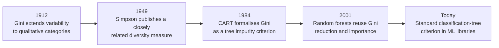
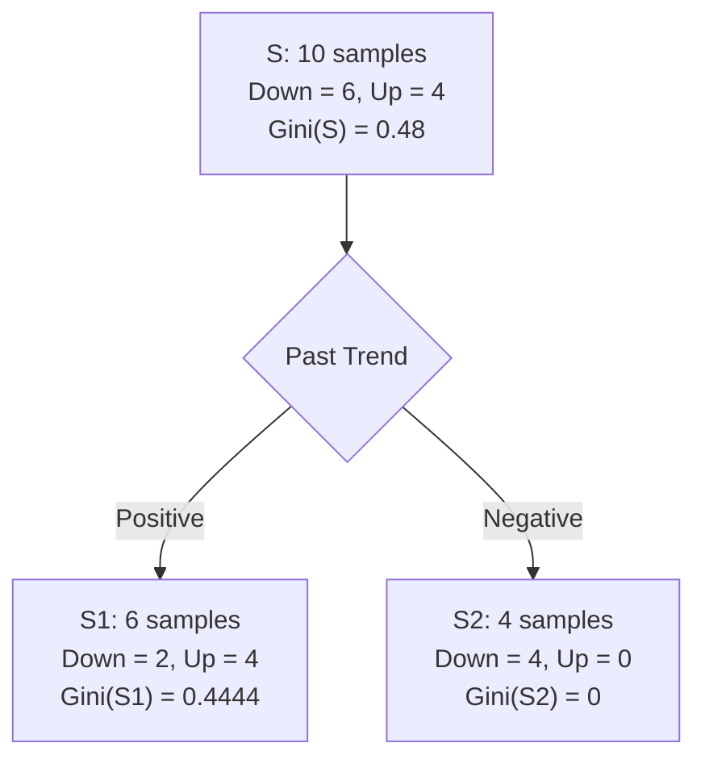

# Gini Impurity: Origin, Development, and Application in Machine Learning

## 1. The central idea

Gini impurity measures how mixed the class labels are in a data set or decision-tree node.
Using the notation from the Week 5 lecture:

$$
\boxed{\operatorname{Gini}(S)=1-\sum_{c=1}^{C}p(c)^2}
$$

where:

- $S$ is the data set, or the samples that reach the current node;
- $C$ is the number of classes;
- $c$ denotes one class;
- $p(c)$ is the proportion of the samples in $S$ that belong to class $c$.

The interpretation is simple:

- $\operatorname{Gini}(S)=0$ means that $S$ is pure: every sample has the same class.
- A larger Gini value means that the classes are more mixed.
- If all $C$ classes are equally represented, Gini impurity reaches its maximum:

$$
\operatorname{Gini}_{\max}=1-\frac{1}{C}.
$$

For binary classification, the maximum is therefore $0.5$, not $1$.

---

## 2. Where did Gini impurity come from?

### 2.1 Corrado Gini and *Variabilità e Mutabilità* (1912)

The name comes from the Italian statistician Corrado Gini. In his 1912 monograph
*Variabilità e Mutabilità*, Gini studied how to quantify variability for both numerical
and qualitative characteristics. A digitised copy of the original book confirms its
publication in 1912 and its sections on indices of variability and mutability
([CNR Byterfly archive](https://www.byterfly.eu/islandora/object/librib%3A680892/pages)).

For a qualitative variable with $C$ categories, Gini treated two observations as:

- having difference $0$ if they belong to the same category;
- having difference $1$ if they belong to different categories.

The average difference between pairs becomes

$$
\sum_{c=1}^{C}p(c)\bigl(1-p(c)\bigr)
=1-\sum_{c=1}^{C}p(c)^2.
$$

That is exactly the expression now called Gini impurity. Montanari and Monari trace this
categorical extension directly to Gini's 1912 work and show its equivalence to the
formula later used in classification trees
([University of Bologna, pp. 242–243](https://rivista-statistica.unibo.it/article/download/3533/2891/8947)).

### 2.2 Gini impurity is not the Gini coefficient

The two measures share Gini's name, but they are not interchangeable:

| Measure | Typical data | Main question | Common formula |
|---|---|---|---|
| Gini impurity | Nominal class labels | How mixed are the classes? | $1-\sum_c p(c)^2$ |
| Gini coefficient | Ordered numerical values such as income | How unequal is a distribution? | Based on pairwise numerical differences or the Lorenz curve |

The Gini coefficient preserves the magnitudes and ordering of numerical observations.
Gini impurity treats class labels as nominal: “Up” and “Down” are different, but no
numerical distance between them is assumed.

This distinction matters in machine learning. A decision-tree node labelled
`gini = 0.48` is reporting class mixture, not economic inequality.

### 2.3 Independent development as a diversity measure

In ecology, Edward H. Simpson proposed a closely related concentration/diversity index
in his 1949 paper “Measurement of Diversity”
([Nature 163, 688](https://doi.org/10.1038/163688a0)). Its complement is commonly called
the Gini–Simpson diversity index:

$$
1-\sum_{c=1}^{C}p(c)^2.
$$

This is mathematically the same population-level expression as Gini impurity. The
interpretation changes with the field:

- ecology: the probability that two randomly selected individuals have different types;
- classification: the probability of disagreement between an observed class and a
  class drawn from the node's class distribution.

For a finite sample, ecological texts may use a without-replacement correction involving
$n_c(n_c-1)/[n(n-1)]$. Standard decision-tree implementations use the class-proportion
formula shown in the lecture, without that correction.

### 2.4 CART brought the measure into modern machine learning

The decisive machine-learning step was the 1984 book *Classification and Regression
Trees* by Leo Breiman, Jerome Friedman, Richard Olshen, and Charles Stone. CART
formalised recursive binary splitting, node impurity, impurity reduction, and
cost-complexity pruning. The book explicitly includes Gini splitting
([Google Books bibliographic record and preview](https://books.google.com/books/about/Classification_and_Regression_Trees.html?id=8k1DvQEACAAJ)).

CART did not invent the mathematical expression. Its major contribution was to make the
expression operational inside a complete learning algorithm:

1. calculate the impurity of the current node;
2. evaluate candidate feature splits;
3. calculate the weighted impurity of the resulting child nodes;
4. select the split with the greatest impurity reduction;
5. repeat recursively and later control complexity through stopping or pruning.

### 2.5 Random forests extended its role

Leo Breiman's 2001 random-forest paper combined many randomised tree predictors
([Machine Learning 45, 5–32](https://doi.org/10.1023/A:1010933404324)). In a
classification forest, Gini impurity can still select splits within individual trees.
The decreases attributed to a feature can also be accumulated across nodes and trees to
form mean decrease in impurity, often called **Gini importance**
([Breiman and Cutler's Random Forests notes](https://www.stat.berkeley.edu/~breiman/forests/cc_home.htm)).

### 2.6 Development at a glance



---

## 3. Three equivalent interpretations

Let $Y$ be the class of a randomly selected sample from node $S$.

### 3.1 One minus the probability of agreement

If $Y_1$ and $Y_2$ are independent draws from the node's class distribution, then

$$
P(Y_1=Y_2)=\sum_{c=1}^{C}p(c)^2.
$$

Therefore,

$$
\operatorname{Gini}(S)=P(Y_1\ne Y_2).
$$

This is the cleanest probabilistic interpretation: Gini impurity is the probability
that two independent class draws disagree.

### 3.2 Expected error under random labelling

Suppose an item at node $S$ is assigned class $c$ with probability $p(c)$ instead of
always selecting the majority class. The probability that this random prediction is
wrong is

$$
\sum_{c=1}^{C}p(c)\bigl(1-p(c)\bigr)
=\operatorname{Gini}(S).
$$

This interpretation is described in the CART literature and summarised by Montanari and
Monari
([University of Bologna, p. 242](https://rivista-statistica.unibo.it/article/download/3533/2891/8947)).

It is an interpretation of the score, not the actual prediction rule of a trained tree.
A normal classification tree predicts the majority class, or returns the estimated
class probabilities, at a leaf.

### 3.3 Sum of binary class variances

For each class $c$, define the indicator

$$
I_c =
\begin{cases}
1, & \text{if the sample belongs to class }c,\\
0, & \text{otherwise.}
\end{cases}
$$

Because $\operatorname{Var}(I_c)=p(c)(1-p(c))$,

$$
\sum_{c=1}^{C}\operatorname{Var}(I_c)
=\sum_{c=1}^{C}p(c)(1-p(c))
=\operatorname{Gini}(S).
$$

Gini impurity therefore measures total variability across the one-hot encoded class
indicators.

---

## 4. From node impurity to the best split

The impurity of a node alone does not select a feature. A tree compares the parent
impurity with the weighted impurity after a candidate split.

Suppose attribute $A$ divides $S$ into subsets $S_v$, one for each value
$v\in\operatorname{Values}(A)$. Following the lecture's information-gain notation, define
the Gini reduction as

$$
\boxed{
\Delta\operatorname{Gini}(S,A)
=\operatorname{Gini}(S)
-\sum_{v\in\operatorname{Values}(A)}
\frac{|S_v|}{|S|}\operatorname{Gini}(S_v)
}
$$

A greedy tree selects the candidate split with the largest reduction.

The weighting $\frac{|S_v|}{|S|}$ is essential. Without it, a tiny pure node could look
far more valuable than it really is.

### Worked example using the Week 5 lecture data

The lecture's root data set contains:

- 10 samples in total;
- 6 `Down` samples;
- 4 `Up` samples.

Thus,

$$
\begin{aligned}
\operatorname{Gini}(S)
&=1-\left(\frac{6}{10}\right)^2-\left(\frac{4}{10}\right)^2\\
&=1-0.36-0.16\\
&=0.48.
\end{aligned}
$$

Consider splitting by `Past Trend`:

- $S_1$ (`Positive`) contains 6 samples: 2 `Down`, 4 `Up`;
- $S_2$ (`Negative`) contains 4 samples: 4 `Down`, 0 `Up`.

The child impurities are

$$
\begin{aligned}
\operatorname{Gini}(S_1)
&=1-\left(\frac{2}{6}\right)^2-\left(\frac{4}{6}\right)^2\\
&=\frac{4}{9}\approx0.4444,
\\[6pt]
\operatorname{Gini}(S_2)
&=1-\left(\frac{4}{4}\right)^2-\left(\frac{0}{4}\right)^2\\
&=0.
\end{aligned}
$$

The weighted impurity after the split is

$$
\frac{6}{10}(0.4444)+\frac{4}{10}(0)=0.2667.
$$

Therefore,

$$
\boxed{
\Delta\operatorname{Gini}(S,\text{Past Trend})
=0.48-0.2667
=0.2133
}
$$



The split is useful because it creates one completely pure child and lowers the total
weighted impurity. It is selected only if its reduction is greater than the reductions
offered by the other candidate attributes or thresholds.

---

## 5. Behaviour of the function

For binary classes with $p=P(\text{Up})$ and $1-p=P(\text{Down})$:

$$
\begin{aligned}
\operatorname{Gini}(S)
&=1-p^2-(1-p)^2\\
&=2p(1-p).
\end{aligned}
$$

| $p$ | Class distribution | Gini impurity |
|---:|---|---:|
| 0.0 | Completely pure | 0.00 |
| 0.1 | 90% / 10% | 0.18 |
| 0.2 | 80% / 20% | 0.32 |
| 0.3 | 70% / 30% | 0.42 |
| 0.4 | 60% / 40% | 0.48 |
| 0.5 | 50% / 50%, maximally mixed | 0.50 |

The function is symmetric around $p=0.5$. Swapping the names `Up` and `Down` cannot
change the impurity.

---

## 6. Applying Gini impurity in machine learning

### 6.1 Manual implementation

```python
from collections import Counter


def gini_impurity(labels):
    """Return Gini(S) = 1 - sum_c p(c)^2."""
    n = len(labels)
    if n == 0:
        return 0.0

    counts = Counter(labels)
    return 1.0 - sum((count / n) ** 2 for count in counts.values())


root = ["Down"] * 6 + ["Up"] * 4
print(gini_impurity(root))  # 0.48
```

For a split:

```python
def weighted_gini(children):
    """children is a list containing the labels in each child node."""
    total = sum(len(child) for child in children)
    return sum(
        (len(child) / total) * gini_impurity(child)
        for child in children
    )


positive = ["Down"] * 2 + ["Up"] * 4
negative = ["Down"] * 4

gain = gini_impurity(root) - weighted_gini([positive, negative])
print(gain)  # approximately 0.2133
```

### 6.2 Using scikit-learn

```python
from sklearn.tree import DecisionTreeClassifier

tree = DecisionTreeClassifier(
    criterion="gini",
    max_depth=3,
    min_samples_leaf=5,
    random_state=42,
)

tree.fit(X_train, y_train)
predictions = tree.predict(X_test)
probabilities = tree.predict_proba(X_test)
```

The scikit-learn documentation defines the criterion as
$\sum_c p(c)(1-p(c))$, which is algebraically identical to
$1-\sum_c p(c)^2$
([Decision Trees: mathematical formulation](https://scikit-learn.org/stable/modules/tree.html#classification-criteria)).

At each node, the implementation searches candidate feature/threshold splits and uses
the reduction in weighted impurity. `criterion="gini"` does not mean that the model
calculates one Gini value for each feature before growing the tree. Impurity is
recalculated locally for candidate splits at every node.

### 6.3 In random forests

```python
from sklearn.ensemble import RandomForestClassifier

forest = RandomForestClassifier(
    n_estimators=300,
    criterion="gini",
    max_features="sqrt",
    random_state=42,
    n_jobs=-1,
)

forest.fit(X_train, y_train)
```

Every tree is trained on a resampled version of the data and considers a random subset
of features at a split. Gini impurity can still decide the best split among the
available candidates.

The fitted attribute `feature_importances_` is based on accumulated impurity reduction,
also known as mean decrease in impurity (MDI). It is fast, but it should not be treated
as causal evidence.

---

## 7. Gini impurity versus entropy

The lecture presents both measures as possible ways to decide the “best” attribute.

| Property | Gini impurity | Entropy |
|---|---|---|
| Formula | $1-\sum_c p(c)^2$ | $-\sum_c p(c)\log_2 p(c)$ |
| Binary range | $[0,0.5]$ | $[0,1]$ bits |
| Multiclass maximum | $1-1/C$ | $\log_2 C$ bits |
| Pure node | 0 | 0 |
| Computation | Squares | Logarithms |
| Classical tree association | CART | ID3 and C4.5 |
| Probabilistic connection | Quadratic/Brier-style uncertainty | Information and log loss |

Both are:

- symmetric in the class labels;
- smallest at a pure node;
- largest when classes are equally represented;
- concave functions of the class probabilities;
- used through weighted impurity reduction.

They often rank candidate splits similarly, especially in binary classification.
However, they are not scaled versions of each other. Entropy changes more sharply near
probabilities of zero and one, so the two criteria can choose different trees.

In scikit-learn, `criterion="gini"` uses Gini impurity, while `"entropy"` and
`"log_loss"` use Shannon information gain
([DecisionTreeClassifier documentation](https://scikit-learn.org/stable/modules/generated/sklearn.tree.DecisionTreeClassifier.html)).

---

## 8. Practical cautions

### 8.1 A pure training leaf is not proof of generalisation

`gini = 0` means that the training samples reaching that node all have the same class.
It does not guarantee that every future sample in that region will be classified
correctly. Deep trees can create pure leaves by memorising noise.

Control tree complexity with validation and parameters such as:

- `max_depth`;
- `min_samples_split`;
- `min_samples_leaf`;
- `ccp_alpha` for cost-complexity pruning.

### 8.2 Class imbalance changes the meaning of “low impurity”

If 99% of the samples belong to one class, the unsplit root already has low Gini
impurity:

$$
1-0.99^2-0.01^2=0.0198.
$$

That does not mean the minority class is unimportant. Use suitable evaluation metrics,
stratified validation, and—when justified—`class_weight` or sample weights. The weighted
class proportions then determine the impurity.

### 8.3 Gini is for classification, not ordinary regression

Gini impurity assumes categorical class proportions. Regression trees normally use
criteria based on squared error, absolute error, or a suitable deviance.

### 8.4 Impurity importance is biased

Impurity-based feature importance tends to favour high-cardinality features and may
assign importance to variables that help a highly flexible tree fit the training data
but do not generalise. Scikit-learn explicitly warns about this bias and recommends
checking permutation importance on held-out data
([Permutation feature importance guide](https://scikit-learn.org/stable/modules/permutation_importance.html)).

### 8.5 Greedy does not mean globally optimal

Choosing the largest immediate Gini reduction is a local decision. A different split
with a smaller immediate gain might lead to a better complete tree several levels later.
Standard tree construction accepts this trade-off because exhaustive search over all
possible trees is impractical.

---

## 9. Takeaway

Gini impurity began as part of Corrado Gini's 1912 study of variability for qualitative
categories. The same mathematical form later appeared in diversity measurement and was
made central to classification-tree learning by CART in 1984. In modern machine
learning, it is primarily a local criterion: a tree chooses the split that produces the
largest decrease in weighted class impurity.

The Week 5 formula captures the whole idea:

$$
\boxed{\operatorname{Gini}(S)=1-\sum_{c=1}^{C}p(c)^2.}
$$

Remember the three most useful interpretations:

1. the probability that two independent class draws disagree;
2. the expected error of random labelling from the node distribution;
3. the total variance of the one-hot class indicators.

---

## References

1. Gini, C. (1912). *Variabilità e Mutabilità*. Tipografia di Paolo Cuppini.
   [Digitised original](https://www.byterfly.eu/islandora/object/librib%3A680892/pages).
2. Ceriani, L., & Verme, P. (2012). “The origins of the Gini index: extracts from
   Variabilità e Mutabilità (1912) by Corrado Gini.” *The Journal of Economic
   Inequality*, 10, 421–443.
   [DOI: 10.1007/s10888-011-9188-x](https://doi.org/10.1007/s10888-011-9188-x).
3. Montanari, A., & Monari, P. “Gini's ideas: new perspectives for modern multivariate
   statistical analysis.”
   [University of Bologna PDF](https://rivista-statistica.unibo.it/article/download/3533/2891/8947).
4. Simpson, E. H. (1949). “Measurement of Diversity.” *Nature*, 163, 688.
   [DOI: 10.1038/163688a0](https://doi.org/10.1038/163688a0).
5. Breiman, L., Friedman, J. H., Olshen, R. A., & Stone, C. J. (1984).
   *Classification and Regression Trees*. Wadsworth.
   [Bibliographic record](https://books.google.com/books/about/Classification_and_Regression_Trees.html?id=8k1DvQEACAAJ).
6. Breiman, L. (2001). “Random Forests.” *Machine Learning*, 45, 5–32.
   [DOI: 10.1023/A:1010933404324](https://doi.org/10.1023/A:1010933404324).
7. scikit-learn developers. “Decision Trees — Mathematical formulation.”
   [Official documentation](https://scikit-learn.org/stable/modules/tree.html#mathematical-formulation).
8. scikit-learn developers. “Permutation feature importance.”
   [Official documentation](https://scikit-learn.org/stable/modules/permutation_importance.html).
