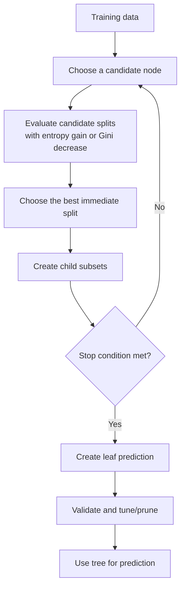
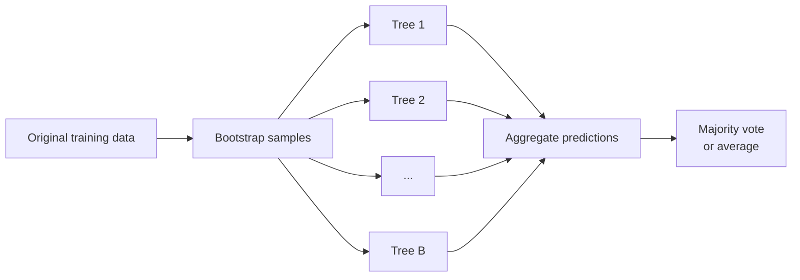

# Week 5 Lecture Notes — Decision Trees, Pruning, and Random Forests

> These notes condense the complete Week 5 lecture transcript. Terminology, formulas,
> and examples have been cleaned up while preserving the order and intent of the class.
> Images are taken from the `lecture_image` folder.

## Learning objectives

By the end of this lecture, you should be able to:

1. explain the structure of a decision tree;
2. use a trained tree to classify a new observation;
3. calculate entropy, information gain, and Gini impurity;
4. describe the greedy ID3 training procedure;
5. handle binary, categorical, ordinal, and continuous attributes;
6. explain why decision trees overfit;
7. distinguish pre-pruning from post-pruning;
8. explain multivariable splits;
9. describe how Random Forest combines bootstrapping, random feature selection, and
   majority voting.

---

## 1. What is a decision tree?

A decision tree is a supervised-learning model that makes a prediction by applying a
sequence of questions to an input. Each answer determines which branch to follow.

The lecture begins with a simple student decision:

- if the exam is more than two days away, play;
- otherwise, check whether there is a football match;
- if there is a match, play;
- if there is no match, study.


The same structure appears in real decision processes such as psychological
consultations and clinical assessment: the next question depends on earlier answers,
and the final path leads to a recommendation or class.

### 1.1 Tree terminology

| Term | Meaning |
|---|---|
| Root node | The first question and starting point of the tree |
| Decision/internal node | An intermediate question that splits the data |
| Branch/edge | The outcome of a question, such as `True` or `False` |
| Leaf/terminal node | The final node that produces a class or prediction |
| Subtree | A node together with all of its descendants |
| Depth | Number of splits along a path from the root |


### 1.2 A tree partitions the feature space

For an input vector

$$
\mathbf{x}=(x_1,x_2),
$$

a test such as $x_1\leq t_1$ divides the feature space into two regions. Later tests
divide the remaining mixed regions again. Every leaf corresponds to one final region
and assigns a class to observations in that region.


Different sequences of tests can partition the same data successfully. Therefore, a
data set may permit multiple valid trees. Training requires a criterion for selecting
which split to make first and which split to make next.

---

## 2. Prediction with a trained tree

Once a tree has been trained, prediction is straightforward:

1. start at the root;
2. evaluate its condition using the new observation;
3. follow the matching branch;
4. repeat until reaching a leaf;
5. return the leaf's class or estimated class probabilities.

The Week 5 example predicts stock `Return` from:

- `Past Trend`: `Positive` or `Negative`;
- `Open Interest`: `High` or `Low`;
- `Trading Volume`: `High` or `Low`.

The target is `Up` or `Down`.


For a new input with:

```text
Past Trend    = Positive
Open Interest = High
Trading Volume= High
```

the model follows only the tests on its path. A feature may not be used at all if an
earlier decision already reaches a leaf. This is one reason tree predictions are easy
to trace and interpret.

Prediction is the easy part. The central learning problem is how to construct the tree
from training data.

---

## 3. Training objective: create informative leaves

To introduce tree construction, the lecture initially assumes:

- every input attribute is binary;
- the target is binary.


At a leaf, the training samples may be:

- **pure**: all samples have the same label;
- **impure**: multiple labels are mixed together.

A pure leaf gives an unambiguous training prediction. An impure leaf normally predicts
the majority class, but its decision is less certain. For example:

- `4 Up, 0 Down`: pure, predict `Up`;
- `2 Up, 1 Down`: impure, predict `Up` by majority;
- `2 Up, 2 Down`: maximally ambiguous for a binary target.


The immediate objective of greedy tree training is therefore:

> Choose splits that make the child nodes purer than the parent node.

However, making every training leaf perfectly pure can memorise noise. Purity is the
local split objective; good test-set performance is the real modelling objective.

---

## 4. Entropy

Entropy measures uncertainty or class impurity in a data set or node $S$:

$$
\boxed{
\operatorname{Entropy}(S)
=-\sum_{c=1}^{C}p(c)\log_2p(c)
}
$$

where:

- $S$ is the current data set or node;
- $C$ is the number of classes;
- $c$ denotes one class;
- $p(c)$ is the proportion of samples in $S$ belonging to class $c$;
- $0\log_2 0$ is defined as $0$ by continuity.


### 4.1 Interpretation

- Entropy $=0$: the node is pure.
- Higher entropy: the labels are more mixed.
- For two classes, entropy is maximised at a 50/50 split and equals $1$ bit.
- For $C$ equally represented classes, the maximum is $\log_2 C$.

For a binary class with positive proportion $p$:

$$
H(p)=-p\log_2p-(1-p)\log_2(1-p).
$$


### 4.2 Leaf examples

For a leaf containing two positive and two negative samples:

$$
\begin{aligned}
\operatorname{Entropy}(S)
&=-\frac{2}{4}\log_2\frac{2}{4}
  -\frac{2}{4}\log_2\frac{2}{4}\\
&=1.
\end{aligned}
$$

For a leaf containing two positive and one negative sample:

$$
\operatorname{Entropy}(S)
=-\frac{2}{3}\log_2\frac{2}{3}
 -\frac{1}{3}\log_2\frac{1}{3}
\approx0.9183.
$$

For a leaf containing three negative samples:

$$
\operatorname{Entropy}(S)=-1\log_2(1)=0.
$$


For the historical development and broader ML applications of entropy, see
[entropy.md](entropy.md).

---

## 5. Information gain

Entropy evaluates one node. Information gain evaluates a candidate split.

### 5.1 What is information gain used for?

Information gain is used to choose the best attribute or threshold for splitting the
samples at the current decision-tree node. It answers:

> **How much uncertainty about the target class is removed after splitting on
> attribute $A$?**

At each node, a greedy tree:

1. generates candidate splits from the available attributes;
2. calculates the information gain of every candidate;
3. selects the split with the **largest information gain**;
4. repeats the process inside each child that still needs to be split.

The interpretation is:

- **large gain:** the split separates the classes well and creates purer children;
- **small gain:** the attribute provides little information about the target;
- **zero gain:** the weighted entropy after the split equals the parent entropy, so the
  split has not reduced class uncertainty.

In compact form:

```text
entropy before the split
− weighted entropy after the split
= information gain
```

Suppose attribute $A$ divides $S$ into children $S_v$, one for every branch value
$v\in\operatorname{Values}(A)$. Then:

$$
\boxed{
\operatorname{Gain}(S,A)
=\operatorname{Entropy}(S)
-\sum_{v\in\operatorname{Values}(A)}
\frac{\lvert S_v\rvert}{\lvert S\rvert}
\operatorname{Entropy}(S_v)
}
$$

| Component | Meaning |
|---|---|
| $\operatorname{Entropy}(S)$ | Uncertainty before the split |
| $\operatorname{Entropy}(S_v)$ | Uncertainty in one child |
| $\frac{\lvert S_v\rvert}{\lvert S\rvert}$ | Fraction of parent samples entering that child |
| Weighted sum | Expected uncertainty after the split |
| Information gain | Uncertainty removed by observing $A$ |

The weights are essential. A child that receives many samples should influence the
post-split score more than a very small child.

In information-theoretic notation, this empirical reduction is the mutual information
between target $Y$ and attribute $A$:

$$
\operatorname{Gain}(S,A)
=H(Y)-H(Y\mid A)
=I(Y;A).
$$

Therefore, an attribute with larger information gain contains more useful information
for predicting the target at that node.


### 5.2 Week 5 worked example

At the root:

- $\lvert S\rvert=10$;
- 4 samples are `Up`;
- 6 samples are `Down`.

Therefore:

$$
\operatorname{Entropy}(S)
=-\frac{4}{10}\log_2\frac{4}{10}
 -\frac{6}{10}\log_2\frac{6}{10}
\approx0.9710.
$$

Splitting on `Past Trend` creates:

- $S_1$ (`Positive`): 4 `Up`, 2 `Down`, entropy $\approx0.9183$;
- $S_2$ (`Negative`): 0 `Up`, 4 `Down`, entropy $=0$.

Thus:

$$
\begin{aligned}
\operatorname{Gain}(S,\text{Past Trend})
&=0.9710
  -\frac{6}{10}(0.9183)
  -\frac{4}{10}(0)\\
&\approx\boxed{0.4200}.
\end{aligned}
$$


The three root candidates give:

| Attribute | Information gain |
|---|---:|
| `Past Trend` | $0.4200$ |
| `Open Interest` | $0.0200$ |
| `Trading Volume` | $0.2814$ |

The greedy rule chooses the maximum, so `Past Trend` becomes the root.


After the root split:

- the `Negative` child is pure and becomes a `Down` leaf;
- the `Positive` child is still mixed, so the split-selection process repeats using
  only the six samples in that child and the remaining candidate attributes.

The current child becomes the new $S$. Do not continue using the original ten samples
when evaluating deeper splits.

---

## 6. Greedy tree learning: ID3

The lecture summarises ID3 as a recursive greedy algorithm:

```text
Split(node, examples):
    1. If the node is pure, stop and create a leaf.
    2. Evaluate every candidate attribute A.
    3. Choose the A with maximum information gain.
    4. Create one child for each value of A.
    5. Send the relevant examples to each child.
    6. Repeat Split(child, child_examples) for every impure child.
```


### 6.1 Why “greedy”?

At each node, ID3 selects the best immediate split. It does not examine every possible
complete future tree. The chosen split is locally optimal but is not guaranteed to
produce the globally smallest or best-generalising tree.

### 6.2 Stopping conditions

The simplest classroom condition is “stop when the node is pure.” Practical
implementations also stop when:

- maximum depth is reached;
- too few samples remain to split;
- a child would contain too few samples;
- impurity reduction is below a threshold;
- no valid split remains.

### 6.3 From ID3 to C4.5

C4.5 extends the ID3 family with practical capabilities including:

- continuous-attribute thresholds;
- handling of missing attribute values;
- post-pruning;
- **gain ratio**, which adjusts information gain's preference for attributes that
  create many branches.

C4.5 is not simply another name for pruning. Pruning is one part of the broader C4.5
algorithm.

---

## 7. Gini impurity as an alternative split criterion

Gini impurity is:

$$
\boxed{
\operatorname{Gini}(S)
=1-\sum_{c=1}^{C}p(c)^2
}
$$

A candidate split is evaluated by its decrease in weighted Gini impurity:

$$
\Delta\operatorname{Gini}(S,A)
=\operatorname{Gini}(S)
-\sum_v
\frac{\lvert S_v\rvert}{\lvert S\rvert}
\operatorname{Gini}(S_v).
$$

The best greedy split has the largest positive decrease.

Both entropy and Gini:

- equal $0$ at a pure node;
- are largest when classes are evenly represented;
- favour splits that create purer children;
- often, but not always, rank candidate splits similarly.

`DecisionTreeClassifier` in scikit-learn uses `criterion="gini"` by default, while
`"entropy"` and `"log_loss"` use Shannon information gain. The practical speed and
accuracy difference is often small; select the criterion through validation rather than
assuming one is universally superior.

For the history, derivation, and detailed worked example, see
[gini_impurity.md](gini_impurity.md).

---

## 8. Attribute types

The initial binary assumption can be extended.

### 8.1 Binary attributes

Examples:

- `Positive` / `Negative`;
- `High` / `Low`;
- `Yes` / `No`.

A binary attribute naturally produces two branches.

### 8.2 Categorical attributes

A categorical feature may have more than two values, such as boat size:

```text
Big / Medium / Small
```

Possible strategies include:

- one branch per category;
- grouping categories into two subsets;
- one-versus-rest tests.

### 8.3 Ordinal/ranked attributes

Ordered categories preserve rank information, such as:

```text
Low < Medium < High
```

A threshold can divide the order into two groups.

### 8.4 Continuous/real-valued attributes

For a continuous feature, sort its observed values and evaluate candidate thresholds:

$$
x_j\leq t.
$$

One child receives values at or below $t$; the other receives values above $t$. The
threshold is selected using impurity reduction.


---

## 9. Overfitting in decision trees

An unrestricted tree can continue splitting until it isolates small groups or even
individual training samples. This often produces:

- very low training error;
- deep, complex rules;
- sensitivity to noise and outliers;
- a large gap between training and test performance.


The solution is to control tree complexity through pruning.

### 9.1 Pre-pruning

Pre-pruning stops growth during training. Typical controls include:

| Control | Meaning |
|---|---|
| Maximum depth | Stop after a fixed number of levels |
| Minimum samples to split | Do not split a node with too few samples |
| Minimum samples per leaf | Reject splits that create very small leaves |
| Minimum impurity decrease | Split only when the reduction is large enough |
| Statistical test | Split only when evidence for an association is sufficient |

If training stops at an impure leaf, the leaf predicts the majority class or returns
the observed class proportions.


Advantages:

- faster than growing a full tree;
- can reduce sensitivity to noise;
- easy to configure.

Limitation: stopping early can remove a branch whose benefit would appear only after
later splits.

### 9.2 Post-pruning

Post-pruning first grows a larger tree, then removes subtrees:

1. evaluate the current tree on validation data;
2. replace a candidate subtree with a leaf;
3. evaluate the smaller tree;
4. keep the removal if validation performance is unchanged or improves;
5. repeat, generally working upward from lower subtrees.


Advantages:

- considers a more complete initial structure;
- uses validation evidence to simplify the model.

Limitations:

- requires additional computation;
- uses validation data for pruning decisions;
- the result depends on the pruning criterion.

### 9.3 Practical answers from the lecture discussion

- There is no universally best `max_depth`, `min_samples_leaf`, or pruning threshold.
  Treat them as hyperparameters and select them using validation or cross-validation.
- Pre-pruning and post-pruning can be combined.
- The aim is not necessarily to obtain zero training impurity; it is to improve
  generalisation.
- In scikit-learn, cost-complexity post-pruning is controlled by `ccp_alpha`.

---

## 10. Univariable and multivariable splits

### 10.1 Univariable/axis-aligned split

A standard test uses one feature:

$$
x_j-t>0.
$$

In two dimensions, this produces a horizontal or vertical decision boundary.

### 10.2 Multivariable/oblique split

A split may combine multiple features:

$$
\boxed{
\mathbf{w}^{\mathsf T}\mathbf{x}+w_0>0
}
$$

where:

- $\mathbf{x}$ contains the input features;
- $\mathbf{w}$ contains learned coefficients;
- $w_0$ is an intercept;
- the sign determines which branch to follow.

In two dimensions:

$$
w_1x_1+w_2x_2+w_0>0.
$$

This produces an oblique linear boundary and may represent a separation using fewer
nodes than an axis-aligned tree.


> **Technical note:** standard CART implementations, including the usual
> scikit-learn decision tree, use univariable axis-aligned splits. Oblique and nonlinear
> tree variants exist, but they are extensions rather than the default CART procedure.

---

## 11. From one tree to a Random Forest

A single tree is interpretable but unstable: a small change in the training data may
produce a different structure. Random Forest reduces this instability by combining many
different trees.


### 11.1 Bootstrap sampling

For a training set of $n$ rows, create a bootstrap data set by drawing $n$ rows **with
replacement**:

- a row may appear multiple times;
- some original rows may not appear;
- each tree receives a different bootstrap sample.


For large $n$, one bootstrap sample contains approximately $63.2\%$ unique training
rows. Approximately $36.8\%$ are left out and are called out-of-bag (OOB) samples:

$$
P(\text{a row is never selected})
=\left(1-\frac{1}{n}\right)^n
\longrightarrow e^{-1}\approx0.368.
$$

OOB samples can estimate prediction error without a separate validation pass for that
tree.

### 11.2 Random feature selection

At each split, a Random Forest normally:

1. selects a random subset of the available features;
2. searches for the best split only within that subset.

This prevents a few strong predictors from dominating every tree and helps decorrelate
the ensemble.

> **Important correction to the raw transcript:** feature bagging does not normally
> duplicate feature columns to keep the same dimensionality. Standard Random Forest
> selects a subset of distinct candidate features at each node.

### 11.3 Training algorithm

For $b=1,\ldots,B$:

1. draw a bootstrap sample from the training rows;
2. grow a decision tree;
3. at each node, consider only a random subset of features;
4. usually grow the tree with little or no pruning;
5. store the tree.

### 11.4 Prediction

For a new input $\mathbf{x}$:

1. obtain one class prediction from each tree;
2. count the votes;
3. return the majority class.

If five trees predict:

```text
Up, Up, Down, Up, Down
```

the forest predicts `Up` by a 3–2 majority.


For regression, the usual aggregation is the average of the trees' numerical
predictions rather than majority voting.

### 11.5 Why the ensemble helps

Different trees see different bootstrap samples and different candidate feature
subsets. Their errors are therefore less likely to be identical. Aggregating many
diverse trees reduces variance and usually generalises better than relying on one deep
tree.

Random Forest is more computationally expensive and less directly interpretable than a
single tree, but the trees can be trained in parallel.

---

## 12. End-to-end workflow



For Random Forest:



---

## 13. Formula sheet

### Entropy

$$
\operatorname{Entropy}(S)
=-\sum_{c=1}^{C}p(c)\log_2p(c)
$$

### Information gain

$$
\operatorname{Gain}(S,A)
=\operatorname{Entropy}(S)
-\sum_v
\frac{\lvert S_v\rvert}{\lvert S\rvert}
\operatorname{Entropy}(S_v)
$$

Choose the split with **maximum information gain**.

### Gini impurity

$$
\operatorname{Gini}(S)
=1-\sum_{c=1}^{C}p(c)^2
$$

### Gini decrease

$$
\Delta\operatorname{Gini}(S,A)
=\operatorname{Gini}(S)
-\sum_v
\frac{\lvert S_v\rvert}{\lvert S\rvert}
\operatorname{Gini}(S_v)
$$

Choose the split with **maximum Gini decrease**.

### Multivariable split

$$
\mathbf{w}^{\mathsf T}\mathbf{x}+w_0>0
$$

### Approximate OOB fraction

$$
\left(1-\frac{1}{n}\right)^n\approx e^{-1}\approx0.368
$$

---

## 14. Key takeaways

1. A decision tree predicts by following a path from the root to a leaf.
2. Training is a recursive partitioning problem.
3. Entropy and Gini quantify class mixture.
4. Information gain or Gini decrease evaluates how useful a split is.
5. ID3 greedily selects the largest information gain at each node.
6. Deeper splitting uses only the samples that reached the current node.
7. Continuous features are divided using learned thresholds.
8. Perfectly pure training leaves can indicate overfitting rather than a perfect model.
9. Pre-pruning stops growth; post-pruning removes parts of a grown tree.
10. Hyperparameters must be selected using validation—there is no universal best depth.
11. Random Forest builds diverse trees using bootstrap samples and random feature
    subsets.
12. Classification forests aggregate by voting; regression forests aggregate by
    averaging.
13. The lecture introduced classification evaluation measures but deferred their
    detailed treatment to a later class.
