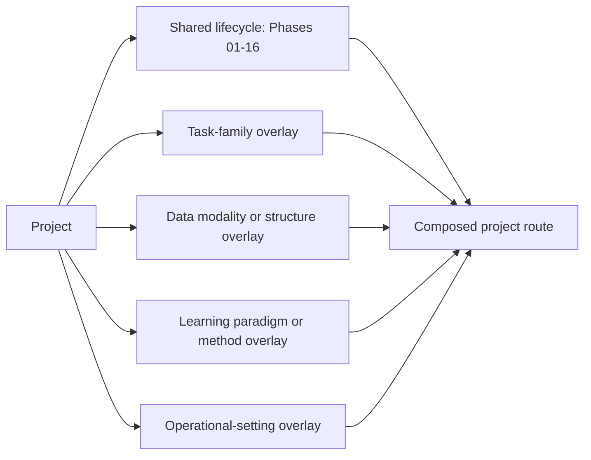

# Machine Learning Lifecycle Handbook

This folder is a documentation-first handbook for designing, evaluating, deploying, monitoring, and retiring machine-learning systems. It contains one shared lifecycle and a set of composable specialisation guides. It does not contain executable training or serving code.

## Start here

1. Use the [shared 16-phase lifecycle](machine_learning_lifecycle_phases/README.md) for requirements that apply to every project.
2. Describe the project with the [ML taxonomy passport](machine_learning_specialisations/taxonomy_and_coverage.md#ml-taxonomy-passport).
3. Select every applicable [specialisation overlay](machine_learning_specialisations/README.md).
4. Apply the strictest applicable rule for leakage, privacy, safety, and final evaluation.
5. Record why each selected overlay applies and which deliverables it adds.

The [single-page lifecycle reference](machine_learning_model_development_lifecycle.md) remains a compact classical-ML reference. The phase pages and specialisation guides are the canonical detailed documentation.

## Architecture

These axes are deliberately separate. For example, `image` is a modality, `classification` is a task, `self-supervised` describes a learning signal, `deep neural network` is a model family, and `federated` describes data and computation placement. A project may use all of them.

## Shared lifecycle

| Phase | Purpose |
|---:|---|
| 01 | Define the decision, task, target, users, success, constraints, and risks |
| 02 | Collect authorised, representative, traceable data and feedback |
| 03 | Understand and validate data, labels, structure, and leakage risks |
| 04 | Design development and final-evaluation partitions |
| 05 | Build leakage-safe representations and preprocessing |
| 06 | Establish meaningful non-learned and learned baselines |
| 07 | Train candidate systems under a reproducible protocol |
| 08 | Validate, tune, and select without touching the final test evidence |
| 09 | Compute task-appropriate metrics and uncertainty |
| 10 | Analyse errors, slices, robustness, safety, and failure modes |
| 11 | Run the locked final evaluation and release gate |
| 12 | Finalise the complete reproducible system artefact |
| 13 | Deploy through a controlled release with rollback |
| 14 | Monitor data, model, system, decision, and risk signals |
| 15 | Maintain or update through a controlled new lifecycle |
| 16 | Retire the system and its dependencies safely |

## Quick routing examples

| Project | Compose these guides |
|---|---|
| Tabular churn classifier | Core lifecycle; classification is core-owned |
| Frozen image encoder plus classifier | Core + deep/transfer + computer vision |
| Fine-tuned LLM with retrieval | Core + deep/transfer + foundation-model/system-pattern + NLP/LLM + recommendation/retrieval + generative when content is generated |
| Medical time-to-event model | Core + survival; add probabilistic/Bayesian if posterior inference is used |
| Fraud graph model updated weekly | Core + graph ML + anomaly detection; add online/continual only if updates occur incrementally |
| Contextual product recommender | Core + recommendation/ranking + reinforcement learning or bandits |
| Cross-hospital image model | Core + computer vision + deep learning + federated + privacy-preserving ML |
| Streaming sensor classification or forecasting | Core + temporal-sequence data + supervised/forecasting task + online/continual; add audio or geospatial when applicable |
| Generative multimodal assistant | Core + foundation-model/system-pattern + generative + multimodal + relevant modality guides + privacy |
| Automated model search | Core + AutoML; add the task and modality guides selected by the search |

## Coverage statement

The handbook covers the major practically relevant ML families across four orthogonal dimensions:

- learning paradigms and method regimes;
- prediction, discovery, generation, causal, and sequential-decision tasks;
- tabular, text, image, video, audio, time-series, graph, spatial, and multimodal data;
- offline, online, active, federated, privacy-preserving, and automated operating settings.

It does not claim to enumerate every historical algorithm, research subfield, scientific domain, or vendor product. New concepts should normally be routed to an existing axis before a new guide is created.

## Documentation map

- [Shared lifecycle phase handbook](machine_learning_lifecycle_phases/README.md)
- [Specialisation overlay index](machine_learning_specialisations/README.md)
- [Taxonomy and coverage matrix](machine_learning_specialisations/taxonomy_and_coverage.md)
- [Research and source policy](machine_learning_specialisations/research_and_source_policy.md)
- [Research report and source-to-claim map](research/ml_lifecycle_extension_research_2026-08-14.md)
- [Reusable overlay template](machine_learning_specialisations/_templates/specialisation_overlay_template.md)

## Composition rules

1. Core requirements always apply.
2. Dedicated task-family guides own target definition, evaluation protocol, and task metrics; when no dedicated task guide exists, the modality guide owns output-structure-specific evaluation.
3. Modality guides own ingestion, validation, representation, augmentation, and modality-shift controls.
4. Paradigm/method guides own learning objectives, training stages, and model-selection adaptations.
5. Operational guides own feedback acquisition, update cadence, data placement, privacy boundary, and automation controls.
6. A system-level technology such as RAG may require several overlays; do not force it into one taxonomy label.
7. When guides conflict, keep the stricter leakage, privacy, safety, and final-test isolation rule and document the decision.

## Source status

The specialisation expansion was researched on **2026-08-14**. Each guide carries official or primary references for its scope and central specialised controls; project implementations must add domain- and mechanism-specific sources where the guide marks a boundary. API and platform behaviour can change, so verify versioned documentation before implementation.
