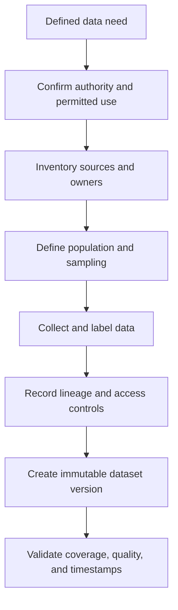

# Phase 02 — Data Collection and Governance

## Purpose

Acquire relevant, representative, authorised, secure, traceable, and reproducible data for the defined task.

## Visual map

## When this phase applies / task-specific variants

- Applies to every initial dataset and every later data refresh.
- Includes existing files/databases, APIs, logs, sensors, surveys, third-party data, and human annotation.
- Governance depth increases for personal, medical, financial, biometric, copyrighted, or high-risk data.

## Inputs

- approved problem and target definition;
- prediction unit, cutoff time, and horizon;
- source inventory and source owners;
- population and sampling requirements;
- label/annotation specification;
- legal, privacy, security, licensing, and retention requirements.

## Core tasks checklist

- [ ] Inventory every source, table/file, owner, access method, and update schedule.
- [ ] Define population, sampling frame, inclusion/exclusion rules, and collection period.
- [ ] Confirm feature and target timestamps relative to the prediction cutoff.
- [ ] Define schemas, units, keys, joins, category meanings, and missing-value conventions.
- [ ] Specify label creation, annotation guidance, adjudication, and quality review.
- [ ] Measure coverage of important classes, groups, locations, devices, and time periods.
- [ ] Identify duplicates, repeated entities, and cross-source overlap.
- [ ] Record consent, purpose limitation, licence, ownership, retention, and deletion rules.
- [ ] Identify PII/sensitive attributes and apply least-privilege access controls.
- [ ] Record lineage: source → extraction → transformation → dataset version.
- [ ] Create immutable snapshots or reproducible source queries.
- [ ] Validate that production-time inputs can be collected with compatible semantics.
- [ ] Document expected freshness, late-arriving data, corrections, and source failure handling.

## Case-specific decision table

| Case | Collection priorities | Key attention |
|---|---|---|
| Regression | Accurate continuous labels, units, measurement precision, full target range | Censoring, target caps/floors, measurement error, outlier provenance |
| Classification | Clear class taxonomy, positive-class policy, enough examples per class | Label ambiguity, class imbalance, changing definitions, negative sampling |
| Time series / forecasting | Sufficient history, stable timestamps, frequency, revisions, external events | Missing intervals, timezone, late data, revised targets, future information |
| Grouped data | Stable entity IDs, repeated observations, group metadata | Identity resolution, one entity represented under multiple IDs, privacy |
| Unsupervised learning | Representative natural population and relevant variables | Collection bias can create artificial clusters or anomaly patterns |
| Text | Language/locale, document boundaries, encoding, source and author metadata | Consent, copyright, toxic/sensitive content, templates and duplicates |
| Image | Capture device/context, resolution, label granularity, subject/source ID | Consent/licence, subject leakage, corrupt files, acquisition-condition bias |

## Scikit-learn keywords / APIs

Scikit-learn is not a data-ingestion, annotation, catalogue, lineage, access-control, or governance platform.

| Limited data-access need | Native scikit-learn API | Scope |
|---|---|---|
| OpenML datasets | `sklearn.datasets.fetch_openml` | Learning/benchmark datasets; verify dataset terms and metadata |
| Bundled toy datasets | `sklearn.datasets.load_iris`, `load_wine`, `load_breast_cancer`, etc. | Examples and education, not production collection |
| Synthetic data | `sklearn.datasets.make_classification`, `make_regression`, `make_blobs` | Testing and demonstrations; not evidence about the real population |
| SVMlight/LibSVM files | `sklearn.datasets.load_svmlight_file`, `dump_svmlight_file` | Sparse dataset file format |

Common broader tools—**not scikit-learn**:

- SQL engines, pandas, PyArrow, cloud object stores, APIs, and ETL/ELT tools: acquisition and transformation;
- labelling platforms: annotation workflow and adjudication;
- data catalogues and lineage platforms: ownership, discovery, provenance;
- DVC/lakeFS/data-versioning platforms: data snapshots and version control;
- Great Expectations or Pandera: declarative data-quality/schema checks;
- MLflow or other MLOps platforms: experiment and artefact tracking;
- encryption, IAM, secrets managers, and audit systems: security and access control.

## Key attention / pitfalls

- Collecting convenient data that does not represent the deployment population.
- Using labels or attributes created after the prediction cutoff.
- Losing source timestamps, entity IDs, lineage, or original units.
- Joining tables in a way that duplicates observations or leaks target information.
- Treating missing records as random without verifying the collection process.
- Ignoring rare classes, minority groups, unusual devices, locations, or time periods.
- Mixing revised and unrevised targets without a version policy.
- Using third-party, personal, or copyrighted data without valid permission and retention rules.
- Failing to preserve a reproducible raw snapshot or extraction query.
- Assuming synthetic or public benchmark data is representative of production.
- Collecting sensitive data “just in case” without a defined purpose.

## Outputs / deliverables

- source inventory and ownership register;
- data dictionary, schema, units, keys, and timestamp definitions;
- population and sampling specification;
- label/annotation guide and quality record;
- lineage map and immutable dataset/source version;
- consent, licence, privacy, retention, and access-control record;
- coverage and representativeness summary;
- train–production data compatibility assessment.

## Exit criteria

- Every field and label has an owner, meaning, source, timestamp, and permitted use.
- The dataset covers the intended population, relevant groups, and required time range.
- Labels and joins follow the prediction cutoff without known target leakage.
- Raw data can be reconstructed or retrieved from a fixed version.
- Access, privacy, licence, security, and retention requirements are approved.
- Known collection gaps and biases are documented for later evaluation.

---

[Previous: Problem Definition](01_problem_definition.md) · [Index](README.md) · [Next: Data Understanding and Validation](03_data_understanding_and_validation.md)
