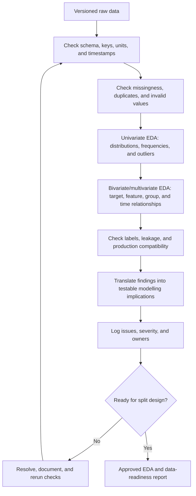

# Phase 03 — Exploratory Data Analysis (EDA), Understanding, and Validation

> Shared core phase. Add modality/structure integrity, contamination, annotation, reward, censoring, and feedback checks from the [specialisation overlays](../machine_learning_specialisations/README.md).

## Purpose

Explore the collected data statistically and visually, then confirm that it is structurally valid, understandable, sufficiently representative, and safe to move into model development.

## Is EDA a separate lifecycle phase?

EDA is not missing from this handbook. It is the exploratory workstream inside
Phase 03:

- Microsoft's current ML lifecycle names its second development stage "Explore
  and understand the data" and defines EDA as summarising and visualising data
  to reveal distributions, correlations, missing values, and outliers.
- IBM's CRISP-DM guidance groups data description, exploration with tables and
  graphics, and data-quality verification under the broader **Data
  Understanding** phase.

These are different labels for substantially overlapping lifecycle
responsibilities. This handbook keeps one combined phase to avoid duplicating
work. In a course report or notebook, it is still appropriate to use an
explicit **EDA** section and map it to this phase.

## Visual map

## When this phase applies / task-specific variants

- Run on the initial raw dataset and every new dataset version.
- Perform preliminary schema and quality checks before splitting.
- After the test set is locked, conduct target-informed exploration and modelling decisions on training data only.
- Reuse the same validation rules later for training–serving checks and monitoring.

## Inputs

- versioned raw dataset;
- problem, target, prediction-unit, cutoff, and horizon definitions;
- data dictionary and schema;
- source/lineage and label documentation;
- expected ranges, categories, frequencies, and quality thresholds.

## Core tasks checklist

- [ ] Verify row count, column count, schema, types, units, keys, and timestamp ranges.
- [ ] Measure missingness by column, target, group, and time.
- [ ] Detect exact duplicates, near-duplicates where relevant, and repeated entities.
- [ ] Review unique counts, constants, identifiers, rare values, and unexpected categories.
- [ ] Check allowed ranges, cross-field rules, impossible values, and referential integrity.
- [ ] Perform univariate EDA: inspect numeric distributions, categorical frequencies, and the target distribution.
- [ ] Perform bivariate EDA: inspect each plausible feature's relationship with the target using task-appropriate statistics and plots.
- [ ] Perform multivariate EDA: inspect correlations or associations, redundant signals, interactions, confounding groups, and time effects where relevant.
- [ ] Review class balance, multilabel structure, and samples per class where applicable.
- [ ] Investigate outliers; distinguish valid rare events from measurement/data errors.
- [ ] Check label quality, disagreement, ambiguity, missing labels, and delayed labels.
- [ ] Inspect relationships that may reveal target leakage or post-outcome variables.
- [ ] Review patterns by time, entity/group, location, source, device, and important subgroup.
- [ ] Compare development data definitions with expected production inputs.
- [ ] Record each material EDA finding with its evidence, modelling implication, and any follow-up experiment; do not treat correlation alone as proof of causation or a reason to remove a feature.
- [ ] Record each issue, severity, owner, resolution, and accepted limitation.
- [ ] Convert confirmed rules into repeatable validation tests.

## Case-specific decision table

| Case | Key checks | Key attention |
|---|---|---|
| Regression | Target range/distribution, units, missing labels, censoring, extreme errors | Invalid target values, caps/floors, skew, repeated measurements |
| Classification | Class counts, label policy, confusion in annotation, rare classes | Imbalance, label noise, class-definition drift, unsupported classes |
| Time series / forecasting | Ordering, frequency, gaps, duplicated timestamps, seasonality, revisions | Timezone, future-derived fields, irregular intervals, structural breaks |
| Grouped data | Group sizes, observations per entity, group overlap and identifiers | Dominant groups, duplicate identities, group-specific missingness |
| Unsupervised learning | Scale, distributions, correlations, density, missingness, outliers | Feature scale can dominate distance; validation needs domain review |
| Text | Empty/very short documents, language, encoding, length, duplicates, vocabulary | Templates, copied content, PII, label/source shortcuts |
| Image | File integrity, dimensions, channels, capture metadata, duplicates | Same subject in many images, metadata leakage, source/device artifacts |

## Scikit-learn keywords / APIs

| Need | Native scikit-learn API | Scope |
|---|---|---|
| Validate array shape/content | `sklearn.utils.validation.check_array` | Estimator-style numeric/array checks |
| Validate aligned features and target | `sklearn.utils.validation.check_X_y` | Consistent sample counts plus array validation |
| Validate finite values | `sklearn.utils.validation.assert_all_finite` | Detect NaN/infinity according to options |
| Inspect target type | `sklearn.utils.multiclass.type_of_target` | Binary, multiclass, multilabel, continuous, etc. |
| Check multilabel structure | `sklearn.utils.multiclass.is_multilabel` | Multilabel indicator detection |
| Inspect known labels | `sklearn.utils.multiclass.unique_labels` | Ordered label set across compatible targets |

Most exploratory analysis and business-rule validation is outside core scikit-learn:

- pandas/NumPy: summaries, duplicates, missingness, grouping, joins;
- Matplotlib/Seaborn/Plotly: distributions and visual checks;
- SciPy: statistical diagnostics;
- Great Expectations/Pandera: schema and data-contract tests;
- image/audio/text libraries: corrupt-file and modality-specific validation.

These are external tools, not scikit-learn APIs.

## Key attention / pitfalls

- Treating an unusual value as an error without checking domain provenance.
- Dropping missing values, outliers, or rare groups before understanding why they occur.
- Using the full test target distribution to select features, transformations, or models.
- Confusing correlation with causal value or valid prediction-time availability.
- Leaving ID-like, post-outcome, manually curated, or duplicated target-proxy fields unnoticed.
- Checking only global averages and missing failures in subgroups or time periods.
- Allowing exact or near duplicates to cross future train/test boundaries.
- “Fixing” data without recording the original value, rule, owner, and version.
- Assuming validation utilities replace domain-specific schema and semantic rules.
- Ignoring train–production differences in units, categories, timestamps, or collection logic.

## Outputs / deliverables

- reproducible EDA report containing plots, statistics, findings, and modelling implications;
- data profile and target profile;
- validated schema and reusable data-quality rules;
- missingness, duplicate, outlier, class/group/time coverage summaries;
- leakage-candidate list and confirmed exclusions;
- data-issue log with severity, owner, and resolution;
- approved cleaning rules and accepted limitations;
- data-readiness report for split design.

## Exit criteria

- Schema, units, keys, timestamps, target, and prediction unit match their definitions.
- Critical missingness, duplication, invalid-value, label, and leakage issues are resolved or explicitly accepted.
- Important classes, groups, periods, sources, and modalities have documented coverage.
- Material EDA findings are linked to evidence and a concrete downstream decision, check, or experiment.
- Repeatable validation rules detect known failure modes.
- The correct random, stratified, grouped, temporal, or custom split strategy can now be specified.

## Official references

- [Microsoft Learn: Machine learning lifecycle](https://learn.microsoft.com/en-us/azure/databricks/machine-learning/concepts/ml-lifecycle)
- [Microsoft Learn: Exploratory data analysis](https://learn.microsoft.com/en-us/azure/databricks/exploratory-data-analysis/)
- [IBM SPSS Modeler: Data Understanding Overview](https://www.ibm.com/docs/en/spss-modeler/saas?topic=understanding-data-overview)
- [Google Machine Learning Crash Course: Numerical data - First steps](https://developers.google.com/machine-learning/crash-course/numerical-data/first-steps)

---

[Previous: Data Collection and Governance](02_data_collection_and_governance.md) · [Index](README.md) · [Next: Data Splitting](04_data_splitting.md)
