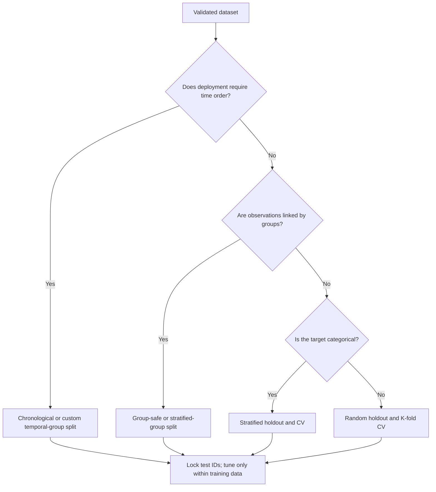

# Phase 04 — Data Splitting

## Purpose

Create independent partitions for parameter learning, model selection, and final generalisation evaluation without leakage.

## Visual map

## When this phase applies / task-specific variants

- Split before fitting any data-dependent imputer, encoder, scaler, feature selector, resampler, dimensionality reducer, or model.
- Supervised tasks normally need a locked test set plus validation or cross-validation within development data.
- Temporal, grouped, spatial, repeated-measure, and near-duplicate data require structure-aware splitting.
- Unsupervised tasks may still need holdout data for stability, novelty detection, or downstream evaluation; no universal split is mandatory for every exploratory clustering task.

## Inputs

- validated dataset version;
- prediction unit and target;
- timestamps and prediction horizon;
- entity/group/source IDs;
- duplicate and near-duplicate relationships;
- class distribution and sample counts;
- final evaluation and deployment scenario.

## Dataset roles

| Partition | Role | Must not be used for |
|---|---|---|
| Training set/fold | Fit preprocessing and model parameters | Final unbiased performance claim |
| Validation set/fold | Select features, model, threshold, and hyperparameters | Fitting the candidate being evaluated |
| Test set | One final evaluation after all choices are fixed | Preprocessing fit, tuning, feature selection, threshold selection |

## Core tasks checklist

- [ ] Define the independent sampling unit and every leakage-linked group.
- [ ] Choose random, stratified, grouped, temporal, spatial, or custom splitting.
- [ ] Reserve and lock the test set before data-dependent preprocessing.
- [ ] Choose a separate validation set or cross-validation within the training/development portion.
- [ ] Keep the same entity, subject, device, site, source, or duplicate family in one partition.
- [ ] Preserve temporal order and apply an appropriate gap when recent features overlap future targets.
- [ ] Preserve class proportions when appropriate and feasible.
- [ ] Verify enough samples, positive cases, classes, and groups exist in every required fold.
- [ ] Save row/entity IDs or split indices as a versioned artefact.
- [ ] Record splitter, parameters, random seed, dataset version, and resulting sizes.
- [ ] Compare feature/target/group/time coverage across partitions without tuning to test outcomes.
- [ ] Keep test labels and results hidden until the final-evaluation phase.

## Case-specific decision table

| Case | Preferred strategy / native API | Key attention |
|---|---|---|
| Independent regression | `train_test_split`, `ShuffleSplit`; `KFold` or `RepeatedKFold` for CV | Random split only when observations are genuinely independent |
| Independent classification | `train_test_split(..., stratify=y)`, `StratifiedShuffleSplit`, `StratifiedKFold`, `RepeatedStratifiedKFold` | Stratification preserves proportions but does not solve imbalance |
| Time series / forecasting | Chronological holdout, `TimeSeriesSplit(gap=..., test_size=..., max_train_size=...)` | No random shuffle; match forecast horizon and deployment backtest |
| Grouped / repeated entities | `GroupShuffleSplit`, `GroupKFold`, `LeaveOneGroupOut` | Pass `groups`; each group must remain wholly within one side |
| Grouped classification | `StratifiedGroupKFold` | Balance classes while preventing group overlap; feasibility depends on data |
| Spatial generalisation | Spatial blocks as groups plus group-based or custom splitter | No dedicated general-purpose spatial splitter in scikit-learn |
| Unsupervised learning | Use-case-specific holdout; `ShuffleSplit`, group/time split where needed | Define whether the goal is structure discovery, stability, or unseen-data inference |
| Text / image | Group by author, document family, source, subject, scene, or capture session | Exact/near duplicates and repeated subjects can cause severe leakage |

## Scikit-learn keywords / APIs

Official module: `sklearn.model_selection`.

| Need | Native API |
|---|---|
| Simple holdout | `train_test_split` |
| Random repeated splits | `ShuffleSplit` |
| Stratified random splits | `StratifiedShuffleSplit` |
| Standard CV | `KFold`, `RepeatedKFold` |
| Stratified classification CV | `StratifiedKFold`, `RepeatedStratifiedKFold` |
| Group holdout/CV | `GroupShuffleSplit`, `GroupKFold`, `LeaveOneGroupOut` |
| Stratified group CV | `StratifiedGroupKFold` |
| Ordered time CV | `TimeSeriesSplit` |
| Very small datasets | `LeaveOneOut`, `LeavePOut` |
| Fixed validation assignment | `PredefinedSplit` |
| Inspect generated indices | splitter `.split(X, y, groups)` |

Important API notes:

- `train_test_split` is a single holdout helper; `stratify=y` is mainly for categorical class labels.
- `random_state=` improves repeatability, but saved split IDs are more robust to row reordering or dataset updates.
- `GroupKFold` balances fold sizes approximately; `StratifiedGroupKFold` also attempts class preservation.
- Nested CV is a workflow: inner CV for tuning, outer CV for performance estimation.

## Key attention / pitfalls

- Normalising, imputing, selecting features, applying PCA, or resampling before the split.
- Randomly splitting time-dependent observations.
- Allowing the same person/device/site/document/subject or duplicate into multiple partitions.
- Using test results repeatedly until the model looks good; the test set then becomes validation data.
- Using ordinary `KFold` for classification when rare-class representation matters.
- Treating stratification as a remedy for class imbalance.
- Binning a continuous regression target solely to force stratification without validating the consequences.
- Choosing too many folds for the number of minority samples or independent groups.
- Reporting CV variability as a confidence interval without an appropriate statistical procedure.
- Recreating random splits after data order or dataset membership changes instead of versioning split IDs.
- Using spatially adjacent or temporally overlapping samples across folds when they share information.

## Outputs / deliverables

- versioned train/validation/test IDs or fold assignments;
- selected splitter and complete parameter configuration;
- random seed and dataset-version reference;
- partition sizes and class/group/time coverage summary;
- leakage-control rationale for groups, time, space, and duplicates;
- locked-test policy and access owner.

## Exit criteria

- No record or related information unit can leak across partitions under the defined use case.
- The split matches how the model will encounter unseen data in production.
- Every required fold has adequate samples, labels/classes, groups, and time coverage.
- All future learned preprocessing will be fitted only inside training data/folds.
- Split assignments are reproducible and versioned.
- Test data is locked and excluded from model-development decisions.

---

[Previous: EDA, Understanding, and Validation](03_data_understanding_and_validation.md) · [Index](README.md) · [Next: Preprocessing and Feature Engineering](05_preprocessing_and_feature_engineering.md)
