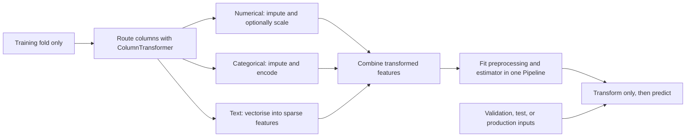

# Phase 05 — Preprocessing and Feature Engineering

> Shared core phase. Tokenisers, augmentation, learned representations, graph construction, pseudo-labels, and modality processors require the applicable [specialisation overlays](../machine_learning_specialisations/README.md).

## Purpose

Define a reproducible, leakage-safe transformation from raw inputs to model-ready features.

## Visual map

## When this phase applies / task-specific variants

- Applies after split design and before or jointly with model fitting.
- Any transformation that learns statistics must be fitted on a training set/fold only.
- Validation, test, and production data use `.transform()` from the already fitted pipeline.
- The required transformations depend on data type, model family, modality, and deployment environment.

## Inputs

- versioned train/validation/test or cross-validation assignments;
- raw feature schema and data-quality rules;
- prediction-time feature availability statement;
- missingness/category/outlier profile;
- candidate model families and their input requirements;
- compute, latency, memory, and interpretability constraints.

## Core tasks checklist

- [ ] Separate target, predictors, identifiers, groups, timestamps, and metadata roles.
- [ ] Define missing-value handling and missingness indicators.
- [ ] Define numeric scaling only where useful for the candidate model family.
- [ ] Define categorical encoding and unknown-category behaviour.
- [ ] Define text, date/time, interaction, spline, or domain feature generation.
- [ ] Ensure every engineered feature can be calculated at prediction time.
- [ ] Place column-specific transformations in a `ColumnTransformer`.
- [ ] Place preprocessing, optional selection, and estimator in one `Pipeline`.
- [ ] Fit all learned transformations separately inside every training fold.
- [ ] Place supervised feature selection and target encoding inside cross-validation.
- [ ] Apply class weighting or external resampling only to training folds.
- [ ] Check output feature names, order, shape, sparsity, memory, and runtime.
- [ ] Test missing values, unseen categories, schema errors, and extreme valid inputs.
- [ ] Record transformation parameters, dependencies, feature definitions, and random seeds.

## Case-specific decision table

| Case | Typical operations / APIs | Key attention |
|---|---|---|
| Regression | imputation, categorical encoding, optional scaling; `TransformedTargetRegressor` for target transformation | Fit target transform on training labels only; preserve target units in outputs |
| Classification | imputation, encoding, optional scaling; `class_weight`, `compute_class_weight` where supported | Preserve natural validation/test distribution; handle unseen categories |
| Time series / forecasting | past-only lags/rolling/calendar features via pandas or `FunctionTransformer`; `TimeSeriesSplit` | No future rows in rolling windows, interpolation, aggregates, or feature selection |
| Grouped data | group-safe historical aggregates and fold-aware preprocessing | Do not calculate an entity/target aggregate using validation or test observations |
| Unsupervised learning | imputation, scale-sensitive preprocessing, optional `PCA`/`TruncatedSVD` | Scale strongly affects distance/density methods; fit on reference/training data |
| Text | `CountVectorizer`, `TfidfVectorizer`, `HashingVectorizer`, optional `TruncatedSVD` | Keep sparse outputs where possible; control vocabulary leakage and memory |
| Image | External resize, normalisation, augmentation, and embeddings | Core scikit-learn has no general image augmentation or deep feature extractor |

## Exact scikit-learn keywords / APIs

### Composition and column routing

| Function | Native API |
|---|---|
| End-to-end chain | `sklearn.pipeline.Pipeline`, `make_pipeline` |
| Parallel feature chains | `sklearn.pipeline.FeatureUnion` |
| Per-column transformations | `sklearn.compose.ColumnTransformer` |
| Select columns by dtype/pattern | `sklearn.compose.make_column_selector` |
| Transform regression target | `sklearn.compose.TransformedTargetRegressor` |

### Missing values and scaling

| Function | Native API |
|---|---|
| Simple fill | `sklearn.impute.SimpleImputer` |
| Neighbour fill | `sklearn.impute.KNNImputer` |
| Multivariate fill | `sklearn.impute.IterativeImputer` — experimental; enable with `sklearn.experimental.enable_iterative_imputer` |
| Missingness flags | `sklearn.impute.MissingIndicator`, `SimpleImputer(add_indicator=True)` |
| Standardisation | `sklearn.preprocessing.StandardScaler` |
| Range scaling | `MinMaxScaler`, `MaxAbsScaler` |
| Robust scaling | `RobustScaler` |
| Row-wise unit norm | `Normalizer` — not the same operation as feature scaling |

### Encoding and feature generation

| Function | Native API |
|---|---|
| Nominal categories | `OneHotEncoder(handle_unknown="ignore")` |
| Ordered categories | `OrdinalEncoder` |
| Supervised category encoding | `TargetEncoder` |
| Custom deterministic transform | `FunctionTransformer` |
| Distribution transform | `PowerTransformer`, `QuantileTransformer` |
| Polynomial/interactions | `PolynomialFeatures` |
| Spline basis | `SplineTransformer` |
| Text counts/TF–IDF/hashing | `CountVectorizer`, `TfidfVectorizer`, `HashingVectorizer` |
| Dense reduction | `sklearn.decomposition.PCA` |
| Sparse reduction / LSA | `sklearn.decomposition.TruncatedSVD` |

`TargetEncoder.fit_transform(X_train, y_train)` uses internal cross-fitting. Use the fitted encoder’s `.transform()` for held-out data; keep it inside the model-selection pipeline.

### Feature selection

| Category | Native API |
|---|---|
| Low variance | `sklearn.feature_selection.VarianceThreshold` |
| Univariate | `SelectKBest`, `SelectPercentile`, `GenericUnivariateSelect` |
| Classification scores | `chi2`, `f_classif`, `mutual_info_classif` |
| Regression scores | `r_regression`, `f_regression`, `mutual_info_regression` |
| Recursive | `RFE`, `RFECV` |
| Sequential | `SequentialFeatureSelector` |
| Model-based | `SelectFromModel` |

`chi2` requires non-negative features. `permutation_importance` is a model-inspection tool, not a preprocessing selector.

### Class imbalance

- Native where estimator supports it: `class_weight=`, `sample_weight=`.
- Native calculation: `sklearn.utils.class_weight.compute_class_weight`.
- `SMOTE`, `RandomOverSampler`, and `RandomUnderSampler` are from external **imbalanced-learn**, not scikit-learn; resample training folds only and use an imbalanced-learn pipeline.

## Model-family preprocessing keywords

| Model family | Typical need |
|---|---|
| Linear/logistic with regularisation, SVM, KNN, MLP | Scaling commonly important |
| Decision trees, random forests, gradient-boosted trees | Scaling usually unnecessary |
| Distance/density clustering | Scaling often critical |
| Naive Bayes | Match feature assumptions; e.g. non-negative counts for `MultinomialNB` |
| Sparse text models | Sparse-compatible transformers and estimators; avoid accidental dense conversion |

## Key attention / pitfalls

- Calling `.fit()` or `.fit_transform()` on validation, test, or production data.
- Preprocessing the entire dataset before splitting.
- Fitting preprocessing once before cross-validation instead of inside each fold.
- Selecting features with target information outside the CV pipeline.
- Leakage from target encoding, target-based aggregation, future rolling windows, or post-outcome features.
- Resampling before the split or changing validation/test class distributions.
- Refitting an encoder/scaler when unseen data arrives instead of using the saved transform.
- Failing to define unknown-category behaviour.
- Confusing `Normalizer` with `StandardScaler` or `MinMaxScaler`.
- Applying `PCA` without scaling when scale differences are not meaningful.
- Polynomial, one-hot, or text feature explosion causing dense-memory failure.
- Removing valid outliers or imputing values without recording the rule and missingness meaning.
- Keeping identifiers or group IDs as predictive features without a valid production rationale.
- Using image augmentation before splitting, which can place variants of one source image in multiple partitions.

## Outputs / deliverables

- reviewed preprocessing and feature-engineering specification;
- unfitted pipeline template for safe CV plus fitted selected pipeline after training;
- raw-input and transformed-feature schemas;
- feature names, order, count, sparsity, memory, and latency report;
- unknown-category, missing-value, and schema-error behaviour;
- leakage review and prediction-time availability check;
- versioned feature definitions, code, configuration, and dependencies.

## Exit criteria

- One pipeline converts raw training-fold inputs into model-ready features without leakage.
- The same fitted pipeline transforms validation, test, and new data without refitting.
- All engineered features exist at prediction time and preserve the cutoff/horizon rules.
- Missing values, unseen categories, sparse/dense output, and schema failures have defined behaviour.
- Feature count, memory, latency, and model compatibility are acceptable.
- Selection, target encoding, and any resampling occur inside the correct training/CV scope.

---

[Previous: Data Splitting](04_data_splitting.md) · [Index](README.md) · [Next: Baseline Development](06_baseline_development.md)
