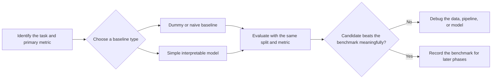

# Phase 06 — Baseline Development

> Shared core phase. Use task-specific heuristic, naive, pretrained/frozen, incumbent, or behaviour-policy baselines from the [specialisation overlays](../machine_learning_specialisations/README.md).

[← Phase 05: Preprocessing and Feature Engineering](05_preprocessing_and_feature_engineering.md) · [Lifecycle index](README.md) · [Phase 07: Model Training →](07_model_training.md)

## Purpose

Create the simplest credible benchmark that a trained model must outperform. A baseline is also a sanity check for the split, preprocessing, metric, and evaluation code.

## Visual map

## When this phase applies

- Always for supervised learning.
- Use a domain or naive rule for forecasting, ranking, recommendation, and anomaly detection.
- For unsupervised learning, define a simple reference only when the comparison is meaningful; there is no universal dummy clustering model.
- Skip only when an externally mandated benchmark already exists, and record that benchmark explicitly.

## Inputs

- frozen task definition and success metric;
- training split and validation strategy;
- target prevalence or target distribution from training data only;
- preprocessing pipeline, if the baseline requires features;
- business rule, current production model, or prior benchmark;
- minimum acceptable performance and operational constraints.

## Core tasks checklist

- [ ] Select a baseline aligned with the prediction task.
- [ ] Evaluate it with the same split, folds, metric, and sample weights planned for candidate models.
- [ ] Include a no-feature dummy or naive rule where possible.
- [ ] Add one simple interpretable trained model when useful.
- [ ] Compare against the current production or business-rule system when available.
- [ ] Record fold-level results, mean, variation, runtime, and inference cost.
- [ ] Confirm that candidate models actually beat the baseline by a useful margin.

## Case-specific decisions

| Case | Recommended baseline | Native scikit-learn keyword/API | Attention point |
|---|---|---|---|
| Regression | Mean, median, quantile, or fixed prediction | `sklearn.dummy.DummyRegressor` | Choose `strategy` to match the metric and business loss |
| Binary classification | Class prior, most frequent class, stratified draw, or fixed class | `sklearn.dummy.DummyClassifier` | Accuracy can reward the majority class on imbalanced data |
| Multiclass classification | Prior or most-frequent class | `DummyClassifier` | Report macro/per-class metrics, not only accuracy |
| Simple supervised benchmark | Linear or logistic model | `LinearRegression`, `Ridge`, `LogisticRegression` | Keep preprocessing identical to later models |
| Time series | Last value, seasonal naive, historical mean | Custom rule; no dedicated scikit-learn forecaster baseline | Backtest chronologically; never shuffle future into past |
| Grouped data | Global baseline plus group-aware business rule if deployable | `GroupKFold` or another group-aware splitter for evaluation | Do not calculate group statistics from validation groups |
| Clustering | Domain grouping or simple `KMeans` reference | `sklearn.cluster.KMeans` | No universal dummy baseline; metric choice changes the comparison |
| Anomaly detection | Known rule, random ranking, or prevalence-based threshold | Usually custom; `DummyClassifier` only when labels and a supervised framing exist | Compare false-alarm burden as well as detection rate |
| Ranking/recommendation | Popularity, recency, random, or current production rule | Custom; no dedicated scikit-learn recommender baseline | Evaluate by query/user groups and at the required cutoff `K` |

## Exact scikit-learn keywords and APIs

### Dummy estimators

- `sklearn.dummy.DummyRegressor(strategy="mean" | "median" | "quantile" | "constant")`
- `sklearn.dummy.DummyClassifier(strategy="prior" | "most_frequent" | "stratified" | "uniform" | "constant")`
- `DummyRegressor.fit`, `predict`, `score`
- `DummyClassifier.fit`, `predict`, `predict_proba`, `score`

### Simple trained references

- `sklearn.linear_model.LinearRegression`
- `sklearn.linear_model.Ridge`
- `sklearn.linear_model.LogisticRegression`
- `sklearn.cluster.KMeans`

### Comparable evaluation

- `sklearn.pipeline.Pipeline`
- `sklearn.model_selection.cross_validate`
- `sklearn.model_selection.cross_val_score`
- `sklearn.model_selection.TimeSeriesSplit`
- `sklearn.model_selection.GroupKFold`
- `sklearn.metrics.get_scorer_names`

## Key attention and pitfalls

- **Metric mismatch:** a mean baseline may be natural for squared error, while a median baseline is more aligned with absolute error.
- **Imbalance illusion:** `most_frequent` can have high accuracy and zero usefulness for the minority class.
- **Unfair comparison:** use identical folds, preprocessing scope, scoring, and filtering for the baseline and candidates.
- **Leakage:** learn target statistics and preprocessing parameters from each training fold only.
- **Weak straw baseline:** include the current production or business rule if it is stronger than a dummy estimator.
- **Random baseline variance:** set `random_state` for stochastic strategies such as `stratified`.
- **Unsupported task:** scikit-learn has no dedicated naive forecaster, recommender baseline, or dummy clusterer.
- **Operational gap:** a small metric gain may not justify much higher latency, memory, or maintenance cost.

## Outputs and deliverables

- baseline specification and rationale;
- reproducible baseline pipeline or custom rule;
- validation results with fold-level variation;
- comparison table: dummy/naive, simple trained model, production rule;
- minimum improvement required from candidate models;
- documented metric, split strategy, seed, runtime, and limitations.

## Exit criteria

- The baseline is reproducible and leakage-free.
- It is evaluated under the same protocol planned for candidate models.
- Results are plausible and expose no obvious pipeline or metric bug.
- The team has a written threshold for deciding whether added complexity is worthwhile.

[← Phase 05](05_preprocessing_and_feature_engineering.md) · [Lifecycle index](README.md) · [Phase 07 →](07_model_training.md)
