# Phase 07 — Model Training

[← Phase 06: Baseline Development](06_baseline_development.md) · [Lifecycle index](README.md) · [Phase 08: Validation and Hyperparameter Tuning →](08_validation_and_hyperparameter_tuning.md)

## Purpose

Fit candidate estimators on training data so they learn model parameters. Keep every data-dependent transformation inside the same reproducible training pipeline.

## Visual map

```mermaid
flowchart LR
    A["Training data and targets"] --> B["Reproducible preprocessing pipeline"]
    B --> C["Choose justified candidate families"]
    C --> D["Fit on training data or a training fold"]
    D --> E["Track convergence, runtime, and resources"]
    E --> F["Capture the fitted pipeline and parameters"]
    F --> G["Record versions, seeds, and experiment ID"]
    G --> H["Candidate artifacts for validation"]
```

## When this phase applies

- After the split, preprocessing design, and baseline are fixed.
- Train several justified model families; do not try every estimator without a task reason.
- Adapt the estimator, loss, weighting, and training protocol to target type, data structure, scale, latency, and interpretability needs.
- Time-aware, group-aware, unsupervised, anomaly, and ranking cases require specialised data handling even when they reuse standard estimators.

## Inputs

- training data and target, or unlabeled training data for unsupervised tasks;
- fitted-by-training pipeline definition, not globally pre-fitted transformers;
- feature schema and target definition;
- baseline results and primary metric;
- candidate model families and initial configurations;
- resource, latency, explainability, and reproducibility constraints;
- sample weights, class weights, groups, or timestamps where applicable.

## Core tasks checklist

- [ ] Build preprocessing and estimator as one `Pipeline`.
- [ ] Fit only on training data or the training fold.
- [ ] Start with a small, justified set of model families.
- [ ] Set seeds for stochastic estimators and record package versions.
- [ ] Apply `sample_weight` or `class_weight` only when supported and justified.
- [ ] Monitor convergence warnings, runtime, memory, and model size.
- [ ] Save training configuration and fold/experiment identifiers.
- [ ] Compare training performance with the baseline; reserve model selection for validation.

## Case-specific decisions

| Case | Candidate families | Native scikit-learn keywords/APIs | Attention point |
|---|---|---|---|
| Numeric regression | Linear, regularised linear, tree ensembles, SVR, KNN, MLP | `LinearRegression`, `Ridge`, `Lasso`, `ElasticNet`, `RandomForestRegressor`, `HistGradientBoostingRegressor`, `SVR`, `KNeighborsRegressor`, `MLPRegressor` | Match loss and target support; inspect skew and outliers |
| Count/positive target | Generalised linear model or tree model | `PoissonRegressor`, `GammaRegressor`, `TweedieRegressor` | Verify target domain and distribution assumptions |
| Robust/quantile regression | Robust linear or quantile model | `HuberRegressor`, `RANSACRegressor`, `TheilSenRegressor`, `QuantileRegressor`, `GradientBoostingRegressor(loss="quantile")` | Define whether the goal is central value, robustness, or interval quantiles |
| Binary/multiclass classification | Linear, tree ensemble, SVM, neighbours, Naive Bayes, MLP | `LogisticRegression`, `RandomForestClassifier`, `HistGradientBoostingClassifier`, `SVC`, `LinearSVC`, `KNeighborsClassifier`, `GaussianNB`, `MLPClassifier` | Confirm class encoding, score/probability needs, and imbalance treatment |
| Sparse text/count features | Sparse-compatible linear or Naive Bayes model | `LogisticRegression`, `LinearSVC`, `SGDClassifier`, `MultinomialNB`, `ComplementNB` | Avoid accidental dense conversion |
| Time series | Lag/rolling/calendar features plus a regressor | `TimeSeriesSplit`, `HistGradientBoostingRegressor` and other regressors | No dedicated ARIMA/Prophet estimator; features must use past data only |
| Grouped/repeated entities | Standard estimator plus group-safe evaluation | `GroupKFold`, `StratifiedGroupKFold`, `LeaveOneGroupOut` | Estimator training is ordinary; split logic must prevent entity leakage |
| Clustering | Centroid, hierarchical, density, spectral, mixture | `KMeans`, `AgglomerativeClustering`, `DBSCAN`, `HDBSCAN`, `OPTICS`, `SpectralClustering`, `GaussianMixture` | Scaling, distance, density, and cluster shape matter |
| Dimensionality reduction | Linear factors or manifold embedding | `PCA`, `TruncatedSVD`, `NMF`, `FastICA`, `TSNE`, `Isomap` | `TSNE` is mainly exploratory; it has no general `transform` for new data |
| Anomaly/novelty detection | Isolation, local density, one-class boundary, robust covariance | `IsolationForest`, `LocalOutlierFactor`, `OneClassSVM`, `SGDOneClassSVM`, `EllipticEnvelope` | For unseen-data novelty with LOF, set `novelty=True` before fitting |
| Semi-supervised classification | Graph propagation or pseudo-labelling | `LabelPropagation`, `LabelSpreading`, `SelfTrainingClassifier` | Validate label quality and unlabeled-data assumptions |
| Ranking/recommendation | Classification/regression or decomposition building blocks | `NearestNeighbors`, `NMF`, supervised estimators | No dedicated collaborative-filtering or learning-to-rank estimator |

## Exact scikit-learn keywords and APIs

### Pipeline and composition

- `sklearn.pipeline.Pipeline`
- `sklearn.pipeline.make_pipeline`
- `sklearn.compose.ColumnTransformer`
- `sklearn.compose.TransformedTargetRegressor`
- `fit`, `transform`, `fit_transform`, `predict`, `predict_proba`, `decision_function`
- nested parameter name: `step_name__parameter_name`

### Regression families

- Linear: `LinearRegression`, `Ridge`, `Lasso`, `ElasticNet`, `SGDRegressor`
- Robust/quantile: `HuberRegressor`, `RANSACRegressor`, `TheilSenRegressor`, `QuantileRegressor`
- Generalised linear: `PoissonRegressor`, `GammaRegressor`, `TweedieRegressor`
- Trees/ensembles: `DecisionTreeRegressor`, `RandomForestRegressor`, `ExtraTreesRegressor`, `GradientBoostingRegressor`, `HistGradientBoostingRegressor`
- Other: `SVR`, `LinearSVR`, `KNeighborsRegressor`, `KernelRidge`, `GaussianProcessRegressor`, `MLPRegressor`

### Classification families

- Linear: `LogisticRegression`, `RidgeClassifier`, `SGDClassifier`, `Perceptron`, `PassiveAggressiveClassifier`
- Naive Bayes: `GaussianNB`, `MultinomialNB`, `ComplementNB`, `BernoulliNB`, `CategoricalNB`
- Trees/ensembles: `DecisionTreeClassifier`, `RandomForestClassifier`, `ExtraTreesClassifier`, `GradientBoostingClassifier`, `HistGradientBoostingClassifier`, `AdaBoostClassifier`, `BaggingClassifier`
- Other: `SVC`, `LinearSVC`, `KNeighborsClassifier`, `LinearDiscriminantAnalysis`, `QuadraticDiscriminantAnalysis`, `GaussianProcessClassifier`, `MLPClassifier`
- Combined models: `VotingClassifier`, `StackingClassifier`

### Weighting and reproducibility

- estimator parameter where supported: `class_weight="balanced"`
- `sklearn.utils.class_weight.compute_class_weight`
- `sklearn.utils.class_weight.compute_sample_weight`
- estimator-specific `sample_weight` in `fit`
- estimator-specific `random_state`, `n_jobs`, `warm_start`, `early_stopping`

## External tools, not native scikit-learn

| Need | External package/examples |
|---|---|
| XGBoost, LightGBM, CatBoost | `xgboost`, `lightgbm`, `catboost` |
| SMOTE and specialised resampling | `imbalanced-learn` |
| ARIMA/SARIMA/exponential smoothing | `statsmodels` or forecasting libraries |
| Prophet | `prophet` |
| Deep learning, RNN/LSTM, transformers | PyTorch, TensorFlow, Keras |
| Dedicated recommender/learning-to-rank systems | Specialist libraries or custom implementation |

## Key attention and pitfalls

- **Preprocessing leakage:** do not pre-fit imputation, scaling, encoding, PCA, or feature selection on all data.
- **Parameter versus hyperparameter:** training learns coefficients/tree structure; validation selects configuration such as `alpha`, `C`, depth, or degree.
- **Convergence:** do not silence `ConvergenceWarning` without diagnosing scaling, solver, tolerance, iteration limit, or data issues.
- **Probability requirement:** not every classifier provides `predict_proba`; `decision_function` scores are not probabilities.
- **Sparse/dense mismatch:** some transformations or estimators densify sparse matrices and can exhaust memory.
- **Class imbalance:** weighting changes the fitted objective; evaluate with an imbalance-aware metric and inspect calibration.
- **Target transformation:** fit target transforms on training data and invert predictions correctly; use `TransformedTargetRegressor` when appropriate.
- **Time leakage:** rolling, lagged, and aggregate features must not use future observations.
- **Group leakage:** repeated people, devices, patients, or organisations must remain in the intended split group.
- **Reproducibility:** `random_state` improves repeatability but does not guarantee identical results across all platforms, versions, or parallel execution paths.

## Outputs and deliverables

- trained candidate pipelines;
- estimator and preprocessing configurations;
- seeds, versions, hardware/resource notes, runtime, and convergence status;
- training metrics and learning logs where available;
- model artefacts kept for validation, not yet declared final;
- traceable experiment identifiers.

## Exit criteria

- Every candidate can be re-created from code and configuration.
- Only training data was used to learn model and preprocessing parameters.
- Training completes without unexplained errors or convergence warnings.
- Candidates produce the outputs required by the chosen metric and deployment use case.
- Candidates are ready for identical, leakage-free validation.

[← Phase 06](06_baseline_development.md) · [Lifecycle index](README.md) · [Phase 08 →](08_validation_and_hyperparameter_tuning.md)
