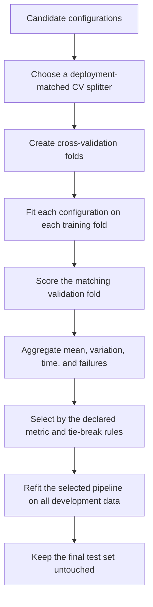

# Phase 08 — Validation and Hyperparameter Tuning

> Shared core phase. Add compute/label/privacy budgets, checkpoint selection, repeated seeds, off-policy evaluation, and search-overfitting controls from the [specialisation overlays](../machine_learning_specialisations/README.md).

[← Phase 07: Model Training](07_model_training.md) · [Lifecycle index](README.md) · [Phase 09: Evaluation Metrics →](09_evaluation_metrics.md)

## Purpose

Estimate development performance and select the model, preprocessing choices, threshold, and hyperparameters that are most likely to generalise.

## Visual map

## When this phase applies

- After candidate pipelines can train successfully.
- Use a validation set when data or compute is large enough; use cross-validation when a more stable estimate is needed.
- The split strategy must follow how unseen data will arrive: independent rows, future periods, new groups, or new queries.
- Use nested cross-validation when an approximately unbiased performance estimate is required during repeated model selection and no separate test evaluation is sufficient.

## Inputs

- candidate pipelines and hyperparameter spaces;
- development/training data; untouched test data remains excluded;
- primary metric, secondary diagnostics, and tie-breaking rules;
- splitter matched to class, group, and time structure;
- compute budget, search budget, seed, and stopping policy;
- sample weights, groups, or timestamps when needed.

## Core tasks checklist

- [ ] Choose the primary metric before viewing search results.
- [ ] Choose a splitter that matches the real generalisation unit.
- [ ] Put all learned preprocessing inside the searched `Pipeline`.
- [ ] Define sensible parameter ranges and distributions.
- [ ] Run the same folds across candidates when practical.
- [ ] Record mean, variation, fold results, fit time, and score time.
- [ ] Inspect train-versus-validation performance and failed fits.
- [ ] Select using validation/CV only; do not consult the final test set.
- [ ] Refit the selected pipeline on all development data when appropriate.

## Case-specific decisions

| Case | Validation strategy | Native scikit-learn keywords/APIs | Attention point |
|---|---|---|---|
| IID regression | K-fold or repeated K-fold | `KFold`, `RepeatedKFold` | Shuffling is optional and must be seeded when enabled |
| Binary/multiclass classification | Preserve class proportions | `StratifiedKFold`, `RepeatedStratifiedKFold`, `StratifiedShuffleSplit` | Stratification does not prevent entity or time leakage |
| Grouped/repeated entities | Hold whole groups out | `GroupKFold`, `GroupShuffleSplit`, `LeaveOneGroupOut` | Pass `groups`; define the deployment unit correctly |
| Grouped classification | Preserve classes while separating groups | `StratifiedGroupKFold` | Feasibility depends on class distribution across groups |
| Time series/forecasting | Forward, expanding-window validation | `TimeSeriesSplit` | Preserve order; configure `gap`, `test_size`, `max_train_size` when needed |
| Fixed external validation set | Predefined fold membership | `PredefinedSplit` | Do not fit preprocessing on the validation portion |
| Small supervised dataset | Repeated or nested CV | inner `GridSearchCV`/`RandomizedSearchCV` plus outer `cross_validate` | Report outer-fold performance, not inner best score |
| Clustering/unsupervised | Stability analysis and internal metrics | `silhouette_score`, `davies_bouldin_score`, `calinski_harabasz_score` | No universal CV protocol; internal metrics encode assumptions |
| Labelled anomaly detection | Stratified/group/time-aware supervised evaluation | standard splitters plus `average_precision`, recall, precision | Preserve realistic rarity and avoid synthetic prevalence in final reporting |
| Ranking/recommendation | Split by time, user, query, or session | usually custom split and scorer | Random row CV often leaks user/item history |

## Exact scikit-learn keywords and APIs

### Evaluation helpers

- `sklearn.model_selection.cross_val_score`
- `sklearn.model_selection.cross_validate`
- `sklearn.model_selection.cross_val_predict`
- `sklearn.model_selection.learning_curve`
- `sklearn.model_selection.validation_curve`
- `sklearn.model_selection.LearningCurveDisplay`
- `sklearn.model_selection.ValidationCurveDisplay`

`cross_val_predict` creates out-of-fold predictions for diagnostics or stacking-style workflows. Its combined output is not automatically a valid generalisation score for every metric or fold configuration.

### Search APIs

- `sklearn.model_selection.GridSearchCV`
- `sklearn.model_selection.RandomizedSearchCV`
- `sklearn.model_selection.ParameterGrid`
- `sklearn.model_selection.ParameterSampler`
- experimental: `HalvingGridSearchCV`, `HalvingRandomSearchCV`
- required experimental import: `from sklearn.experimental import enable_halving_search_cv`

### Search configuration keywords

- pipeline parameter: `step_name__parameter_name`
- scoring: `scoring`, `sklearn.metrics.make_scorer`, `get_scorer_names`
- multiple metrics: `scoring={...}`, `refit="metric_name"` or callable `refit`
- compute: `n_jobs`, `pre_dispatch`, `verbose`
- results: `best_estimator_`, `best_params_`, `best_score_`, `cv_results_`
- fit handling: `error_score`, `return_train_score`
- random search: `n_iter`, `random_state`

### Calibration and decision threshold

- probability calibration: `sklearn.calibration.CalibratedClassifierCV`
- decision-threshold tuning: `sklearn.model_selection.TunedThresholdClassifierCV`
- diagnostic curve: `CalibrationDisplay`, `calibration_curve`

Calibration changes probability estimates; threshold tuning changes the action rule. They are separate decisions and need validation data or internal cross-validation.

## Common hyperparameter keywords

| Family | Typical parameters |
|---|---|
| Polynomial features | `degree`, `interaction_only`, `include_bias` |
| Ridge/Lasso/Elastic Net | `alpha`, `l1_ratio` |
| Logistic regression/SVM | `C`, `penalty`, `solver`, `kernel`, `gamma` |
| Decision tree | `max_depth`, `min_samples_split`, `min_samples_leaf`, `criterion`, `ccp_alpha` |
| Random forest/Extra Trees | `n_estimators`, `max_features`, `max_depth`, `min_samples_leaf` |
| Gradient boosting | `learning_rate`, `n_estimators`, `max_depth`/leaf controls, `subsample` |
| KNN | `n_neighbors`, `weights`, `metric`, `p` |
| MLP | `hidden_layer_sizes`, `activation`, `alpha`, `learning_rate_init`, `batch_size`, `early_stopping` |

## External tools, not native scikit-learn

- Bayesian optimisation and study management: Optuna and other optimisation libraries.
- Hyperband as a general tuner: external tools; scikit-learn successive halving is related but not a general Hyperband API.
- Distributed experiment orchestration: Ray Tune, Dask integrations, or platform-specific systems.

## Key attention and pitfalls

- **Test-set peeking:** choosing any setting after seeing test performance turns the test set into development data.
- **Preprocessing outside CV:** globally fitted scalers, encoders, imputers, selectors, PCA, or resampling leak fold information.
- **Wrong splitter:** random folds are invalid for many temporal, grouped, spatial, or repeated-entity datasets.
- **Metric shopping:** define the primary metric and tie-breakers before search.
- **Search overfitting:** a very large search can overfit the validation protocol; use nested CV or a final untouched test set.
- **Invalid ranges:** search plausible scales; regularisation and learning rates often benefit from logarithmic ranges.
- **Negative scorer confusion:** scikit-learn loss scorers use the higher-is-better convention and often begin with `neg_`.
- **Unfair resources:** compare model families under clear compute/time budgets.
- **Parallel reproducibility:** record `random_state`, `n_jobs`, versions, and search space.
- **Failed candidates:** inspect `cv_results_` and warnings; do not silently interpret failed fits as genuine poor performance.
- **Threshold leakage:** do not optimise the decision threshold on the final test set.

## Outputs and deliverables

- selected pipeline and hyperparameters;
- full search space, splitter, folds/groups, metric, seed, and compute budget;
- `cv_results_` or equivalent experiment table;
- fold-level train/validation scores and timing;
- overfitting/underfitting diagnostics;
- selected calibration and threshold policy where relevant;
- justification for the chosen model, including complexity and operational trade-offs.

## Exit criteria

- The selection protocol matches the deployment data structure.
- All learned transformations were fitted inside each training fold.
- The chosen model beats the agreed baseline by a meaningful and sufficiently stable margin.
- Results are reproducible and no unresolved failed fits or leakage concerns remain.
- The final test set has not influenced any development decision.

[← Phase 07](07_model_training.md) · [Lifecycle index](README.md) · [Phase 09 →](09_evaluation_metrics.md)
