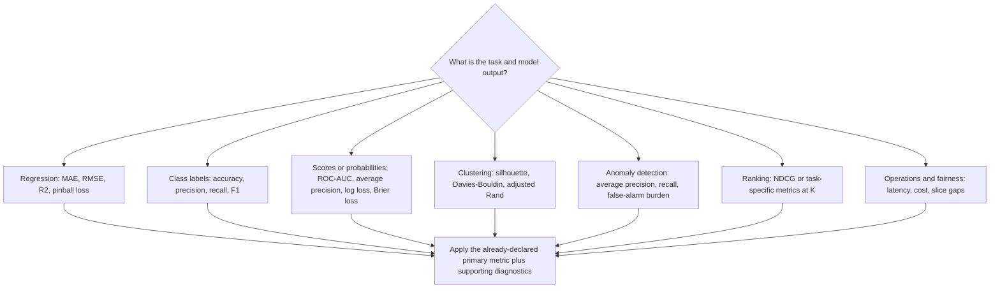

# Phase 09 — Evaluation Metrics

> Shared core phase. Route specialised metrics, aggregation units, uncertainty, and human evaluation through the applicable [specialisation overlays](../machine_learning_specialisations/README.md), especially their task and modality guides.

[← Phase 08: Validation and Hyperparameter Tuning](08_validation_and_hyperparameter_tuning.md) · [Lifecycle index](README.md) · [Phase 10: Error Analysis and Robustness →](10_error_analysis_and_robustness.md)

## Purpose

Measure model quality in terms that match the prediction task, business cost, decision rule, and deployment population. Use one declared primary metric plus supporting diagnostics.

## Visual map

## When this phase applies

- Define metrics during problem definition, use them during validation, and confirm them during final evaluation and monitoring.
- Choose metrics by target type and output type: prediction, class label, score, probability, cluster label, or ranking.
- Add slice, operational, and fairness measurements when aggregate predictive quality is insufficient.
- No single metric is correct for every problem.

## Inputs

- ground truth where available;
- predictions, scores, probabilities, clusters, or ranked outputs;
- baseline and candidate outputs on identical observations;
- sample weights and important group/slice labels;
- business costs, alert capacity, decision threshold, and required cutoff `K`;
- split/fold identifiers to preserve valid aggregation.

## Core tasks checklist

- [ ] Declare the primary metric and optimisation direction.
- [ ] Match the metric to the estimator output type.
- [ ] Add secondary metrics that expose costly failure modes.
- [ ] Report fold-level variation or uncertainty, not only one mean.
- [ ] Report per-class, per-group, per-horizon, or per-query results where relevant.
- [ ] Compare with the baseline under the same evaluation protocol.
- [ ] Record threshold, averaging method, labels, weights, and cutoff `K`.
- [ ] Keep operational and fairness metrics separate from predictive metrics while reviewing all of them together.

## Case-specific metric decisions

| Case | Primary candidates | Supporting diagnostics | Attention point |
|---|---|---|---|
| General regression | MAE, RMSE, $R^2$ | Median AE, residual plots | MAE weights errors linearly; RMSE emphasises large errors; $R^2$ can be negative |
| Positive/skewed regression | RMSLE, MAE, pinball loss | Error by target range | RMSLE requires valid non-negative targets/predictions |
| Binary balanced classification | Accuracy, F1, ROC-AUC | Confusion matrix, precision, recall, log loss | Label metric requires a threshold; AUC uses scores |
| Binary imbalanced classification | Average Precision, recall, precision, F-beta, balanced accuracy | ROC-AUC, confusion matrix, alert volume | Accuracy can hide minority-class failure |
| Multiclass classification | Macro/weighted F1, balanced accuracy, log loss | Per-class report, confusion matrix, top-k accuracy | Record macro/micro/weighted averaging and label order |
| Probability quality | Log loss, Brier loss | Calibration curve | Probability quality and discrimination are different |
| Time series/forecasting | MAE, RMSE, pinball loss; custom MASE/sMAPE/WAPE | Metric by horizon, season, regime | Evaluate on chronological backtests; MAPE is unstable near zero |
| Grouped data | Overall metric plus group-wise/worst-group metric | Distribution across groups | Aggregate performance can hide weak groups |
| Clustering without labels | Silhouette, Davies–Bouldin, Calinski–Harabasz | Cluster sizes and stability | Internal metrics favour particular geometry |
| Clustering with reference labels | Adjusted Rand, normalised mutual information | Per-cluster inspection | Reference classes may not equal the desired clusters |
| Labelled anomaly detection | Average Precision, recall, precision, F1 | false alarms, recall at alert budget, detection delay | Preserve realistic anomaly prevalence |
| Ranking/recommendation | NDCG or custom Precision@K/Recall@K/MAP@K/MRR | coverage, diversity, novelty | Native multilabel ranking metrics are not automatically recommender metrics |

## Exact scikit-learn regression metrics

| Keyword | `sklearn.metrics` function | CV/search scorer |
|---|---|---|
| MAE | `mean_absolute_error` | `neg_mean_absolute_error` |
| MSE | `mean_squared_error` | `neg_mean_squared_error` |
| RMSE | `root_mean_squared_error` | `neg_root_mean_squared_error` |
| Median absolute error | `median_absolute_error` | `neg_median_absolute_error` |
| $R^2$ | `r2_score` | `r2` |
| MAPE | `mean_absolute_percentage_error` | `neg_mean_absolute_percentage_error` |
| RMSLE | `root_mean_squared_log_error` | `neg_root_mean_squared_log_error` |
| Pinball loss | `mean_pinball_loss` | `make_scorer(..., greater_is_better=False, alpha=...)` |

Not built in as dedicated scikit-learn metrics: adjusted $R^2$, sMAPE, WAPE, and MASE.

## Exact scikit-learn classification metrics

| Keyword | `sklearn.metrics` function | Typical scorer |
|---|---|---|
| Accuracy | `accuracy_score` | `accuracy` |
| Balanced accuracy | `balanced_accuracy_score` | `balanced_accuracy` |
| Precision | `precision_score` | `precision`, `precision_macro`, `precision_weighted` |
| Recall/sensitivity | `recall_score` | `recall`, `recall_macro`, `recall_weighted` |
| Specificity/TNR | `recall_score(..., pos_label=negative_label)` | custom `make_scorer` |
| F1 | `f1_score` | `f1`, `f1_macro`, `f1_weighted` |
| F-beta | `fbeta_score` | custom `make_scorer` |
| ROC-AUC | `roc_auc_score` | `roc_auc`, `roc_auc_ovr`, `roc_auc_ovo` |
| Average Precision | `average_precision_score` | `average_precision` |
| Log loss | `log_loss` | `neg_log_loss` |
| Brier loss | `brier_score_loss` | `neg_brier_score` |
| Matthews correlation coefficient | `matthews_corrcoef` | `matthews_corrcoef` |
| Cohen's kappa | `cohen_kappa_score` | custom `make_scorer` |
| Top-k accuracy | `top_k_accuracy_score` | `top_k_accuracy` |
| Confusion matrix | `confusion_matrix`, `multilabel_confusion_matrix` | diagnostic output |
| Summary | `classification_report` | diagnostic report |

Use **Average Precision (AP)** for `average_precision_score`. Trapezoidal area computed with `precision_recall_curve` plus `auc` is a different calculation, so the label “PR-AUC” is ambiguous.

## Exact scikit-learn clustering and ranking metrics

### Clustering

- `silhouette_score`, `silhouette_samples`
- `davies_bouldin_score`
- `calinski_harabasz_score`
- `adjusted_rand_score`
- `normalized_mutual_info_score`

### Native multilabel ranking

- `ndcg_score`, `dcg_score`
- `label_ranking_average_precision_score`
- `label_ranking_loss`
- `coverage_error`

`label_ranking_average_precision_score` is LRAP, not recommender MAP@K. `coverage_error` is multilabel ranking depth, not catalogue coverage.

## Scoring API keywords

- metric functions: `sklearn.metrics`
- registered scorer names: `sklearn.metrics.get_scorer_names`
- custom scorer: `sklearn.metrics.make_scorer`
- multiple metrics: `cross_validate(..., scoring={...})`
- sample weighting where supported: `sample_weight`
- classification averaging: `average="binary" | "macro" | "micro" | "weighted" | "samples" | None`
- zero division handling where supported: `zero_division`
- multiclass ROC-AUC: `multi_class="ovr" | "ovo"`, plus suitable `average`

Scorer strings follow a **higher-is-better** convention. Loss scorers therefore commonly use the `neg_` prefix; convert the sign when presenting the original loss.

## Custom or external metrics

| Scope | Keywords | Native status |
|---|---|---|
| Forecasting | sMAPE, WAPE, MASE | custom implementation |
| Recommenders | Precision@K, Recall@K, Hit Rate@K, MAP@K, MRR, catalogue coverage, diversity, novelty | custom or specialist library |
| Anomaly operations | precision@K, detection delay, false alarms per period | custom/domain-specific |
| Fairness | demographic parity, equal opportunity, equalised odds, subgroup parity | custom or external `fairlearn` |
| Production | latency, throughput, availability, memory, cost per prediction | production monitoring, not `sklearn.metrics` |

## Key attention and pitfalls

- **Metric–objective mismatch:** a convenient metric may not represent business cost or user value.
- **Wrong input:** accuracy/F1 need labels; ROC-AUC/AP need scores; log loss/Brier need probabilities.
- **Averaging ambiguity:** always record binary, macro, micro, weighted, samples, or per-class averaging.
- **Threshold dependence:** precision, recall, F1, specificity, and confusion matrix change with the decision threshold.
- **Class prevalence:** precision and AP depend strongly on prevalence; compare datasets carefully.
- **MAPE near zero:** small or zero targets can make values unstable or misleading.
- **Calibration overclaim:** Brier loss and log loss reflect probability quality,
  including calibration and discrimination/resolution; use calibration curves
  when calibration itself is the question.
- **Aggregation bias:** compute folds, groups, horizons, or queries correctly before averaging.
- **No uncertainty:** one score can hide fold variance, temporal variation, or small-sample instability.
- **Metric selection on test:** do not choose the winning metric or threshold after reading final test results.
- **Operational blindness:** predictive gains can be unusable if latency, capacity, fairness, or alert-volume constraints fail.

## Outputs and deliverables

- metric specification: function/scorer, direction, averaging, threshold, labels, weights, cutoff `K`;
- baseline and candidate score table;
- fold-level and slice-level results;
- confusion matrix, calibration, residual, ranking, or cluster diagnostics as applicable;
- operational and fairness measurements where required;
- decision statement tied to minimum acceptable performance.

## Exit criteria

- The primary metric matches the task and intended decision.
- Required outputs and metric inputs are correctly aligned.
- Aggregate and important slice results are available with variation or uncertainty.
- Baseline comparison and business/operational constraints are visible.
- Metric definitions are reproducible and fixed before final test evaluation.

[← Phase 08](08_validation_and_hyperparameter_tuning.md) · [Lifecycle index](README.md) · [Phase 10 →](10_error_analysis_and_robustness.md)
