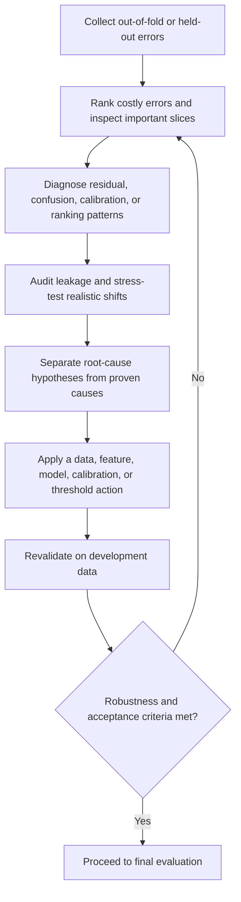

# Phase 10 — Error Analysis and Robustness

[← Phase 09: Evaluation Metrics](09_evaluation_metrics.md) · [Lifecycle index](README.md) · [Phase 11: Final Evaluation →](11_final_evaluation.md)

## Purpose

Identify where, why, and for whom the model fails, then verify that performance remains acceptable under realistic data variation and operating conditions.

## Visual map

## When this phase applies

- After a candidate has credible validation results and before final test evaluation.
- Repeat after material changes to data, features, model, threshold, or deployment context.
- Scale the analysis to risk: safety-critical, financial, medical, legal, or high-impact uses require deeper domain review and stress testing.
- For unsupervised and ranking tasks, use qualitative/domain inspection because aggregate labels may be absent or incomplete.

## Inputs

- out-of-fold or held-out predictions from the development data;
- true labels where available;
- prediction scores/probabilities, residuals, and decision thresholds;
- important features, groups, timestamps, horizons, queries, and operational segments;
- training/validation learning curves and baseline results;
- known edge cases, data-quality rules, plausible shifts, and business costs;
- candidate pipeline and preprocessing schema.

## Core tasks checklist

- [ ] Compare training, validation, and baseline performance.
- [ ] Rank and inspect high-error, high-confidence-wrong, and costly cases.
- [ ] Evaluate important slices and worst-performing groups.
- [ ] Inspect residuals, confusion patterns, calibration, or cluster/ranking quality as relevant.
- [ ] Check performance by time, target range, missingness, rarity, and data source.
- [ ] Audit target, temporal, group, duplicate, and preprocessing leakage.
- [ ] Stress-test plausible missing, noisy, extreme, shifted, and unseen-category inputs.
- [ ] Verify threshold, probability, and alert-volume behaviour.
- [ ] Document root-cause hypotheses separately from proven causes.
- [ ] Define fixes and rerun validation without consulting the final test set.

## Case-specific analysis

| Case | Error-analysis focus | Native scikit-learn keywords/APIs | Attention point |
|---|---|---|---|
| Regression | residual magnitude/sign, target range, heteroscedastic pattern, extreme errors | `PredictionErrorDisplay`, `mean_absolute_error`, `root_mean_squared_error` | Inspect original target units and important slices |
| Binary classification | FP/FN cost, threshold, high-confidence errors, probability calibration | `ConfusionMatrixDisplay`, `PrecisionRecallDisplay`, `RocCurveDisplay`, `CalibrationDisplay` | Threshold tuning and calibration are separate |
| Multiclass/multilabel | class confusion, per-class support, rare labels | `classification_report`, `multilabel_confusion_matrix`, `ConfusionMatrixDisplay` | Aggregate averages can hide a failed class |
| Time series | residual by horizon, season, regime, event, and backtest window | time-aware predictions plus regression metrics; `TimeSeriesSplit` | Look for drift and future-feature leakage |
| Grouped data | per-group and unseen-group performance | group-aware predictions; `GroupKFold`, `StratifiedGroupKFold` | Small groups need uncertainty and privacy care |
| Clustering | cluster size, cohesion, stability, outliers, semantic usefulness | `silhouette_samples`, `silhouette_score` | Internal scores do not prove business meaning |
| Anomaly detection | false alarms, missed anomalies, score threshold, alert capacity, detection delay | estimator `decision_function`/`score_samples`; labelled metrics when available | Validate on realistic rarity and chronology |
| Ranking/recommendation | error by query/user/item, position, cold start, popularity, coverage | native ranking metrics where applicable; otherwise custom | Random row analysis can hide history leakage |

## Exact scikit-learn diagnostic APIs

### Prediction and classification displays

- `sklearn.metrics.PredictionErrorDisplay`
- `sklearn.metrics.ConfusionMatrixDisplay`
- `sklearn.metrics.RocCurveDisplay`
- `sklearn.metrics.PrecisionRecallDisplay`
- `sklearn.metrics.DetCurveDisplay`
- class methods where supported: `.from_estimator(...)`, `.from_predictions(...)`

### Calibration and threshold

- `sklearn.calibration.calibration_curve`
- `sklearn.calibration.CalibrationDisplay`
- `sklearn.calibration.CalibratedClassifierCV`
- `sklearn.model_selection.TunedThresholdClassifierCV`

### Learning behaviour

- `sklearn.model_selection.learning_curve`
- `sklearn.model_selection.validation_curve`
- `sklearn.model_selection.LearningCurveDisplay`
- `sklearn.model_selection.ValidationCurveDisplay`

### Inspection and interpretation

- estimator-specific coefficients: `.coef_`
- tree-specific impurity importance: `.feature_importances_`
- `sklearn.inspection.permutation_importance`
- `sklearn.inspection.PartialDependenceDisplay`
- clustering samples: `sklearn.metrics.silhouette_samples`

### Error tables

- `sklearn.metrics.classification_report`
- `sklearn.metrics.confusion_matrix`
- `sklearn.metrics.multilabel_confusion_matrix`
- out-of-fold diagnostics: `sklearn.model_selection.cross_val_predict`

Use `cross_val_predict` carefully: its combined predictions are useful for case inspection, but a metric computed over them is not automatically equivalent to a valid cross-validation performance estimate.

## Diagnostic patterns

| Pattern | Likely investigation path |
|---|---|
| High training and validation error | underfitting, weak features, excessive regularisation, label noise |
| Low training error and high validation error | overfitting, leakage in training, insufficient data, unstable features |
| Good aggregate score and weak subgroup score | representation gap, sample-size imbalance, proxy features, distribution difference |
| Good discrimination and poor calibration | probability calibration, shift, class weighting, sampling design |
| Strong offline and weak production performance | data/serving skew, drift, leakage, wrong threshold, pipeline mismatch |
| Errors concentrated over time | regime change, seasonality, stale data, temporal leakage |
| Extreme feature importance instability | correlated features, small data, model instability, split sensitivity |

## Robustness test keywords

- missing values and missingness patterns;
- unseen categories;
- out-of-range and extreme values;
- measurement noise and rounding;
- duplicate and near-duplicate records;
- class/prevalence shift;
- covariate/domain/temporal shift;
- subgroup and worst-group performance;
- seed and fold sensitivity;
- threshold and alert-budget sensitivity;
- latency, memory, batch-size, and schema stress;
- train-serving transformation parity.

Scikit-learn supplies estimators, metrics, inspection tools, and splitters, but it does not provide a complete production stress-testing or drift-testing framework.

## External tools, not native scikit-learn

- local/global attribution: SHAP (`shap`) and LIME (`lime`);
- fairness metrics and mitigation: Fairlearn (`fairlearn`);
- data validation and drift monitoring: specialist libraries or platform tools;
- adversarial robustness and deep-model testing: specialist frameworks.

## Key attention and pitfalls

- **Test contamination:** perform development error analysis on validation or out-of-fold predictions, not the final untouched test set.
- **Causal overclaim:** coefficients, feature importance, PDP, SHAP, and LIME do not by themselves establish causality.
- **Correlated features:** permutation and impurity importances can split, mask, or distort apparent importance.
- **PDP assumptions:** partial dependence can evaluate unrealistic combinations when features are strongly dependent.
- **Slice sample size:** show support and uncertainty; do not overinterpret tiny groups.
- **Multiple comparisons:** searching many slices can create chance findings; confirm important patterns.
- **Unrealistic stress tests:** perturbations should represent plausible data or operational conditions.
- **Calibration confusion:** a calibrated model can still rank poorly; a high-AUC model can still be poorly calibrated.
- **Fix without revalidation:** every feature, preprocessing, threshold, or model change requires the same validation protocol again.
- **Symptom versus cause:** an error cluster suggests where to investigate, not automatically why it happened.

## Outputs and deliverables

- error taxonomy with representative cases and support counts;
- slice-level and worst-group score table;
- residual, confusion, calibration, curve, or cluster diagnostics;
- leakage audit and train-serving parity findings;
- robustness test matrix with expected and observed behaviour;
- ranked root-cause hypotheses, owners, fixes, and residual risks;
- decision to proceed, revise, collect data, or stop.

## Exit criteria

- Important error modes and affected populations are documented.
- No unresolved leakage or evaluation-protocol defect remains.
- Performance meets requirements on critical slices and plausible stress cases.
- Calibration, threshold, and operational behaviour are acceptable where applicable.
- Any corrective change has been revalidated without using the final test set.
- Residual risks are explicit and approved before final evaluation.

[← Phase 09](09_evaluation_metrics.md) · [Lifecycle index](README.md) · [Phase 11 →](11_final_evaluation.md)
