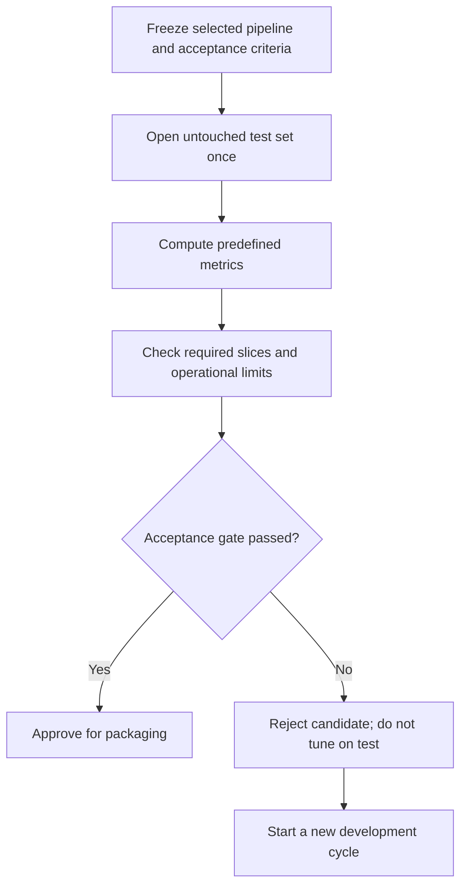

# Phase 11 — Final Evaluation

> Shared core phase. Final evidence may be external, temporal, geographic, client-held, environment-based, simulator-based, or staged online; use the applicable [specialisation overlays](../machine_learning_specialisations/README.md).

[Previous: Phase 10 - Error Analysis and Robustness](10_error_analysis_and_robustness.md) | [Index](README.md) | [Next: Phase 12 - Model Finalisation and Packaging](12_model_finalisation_and_packaging.md)

## Purpose

Estimate the selected model's final generalisation performance on untouched test data and decide whether it meets the predefined acceptance criteria.

## Visual map

## When this phase applies

- **Every supervised ML project:** after model selection, feature selection, threshold selection, calibration, and hyperparameter tuning are complete.
- **Course project:** produce a defensible final result, baseline comparison, and limitations section.
- **Production project:** also verify operational, subgroup, risk, and release requirements.
- **Unsupervised project:** use suitable held-out, stability, domain, or external-label evaluation; a conventional labelled test set may not exist.

## Inputs

- frozen fitted pipeline and selected configuration;
- untouched, versioned test set;
- primary metric and acceptance threshold defined in Phase 1;
- secondary metrics and important data slices;
- baseline or current production model;
- approved decision threshold and calibration method, if applicable;
- latency, memory, throughput, fairness, or risk requirements.

## Core tasks checklist

- [ ] Freeze model, features, hyperparameters, preprocessing, and decision threshold before opening test results.
- [ ] Confirm that the test set was excluded from preprocessing, tuning, feature selection, and model choice.
- [ ] Apply the already-fitted pipeline; do not refit any step on test data.
- [ ] Calculate the predefined primary metric and relevant secondary metrics.
- [ ] Report per-class, per-group, per-time-window, or per-segment results where relevant.
- [ ] Compare with the dummy baseline, simple baseline, and current production model if one exists.
- [ ] Inspect final errors without using them to tune the released candidate.
- [ ] Measure operational requirements such as prediction latency, memory, model size, and throughput when required.
- [ ] Record test-data version, code version, environment, model version, and evaluation date.
- [ ] Write limitations, expected failure modes, and the final pass/fail decision.

## Case-specific decisions

| Case | Useful metrics and decisions |
|---|---|
| Regression | MAE, RMSE, median absolute error, $R^2$, MAPE only when targets are safely away from zero |
| Binary classification | Precision, recall, F1, balanced accuracy, ROC-AUC, Average Precision, log loss, Brier loss, confusion matrix; use the frozen operating threshold |
| Multiclass/multilabel | Per-class results plus `macro`, `micro`, `weighted`, or `samples` averaging as appropriate |
| Imbalanced classification | Prefer class-sensitive metrics; inspect minority-class recall/precision and Average Precision rather than accuracy alone |
| Forecasting | Time-ordered holdout, horizon-specific metrics, seasonal/naive baseline, no random future-to-past leakage |
| Clustering | Silhouette/Davies-Bouldin/Calinski-Harabasz for internal structure; ARI/NMI only when meaningful reference labels exist |
| Anomaly detection | Precision, recall, F1, Average Precision, false-alarm rate, detection delay, precision@K where operationally relevant |
| Ranking/recommendation | NDCG or task-specific Precision@K, Recall@K, MAP@K, MRR; several recommender metrics require custom or external code |

## Scikit-learn keywords and APIs

| Function | API keyword |
|---|---|
| Final inference | fitted estimator or `Pipeline`: `.predict()` |
| Probability metrics | `.predict_proba()` where supported |
| Score-based metrics | `.decision_function()` where supported |
| Regression | `mean_absolute_error`, `root_mean_squared_error`, `median_absolute_error`, `r2_score`, `mean_absolute_percentage_error` |
| Classification | `accuracy_score`, `balanced_accuracy_score`, `precision_score`, `recall_score`, `f1_score`, `roc_auc_score`, `average_precision_score`, `log_loss`, `brier_score_loss` |
| Diagnostic summaries | `confusion_matrix`, `classification_report`, `ConfusionMatrixDisplay`, `RocCurveDisplay`, `PrecisionRecallDisplay`, `CalibrationDisplay` |
| Clustering | `silhouette_score`, `davies_bouldin_score`, `calinski_harabasz_score`, `adjusted_rand_score`, `normalized_mutual_info_score` |
| Ranking | `ndcg_score`, `dcg_score`, `label_ranking_average_precision_score` |

Scikit-learn has no universal confidence-interval helper for final model performance. If intervals are required, select and document a statistically appropriate external or custom procedure. Cross-validation standard deviation is not automatically a confidence interval.

## Key attention and pitfalls

- Test data is for final estimation, not another tuning round.
- If test results cause a model change, the test set has become development data; obtain a new independent final test set where an unbiased estimate is required.
- Match each metric to the correct input: hard labels, probabilities, or decision scores.
- Keep label mapping, positive class, averaging method, and threshold explicit.
- A strong aggregate metric can hide poor subgroup or minority-class performance.
- Small slices can produce unstable metrics; always report support/sample counts.
- Evaluate the complete pipeline, not only the final estimator.
- Delayed or missing ground-truth labels limit performance evaluation; document the limitation.
- Do not claim causality, fairness, or production readiness from one offline metric.

## Outputs and deliverables

- signed-off final evaluation report;
- primary and secondary test metrics;
- slice/per-class results and sample counts;
- baseline and acceptance-threshold comparison;
- operational benchmark results where applicable;
- limitations and failure-mode summary;
- reproducibility metadata and pass/fail decision.

## Exit criteria

- The frozen candidate has been evaluated exactly as specified on untouched test data.
- Required performance, risk, fairness, and operational gates are passed or an explicit rejection is recorded.
- Results, data version, code version, and limitations are reproducible and documented.
- No further model selection is performed from these test results.

## Official references

- [Scikit-learn: Metrics and scoring](https://scikit-learn.org/stable/modules/model_evaluation.html)
- [Scikit-learn: Common pitfalls and recommended practices](https://scikit-learn.org/stable/common_pitfalls.html)

[Previous: Phase 10 - Error Analysis and Robustness](10_error_analysis_and_robustness.md) | [Index](README.md) | [Next: Phase 12 - Model Finalisation and Packaging](12_model_finalisation_and_packaging.md)
