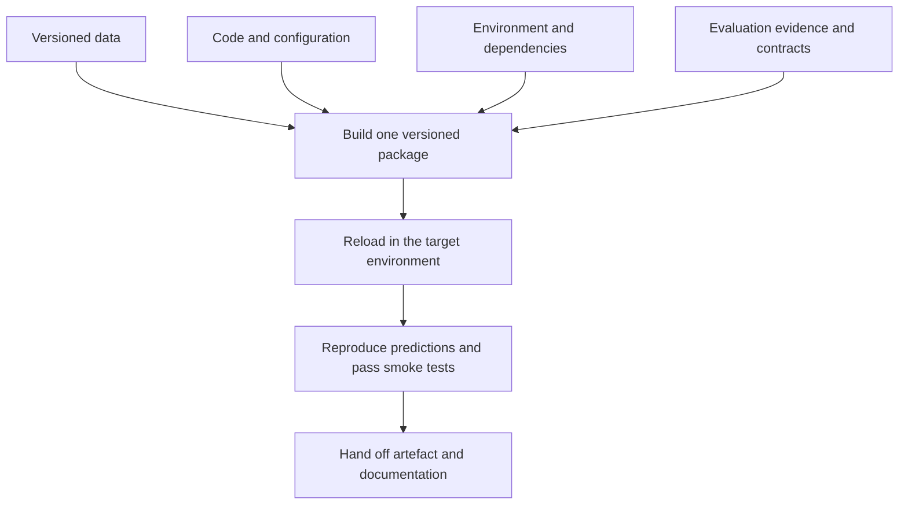

# Phase 12 - Model Finalisation and Packaging

[Previous: Phase 11 - Final Evaluation](11_final_evaluation.md) | [Index](README.md) | [Next: Phase 13 - Deployment](13_deployment.md)

## Purpose

Turn the approved model, preprocessing, configuration, and documentation into a reproducible and deployable artefact.

## Visual map

## When this phase applies

- **Course project:** preserve a reproducible notebook/script, environment, fitted pipeline if requested, and clear inference instructions.
- **Production project:** create a tested, immutable, versioned package with an input/output contract, security controls, ownership, and rollback information.
- **Research prototype:** preserve the exact experiment recipe even when no serving deployment is planned.

## Inputs

- approved model family and hyperparameters;
- fitted or refittable end-to-end pipeline;
- final evaluation report and acceptance decision;
- approved development dataset and split definitions;
- source code, feature definitions, random seeds, and dependency versions;
- target serving pattern and input/output schema;
- model owner, intended use, limitations, and risk controls.

## Core tasks checklist

- [ ] Refit the selected pipeline on the approved final training/development data according to the evaluation protocol.
- [ ] Keep preprocessing and estimator together in one inference pipeline where possible.
- [ ] Freeze feature order, names, data types, category handling, target mapping, and prediction threshold.
- [ ] Assign a unique model/version identifier.
- [ ] Record data version, code commit, configuration, random seeds, library versions, and training date.
- [ ] Save the artefact using a format appropriate for the target runtime and trust boundary.
- [ ] Create an input/output contract and example inference request.
- [ ] Add smoke tests for loading, schema handling, transformations, and prediction output.
- [ ] Confirm the packaged artefact reproduces expected predictions in the target environment.
- [ ] Create a model card or equivalent documentation.
- [ ] Store artefact checksum/signature, approval state, owner, and rollback version.

## Case-specific decisions

| Case | Packaging choice |
|---|---|
| Python-only trusted environment | Persist a fitted `Pipeline` with `joblib`, `pickle`, or `cloudpickle`; enforce trusted-source loading and matched dependencies |
| Safer Python object inspection | External `skops.io`; verify trusted types before loading |
| Non-Python or lightweight runtime | External ONNX conversion/runtime such as `skl2onnx`; confirm estimator and preprocessing support and prediction parity |
| Reproducible rebuild preferred | Store code, immutable data reference, configuration, dependency lock, and deterministic training recipe |
| Course submission | Notebook/script, `requirements.txt` or equivalent, data instructions, seed, metric output, and optional saved model |
| Production release | Registry entry, immutable artefact, container/runtime definition, model card, tests, signatures, approvals, and rollback package |

## Scikit-learn keywords and APIs

| Function | API keyword/scope |
|---|---|
| End-to-end package | `sklearn.pipeline.Pipeline`, `make_pipeline` |
| Mixed preprocessing | `sklearn.compose.ColumnTransformer` |
| Confirm fitted state | `sklearn.utils.validation.check_is_fitted` |
| Inspect configuration | estimator `.get_params(deep=True)` |
| Inference interface | `.predict()`, `.predict_proba()`, `.decision_function()`, `.transform()` as supported |
| Python persistence | `joblib` / Python `pickle`; not secure for untrusted artefacts |
| Safer format | external `skops.io` |
| Portable inference | external ONNX / `skl2onnx`; support varies by estimator |
| Registry and experiment tracking | external MLOps tooling, not core scikit-learn |
| Containers and dependency locking | external environment/build tooling, not core scikit-learn |

## Persistence security and version rules

- Never load a `pickle`, `joblib`, or `cloudpickle` artefact from an untrusted source; loading can execute arbitrary code.
- Loading a persisted estimator under a different scikit-learn version is unsupported.
- Pin Python, scikit-learn, NumPy, SciPy, and relevant dependencies.
- Preserve the training recipe and source data reference; a binary artefact alone is not reproducibility.
- Validate artefact origin and integrity with access control, checksum, signature, or registry policy.
- Do not include secrets, credentials, or unnecessary personal data in the artefact or metadata.
- Test converter/runtime parity when using ONNX or another portable format.

## Key attention and pitfalls

- Do not package only the estimator while recreating preprocessing manually in production.
- Do not refit the scaler, encoder, imputer, or feature selector at inference time.
- Preserve column semantics, not only column count.
- Configure unknown-category and missing-value behaviour explicitly.
- A random seed improves repeatability but does not guarantee identical results across all hardware and software versions.
- Keep the evaluation artefact and final refitted deployment artefact clearly identified if they differ.
- Verify both normal and invalid inputs before release.
- Treat custom transformers and arbitrary Python functions as code dependencies and security-relevant components.

## Outputs and deliverables

- immutable versioned model package;
- complete fitted pipeline or reproducible training recipe;
- dependency/environment specification;
- input/output schema and inference example;
- loading and smoke tests;
- model card, intended use, limitations, and owner;
- registry metadata, integrity record, and rollback reference.

## Exit criteria

- The approved artefact loads and produces verified predictions in the target environment.
- Preprocessing and feature logic are identical to the approved workflow.
- Security, dependency, provenance, schema, documentation, and rollback requirements are satisfied.
- Another authorised person or system can reproduce or safely consume the package.

## Official reference

- [Scikit-learn: Model persistence](https://scikit-learn.org/stable/model_persistence.html)

[Previous: Phase 11 - Final Evaluation](11_final_evaluation.md) | [Index](README.md) | [Next: Phase 13 - Deployment](13_deployment.md)
