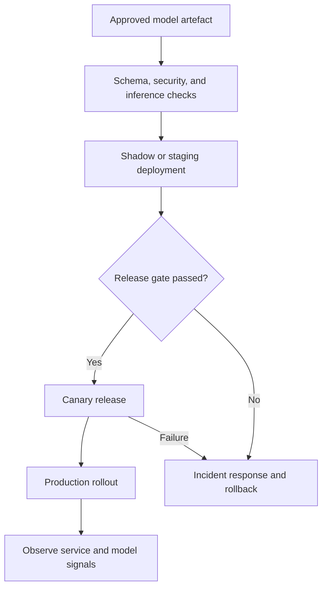

# Phase 13 - Deployment

[Previous: Phase 12 - Model Finalisation and Packaging](12_model_finalisation_and_packaging.md) | [Index](README.md) | [Next: Phase 14 - Monitoring](14_monitoring.md)

## Purpose

Make the approved model available to its intended users or systems with consistent preprocessing, controlled release, observability, security, and rollback.

## Visual map

## When this phase applies

- **Course project:** deployment may be only a reproducible inference script, notebook demonstration, or local application.
- **Production project:** deploy as a governed batch job, service, stream processor, edge artefact, or embedded component.
- **Decision-support system:** define human review and override behaviour as part of deployment.
- **High-risk system:** require stronger validation, approvals, audit logging, fallback, and staged release.

## Inputs

- approved versioned model package;
- input/output schema and feature definitions;
- target runtime and infrastructure;
- latency, throughput, availability, cost, and security requirements;
- release strategy, rollback version, and incident owner;
- monitoring plan, alert thresholds, and required logs;
- user-facing or downstream decision workflow.

## Core tasks checklist

- [ ] Choose batch, online, streaming, edge, or embedded serving.
- [ ] Recreate the approved dependency environment and verify artefact integrity.
- [ ] Load the model once per intended serving process and run a smoke prediction.
- [ ] Validate input names, order, data types, ranges, missing values, and categories.
- [ ] Use the packaged fitted preprocessing; never fit on live requests.
- [ ] Define output schema, class labels, scores/probabilities, threshold, and error responses.
- [ ] Add authentication, authorisation, encryption, secret management, and least-privilege access as required.
- [ ] Add model version, request tracing, latency, errors, and safe prediction metadata to logs.
- [ ] Load-test expected traffic and test timeout, failure, fallback, and rollback behaviour.
- [ ] Release with shadow, canary, blue-green, A/B, or champion-challenger controls when appropriate.
- [ ] Confirm dashboards, alerts, ownership, runbook, and rollback before full traffic.

## Case-specific decisions

| Pattern | Function and attention |
|---|---|
| Batch prediction | Scheduled large-volume inference; control data snapshot, idempotency, output location, retries, and completion checks |
| Online API | Low-latency request/response; control concurrency, timeout, capacity, authentication, schema, and fallback |
| Streaming inference | Continuous events; control ordering, state, duplicate events, late events, and back-pressure using external stream infrastructure |
| Edge deployment | Local/offline inference; control model size, hardware compatibility, update mechanism, privacy, and rollback |
| Embedded model | Model inside an application; control release coupling, dependency compatibility, and application-level tests |
| Human-in-the-loop | Route low-confidence or high-risk cases to review; log overrides and outcomes |
| Course demonstration | Load the frozen pipeline, transform a valid example through it, predict, and document execution steps |

## Scikit-learn keywords and scope

| Function | API keyword/scope |
|---|---|
| Prediction | fitted estimator/`Pipeline`: `.predict()` |
| Probabilities | `.predict_proba()` where supported |
| Decision scores | `.decision_function()` where supported |
| Transformation | fitted transformer/`Pipeline`: `.transform()` |
| Unknown categories | `OneHotEncoder(handle_unknown=...)`, `OrdinalEncoder(handle_unknown=...)` |
| Missing values | fitted `SimpleImputer`, `KNNImputer`, or supported native missing-value handling |
| Performance guidance | scikit-learn computational performance documentation |
| Web APIs, queues, containers, registries, orchestration | external deployment/MLOps scope |
| Authentication, tracing, autoscaling, service monitoring | external platform scope |

Scikit-learn supplies estimators, pipelines, inference APIs, and offline performance guidance. It is not a deployment platform or model server.

## Key attention and pitfalls

- **Training-serving skew:** production feature logic must match training feature logic exactly.
- **Schema drift:** column order alone is unsafe; validate names, types, units, category semantics, and null behaviour.
- **Leakage at serving:** never call `.fit()` or `.fit_transform()` on production requests.
- **Threshold mismatch:** deploy the approved class mapping, probability calibration, and operating threshold.
- **Unsafe loading:** load only trusted artefacts and matched library versions.
- **Silent failure:** return controlled errors or fallback decisions; do not silently substitute invalid values.
- **Logging risk:** avoid passwords, secrets, unnecessary PII, raw sensitive features, and unrestricted model outputs.
- **Concurrency:** do not assume universal thread/process behaviour; test the actual estimator, runtime, and server configuration.
- **Resource mismatch:** benchmark realistic batch sizes, sparsity, feature dimensions, hardware, and traffic.
- **No rollback:** keep a verified previous version and explicit traffic-switch procedure.

## Outputs and deliverables

- live endpoint, batch job, stream component, edge package, or demonstration workflow;
- deployed model/version record;
- serving schema and API/job documentation;
- release and rollback record;
- load, integration, security, and smoke-test evidence;
- production logs, dashboards, alerts, runbook, and named owner.

## Exit criteria

- Production or demonstration inference uses the approved full pipeline and schema.
- Expected predictions, errors, latency, capacity, security, logging, and fallback behaviour are verified.
- Monitoring and rollback work before full release.
- Ownership and incident response are active and documented.

## Official reference

- [Scikit-learn: Computational performance](https://scikit-learn.org/stable/computing/computational_performance.html)

[Previous: Phase 12 - Model Finalisation and Packaging](12_model_finalisation_and_packaging.md) | [Index](README.md) | [Next: Phase 14 - Monitoring](14_monitoring.md)
