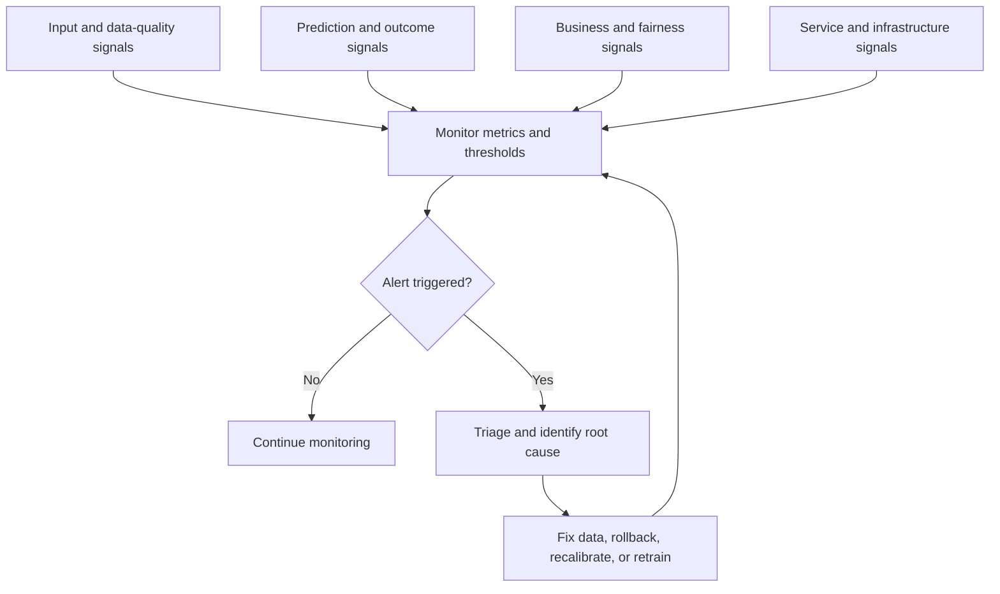

# Phase 14 - Monitoring

[Previous: Phase 13 - Deployment](13_deployment.md) | [Index](README.md) | [Next: Phase 15 - Retraining and Maintenance](15_retraining_and_maintenance.md)

## Purpose

Detect data, prediction, model, business, fairness, and infrastructure problems after release, then route each problem to an owner and response.

## Visual map

## When this phase applies

- **Course project without deployment:** write a monitoring plan, expected drift risks, metrics, thresholds, label strategy, and retraining triggers.
- **Production project:** monitor continuously or on a defined batch schedule.
- **Immediate-label system:** calculate performance soon after prediction.
- **Delayed-label system:** separate real-time proxy/data checks from later outcome-based performance checks.
- **No-label system:** rely on data quality, drift, prediction, business, sampling, and manual-review signals; do not claim these equal true performance.

## Inputs

- training/reference feature and prediction distributions;
- approved offline metrics, slices, thresholds, and acceptance ranges;
- production predictions, model version, timestamps, and safe request metadata;
- ground-truth outcomes when available;
- business KPIs and service-level objectives;
- schema, validity rules, fairness groups, and incident severity levels;
- owners, notification channels, runbooks, and retraining policy.

## Core tasks checklist

- [ ] Monitor schema, missingness, invalid values, ranges, category changes, volume, freshness, and duplicate rate.
- [ ] Compare production feature distributions with approved reference distributions.
- [ ] Monitor prediction distribution, class proportion, confidence/score distribution, and abstention/review rate.
- [ ] Join predictions to outcomes without introducing label or time-window errors.
- [ ] Recalculate task metrics when reliable labels arrive.
- [ ] Track performance across important classes, groups, regions, products, devices, and time windows.
- [ ] Monitor business KPIs separately from model metrics.
- [ ] Monitor latency, throughput, availability, errors, memory, CPU/GPU, and cost.
- [ ] Check training-serving skew and feature-pipeline failures.
- [ ] Define warning/critical thresholds, minimum sample sizes, persistence windows, and alert owners.
- [ ] Investigate alerts, record incidents, and trigger rollback, remediation, or retraining when criteria are met.
- [ ] Review dashboards, thresholds, reference windows, and ownership on a schedule.

## Monitoring cases

| Category | Keywords and examples |
|---|---|
| Data quality | Schema, null rate, invalid range, new category, freshness, volume, duplicate rate |
| Data drift | Feature-distribution shift, covariate shift, reference window, segment drift |
| Prediction drift | Prediction mean/distribution, class mix, score distribution, confidence, rejection rate |
| Concept/performance drift | Input-target relationship change, MAE/RMSE increase, recall/F1 decrease, calibration degradation |
| Business impact | Conversion, revenue, retention, fraud loss, manual workload, operational savings |
| Fairness | Subgroup support and performance, false-positive/false-negative gaps, allocation outcomes |
| Infrastructure | Latency, throughput, error rate, availability, memory, CPU/GPU, queue depth, cost |
| Security/abuse | Unexpected traffic, adversarial inputs, extraction attempts, access anomalies; external security scope |

## Scikit-learn, SciPy, and external scope

| Function | Keyword/API |
|---|---|
| Reuse supervised metrics | `sklearn.metrics`: `mean_absolute_error`, `root_mean_squared_error`, `accuracy_score`, `precision_score`, `recall_score`, `f1_score`, `roc_auc_score`, `average_precision_score`, `log_loss`, `brier_score_loss` |
| Calibration diagnostic | `sklearn.calibration.calibration_curve`, `CalibrationDisplay` |
| KS two-sample test | `scipy.stats.ks_2samp` |
| Wasserstein distance | `scipy.stats.wasserstein_distance` |
| Jensen-Shannon distance | `scipy.spatial.distance.jensenshannon` |
| Relative entropy/KL building block | `scipy.stats.entropy` |
| PSI and category-frequency change | custom or monitoring-library implementation |
| Dashboards, alerting, tracing, drift platforms | external monitoring/MLOps tooling |

Scikit-learn does not continuously monitor deployed models. Its metrics can be reused after production predictions and reliable labels are collected.

## Key attention and pitfalls

- Drift does not automatically mean performance degradation; investigate cause and impact.
- No detected drift does not prove stable performance.
- Statistical tests are sensitive to sample size, repeated testing, binning, and reference-window choice.
- Define practical effect thresholds, not only statistical significance.
- Compare like-for-like time windows and segments; seasonality can look like harmful drift.
- Store model version and timestamp with every prediction needed for later label joins.
- Delayed, censored, or selectively observed outcomes can bias performance monitoring.
- Feedback loops can change future data and labels because of the model's own decisions.
- Monitor sample counts with every slice metric; small groups are unstable.
- Protect personal data and restrict access to monitoring logs.
- Alerts without owner, severity, runbook, and response deadline are not operational controls.

## Outputs and deliverables

- monitoring specification and reference baselines;
- dashboards for data, prediction, performance, business, fairness, and infrastructure signals;
- alert rules, severity levels, owners, and runbooks;
- label-collection and prediction-outcome join process;
- incident and investigation records;
- rollback, remediation, or retraining triggers.

## Exit criteria

Monitoring is an ongoing phase rather than a one-time completion. The release is adequately monitored when:

- required signals are collected with model/version/time context;
- dashboards and alerts are validated;
- labels and performance are tracked where feasible;
- each alert has an owner and tested response;
- retraining, rollback, and escalation criteria are documented.

## Official references

- [Scikit-learn: Metrics and scoring](https://scikit-learn.org/stable/modules/model_evaluation.html)
- [Scikit-learn: Probability calibration](https://scikit-learn.org/stable/modules/calibration.html)

[Previous: Phase 13 - Deployment](13_deployment.md) | [Index](README.md) | [Next: Phase 15 - Retraining and Maintenance](15_retraining_and_maintenance.md)
