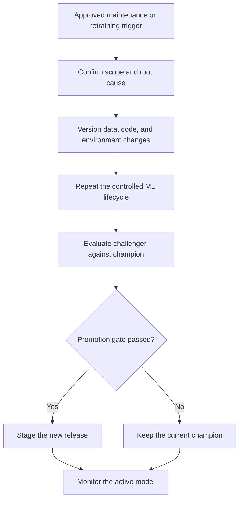

# Phase 15 — Retraining and Maintenance

> Shared core phase. Distinguish full retraining, fine-tuning, index refresh, online update, policy update, active-labelling cycle, and federated round using the [specialisation overlays](../machine_learning_specialisations/README.md).

[Previous: Phase 14 - Monitoring](14_monitoring.md) | [Index](README.md) | [Next: Phase 16 - Model Retirement](16_model_retirement.md)

## Purpose

Update data, code, dependencies, preprocessing, or model behaviour through a controlled and repeatable lifecycle while protecting production quality and rollback capability.

## Visual map

## When this phase applies

- **Course project:** repeat development when error analysis, new data, or requirements justify a new model; document each iteration.
- **Production project:** retrain on a schedule, monitoring trigger, material data change, business change, fairness concern, security update, or dependency migration.
- **Stable environment:** maintenance may mean validation and dependency updates without retraining.
- **Online/incremental case:** use partial updates only when the estimator, preprocessing, evaluation, and operational risk support them.

## Inputs

- monitoring alerts and root-cause evidence;
- new versioned data and labels;
- current production champion and rollback version;
- original training pipeline, tests, code, environment, and acceptance gates;
- updated feature/schema/business requirements;
- retraining schedule or approved trigger;
- governance, fairness, security, cost, and release requirements.

## Core tasks checklist

- [ ] Confirm the trigger, business need, owner, scope, and expected benefit.
- [ ] Validate new data, labels, timestamps, consent, lineage, representativeness, and schema.
- [ ] Revisit problem definition and metric if the target or decision process changed.
- [ ] Create new versioned train/validation/test data with group/time constraints and no leakage.
- [ ] Refit learned preprocessing on the new training data or folds.
- [ ] Train and tune candidate/challenger models through the same controlled pipeline.
- [ ] Run unit, data, pipeline, performance, fairness, security, and regression tests.
- [ ] Evaluate on an appropriate untouched test set and compare with the production champion under the same protocol.
- [ ] Record code, data, environment, configuration, model, metrics, approvals, and reason for change.
- [ ] Package the approved candidate, deploy gradually, monitor, and retain rollback capability.
- [ ] Update documentation, registry status, thresholds, dashboards, runbooks, and ownership.

## Case-specific decisions

| Case | Preferred action and attention |
|---|---|
| Full retraining | Default robust option when enough data and compute exist; rebuild all learned preprocessing and model parameters |
| Scheduled retraining | Use only if data/labels and expected change justify the schedule; still require validation and release gates |
| Drift-triggered retraining | Investigate root cause first; drift alone does not prove retraining will improve outcomes |
| Performance-triggered retraining | Confirm label quality, delay, sample size, segment impact, and serving correctness before retraining |
| Incremental learning | Use `.partial_fit()` only on supported estimators; define preprocessing updates, class handling, evaluation, checkpoint, and rollback |
| Feature/schema change | Treat as a pipeline and serving-contract change; repeat compatibility and integration tests |
| Dependency/security update | Rebuild and reevaluate even if data and algorithm are unchanged |
| Business/target change | Return to Phase 1; do not treat a different target as routine retraining |

## Scikit-learn keywords and APIs

| Function | API keyword/scope |
|---|---|
| Rebuild clean estimator | `sklearn.base.clone` |
| Controlled workflow | `Pipeline`, `ColumnTransformer`, `.fit()` |
| Retuning | `GridSearchCV`, `RandomizedSearchCV`, `HalvingGridSearchCV`, `HalvingRandomSearchCV` |
| Re-evaluation | `cross_validate`, task-specific `sklearn.metrics` functions |
| Incremental update contract | estimator `.partial_fit()` where implemented |
| Common incremental estimators | `SGDClassifier`, `SGDRegressor`, `PassiveAggressiveClassifier`, `PassiveAggressiveRegressor`, `Perceptron`, several Naive Bayes estimators, `MiniBatchKMeans` |
| Incremental scaling | `StandardScaler.partial_fit()` where the workflow is explicitly designed for streaming updates |
| Warm restart | `warm_start=True` where supported; estimator-specific and not equivalent to universal online learning |
| Registries, schedulers, approvals, lineage, CI/CD | external MLOps scope |

Always check the installed estimator's documentation before relying on `partial_fit` or `warm_start`. APIs, supported parameters, class-initialisation rules, and update semantics are estimator-specific.

## Key attention and pitfalls

- Do not retrain automatically from every drift alert; investigate data quality, serving errors, seasonality, and business changes first.
- Do not reuse the same test set indefinitely for repeated model selection.
- Prevent temporal leakage: train only on data available before the evaluation/prediction time.
- New production labels can be biased by the previous model's decisions and feedback loop.
- Keep a stable comparison protocol; unfair test windows can make a challenger appear better.
- Refit or intentionally update preprocessing; stale encoders/scalers and silently changing transforms both create risk.
- Incremental model updates without incremental preprocessing can create mismatch.
- A higher average metric does not automatically justify release if key slices, fairness, calibration, latency, or cost regress.
- Pin and test dependencies; software changes can alter behaviour even with the same model file.
- Preserve champion artefact, traffic switch, database/schema compatibility, and rollback window.

## Outputs and deliverables

- retraining/change request and root-cause record;
- new versioned datasets and training recipe;
- candidate/challenger model and comparison report;
- regression, fairness, security, and operational test evidence;
- approved package, registry entry, deployment and rollback plan;
- updated model card, monitoring baseline, runbooks, and change log.

## Exit criteria

- The change has a justified trigger and documented owner.
- The candidate passed the complete validation and approval gates against the current champion.
- Data, code, pipeline, environment, tests, and artefact are reproducible and versioned.
- Deployment is controlled, monitoring is updated, and rollback remains available.
- If no candidate passes, the champion remains active and the rejection is recorded.

## Official references

- [Scikit-learn: Scaling strategies and out-of-core learning](https://scikit-learn.org/stable/computing/scaling_strategies.html)
- [Scikit-learn: Model selection and evaluation](https://scikit-learn.org/stable/model_selection.html)

[Previous: Phase 14 - Monitoring](14_monitoring.md) | [Index](README.md) | [Next: Phase 16 - Model Retirement](16_model_retirement.md)
