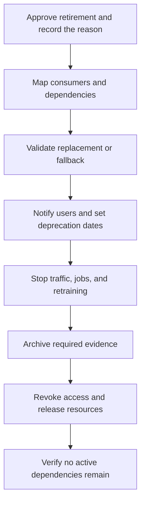

# Phase 16 - Model Retirement

[Previous: Phase 15 - Retraining and Maintenance](15_retraining_and_maintenance.md) | [Index](README.md) | [Next: Index](README.md)

## Purpose

Remove an obsolete, unsafe, unsupported, replaced, or unnecessary model without breaking consumers, losing required evidence, or leaving active security and infrastructure risks.

## Visual map

## When this phase applies

- **Course project:** archive the final artefacts, environment, report, and limitations when active work ends.
- **Production project:** retire after replacement, product closure, unacceptable risk, persistent degradation, data loss, dependency end-of-life, regulatory change, or cost-benefit failure.
- **Emergency retirement:** immediately restrict or stop use when safety, security, privacy, legal, or severe performance risk exceeds the cost of shutdown.
- **Temporary rollback:** not always retirement; distinguish an incident rollback from permanent end-of-life.

## Inputs

- model inventory and version/registry records;
- all known API, batch, application, report, and downstream consumers;
- replacement model or non-model fallback where required;
- business owner, technical owner, risk/compliance owner, and stakeholders;
- retention, privacy, audit, licensing, and deletion requirements;
- endpoint, job, credentials, storage, monitoring, and infrastructure inventory;
- deprecation timeline, rollback window, and communication plan.

## Core tasks checklist

- [ ] Record retirement reason, authority, scope, date, and risk assessment.
- [ ] Discover and notify every model consumer and dependent workflow.
- [ ] Define replacement, manual process, rule-based fallback, or service shutdown.
- [ ] Announce deprecation and migration deadlines when a gradual transition is possible.
- [ ] Validate replacement/fallback behaviour before switching traffic or jobs.
- [ ] Stop new traffic, scheduled predictions, retraining jobs, and automated promotion for the retired version.
- [ ] Remove routing/registry production status and update application configuration.
- [ ] Revoke model-specific credentials, permissions, tokens, and unused access paths.
- [ ] Archive required artefacts, code, environment, configuration, data references, evaluations, approvals, incidents, and model card.
- [ ] Apply retention/deletion policy to artefacts, logs, predictions, and personal data.
- [ ] Stop dedicated compute, storage, dashboards, and alerts only after cutover is verified.
- [ ] Confirm zero unintended traffic and no unresolved downstream dependency.
- [ ] Update inventory, ownership, documentation, audit trail, and stakeholder communication.

## Case-specific decisions

| Case | Action and attention |
|---|---|
| Replaced model | Migrate consumers, compare outputs if needed, retain rollback for the approved period, then remove old routing |
| Product/service closure | Disable prediction paths and jobs; preserve only records required by policy |
| Safety/privacy/security emergency | Restrict access or stop service first, activate safe fallback, then complete investigation and archival |
| Unsupported dependency | Replace, rebuild, isolate, or retire; do not keep an unpatchable artefact silently active |
| Performance degradation | Use rollback/retraining if recoverable; retire if the model no longer meets purpose or risk gates |
| Regulatory/licensing change | Follow legal retention/deletion and evidence requirements; obtain appropriate approval |
| Course/research completion | Archive reproducible code, dependency versions, artefact, report, data instructions, and known limitations |

## Scikit-learn and external scope

- Scikit-learn has **no model-retirement API**.
- `.predict()` availability or a loadable artefact does not mean a model remains approved for use.
- Registry stage changes, endpoint shutdown, job removal, secret revocation, infrastructure cleanup, retention, audit, and stakeholder workflows are external MLOps/operations/governance responsibilities.
- Pickle-based artefacts remain unsafe to load from untrusted sources even after archival.
- Preserve the matching environment if policy requires future reproducibility; cross-version scikit-learn loading is unsupported.

## Key attention and pitfalls

- Unknown consumers are the largest cutover risk; use logs, ownership records, dependency maps, and stakeholder confirmation.
- Do not delete the only rollback artefact before the approved rollback window ends.
- Do not retain personal data or secrets merely for convenience; follow explicit policy and legal requirements.
- Archiving and deletion can conflict; document which policy controls each artefact and record.
- Stop monitoring only after traffic, jobs, retries, queues, and downstream caches are cleared or migrated.
- Remove credentials and permissions, not only the model endpoint.
- Update documentation and registries so a retired version cannot be accidentally redeployed.
- Preserve enough evidence for audit, incident review, and reproducibility without preserving prohibited data.
- Communicate changes to users affected by altered predictions, workflows, or manual fallbacks.

## Outputs and deliverables

- approved retirement decision and reason;
- consumer migration/cutover record;
- replacement or fallback confirmation;
- archived evidence package subject to retention policy;
- revoked access and stopped infrastructure record;
- updated model inventory, registry, documentation, and ownership;
- final zero-traffic/dependency verification and stakeholder notice.

## Exit criteria

- The retired model no longer receives unintended traffic or scheduled work.
- All known consumers are migrated, disabled, or explicitly accepted as closed.
- Credentials, permissions, compute, storage, monitoring, and registry states are handled according to policy.
- Required audit/reproducibility evidence is archived and prohibited data is deleted.
- Replacement, fallback, or service closure has been verified and communicated.

## Official reference

- [Scikit-learn: Model persistence](https://scikit-learn.org/stable/model_persistence.html)

[Previous: Phase 15 - Retraining and Maintenance](15_retraining_and_maintenance.md) | [Index](README.md) | [Next: Index](README.md)
