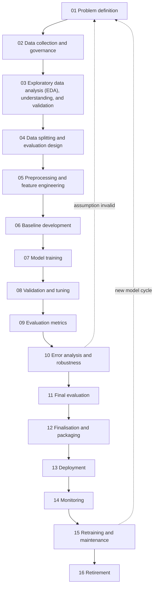
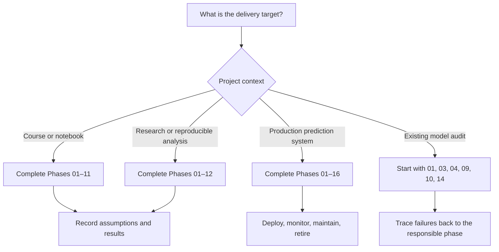

# Machine Learning Lifecycle Phase Handbook

> This is the shared core lifecycle. Start from the [root handbook portal](../README.md), classify the project with the [ML taxonomy passport](../machine_learning_specialisations/taxonomy_and_coverage.md#ml-taxonomy-passport), and add every applicable [specialisation overlay](../machine_learning_specialisations/README.md).

## Should every machine-learning problem follow this lifecycle?

Use the lifecycle as a **decision framework**, not a rigid sequence in which
every phase receives equal effort.

- Every project needs problem framing, trustworthy data, an evaluation design,
  a baseline, model development, and honest final evaluation.
- Preprocessing is optional when the chosen estimator can consume the raw
  representation safely, but leakage controls are never optional.
- A course assignment or one-off offline analysis may stop after final
  evaluation and documentation.
- A production system also needs packaging, deployment, monitoring, retraining,
  governance, and retirement.
- Unsupervised learning, time series, grouped data, ranking, anomaly detection,
  text, and images require different splits, metrics, and model families.
- Some phases can iterate or run in parallel; a failed exit criterion sends the
  project back to an earlier phase.

## Compose the lifecycle for a specialised project

The 16 phases remain the common sequence. A specialised project adds requirements along four independent axes:

| Axis | Examples | Routing |
|---|---|---|
| Task family | forecasting, ranking, generation, causal effect, survival, sequential decision | [Task overlays](../machine_learning_specialisations/README.md#task-families) |
| Data modality/structure | image, video, text, audio, graph, spatial, multimodal | [Modality overlays](../machine_learning_specialisations/README.md#data-modalities-and-structures) |
| Learning paradigm/method | deep/transfer, self-supervised, reinforcement, Bayesian | [Paradigm overlays](../machine_learning_specialisations/README.md#paradigms-and-methods) |
| Operational setting | online/continual, active/HITL, federated, private, AutoML | [Operational overlays](../machine_learning_specialisations/README.md#operational-settings) |

Example: an image model trained across hospitals is not one new lifecycle. It is `core + computer vision + deep/transfer + federated + privacy`. The overlays document only what changes in each phase.

## Lifecycle at a glance



Phase 9 is not the first time metrics are chosen. The primary metric is fixed in
Phase 1, used for baseline and validation decisions, then calculated and
reported consistently through Phases 9, 11, and 14. Governance is also
cross-cutting: Phase 2 concentrates on data governance, while ownership, risk,
approval, monitoring, and safe retirement continue across all phases.

## Phase pages

| Phase | Page | Primary function |
|---:|---|---|
| 1 | [Problem Definition](01_problem_definition.md) | Define target, task, users, metric, constraints, and success |
| 2 | [Data Collection and Governance](02_data_collection_and_governance.md) | Acquire authorised, representative, traceable data |
| 3 | [Exploratory Data Analysis (EDA), Understanding, and Validation](03_data_understanding_and_validation.md) | Explore distributions and relationships; profile quality, labels, bias, and leakage risks |
| 4 | [Data Splitting](04_data_splitting.md) | Create a valid training, validation, and test protocol |
| 5 | [Preprocessing and Feature Engineering](05_preprocessing_and_feature_engineering.md) | Build leakage-safe model inputs |
| 6 | [Baseline Development](06_baseline_development.md) | Establish the minimum benchmark |
| 7 | [Model Training](07_model_training.md) | Fit suitable candidate estimators |
| 8 | [Validation and Hyperparameter Tuning](08_validation_and_hyperparameter_tuning.md) | Select configurations using held-out evidence |
| 9 | [Evaluation Metrics](09_evaluation_metrics.md) | Measure the behaviour that matters |
| 10 | [Error Analysis and Robustness](10_error_analysis_and_robustness.md) | Find failure modes, weak slices, and instability |
| 11 | [Final Evaluation](11_final_evaluation.md) | Estimate final generalisation once on untouched data |
| 12 | [Model Finalisation and Packaging](12_model_finalisation_and_packaging.md) | Produce a reproducible, deployable artefact |
| 13 | [Deployment](13_deployment.md) | Integrate the model into its prediction environment |
| 14 | [Monitoring](14_monitoring.md) | Detect quality, drift, performance, fairness, and service problems |
| 15 | [Retraining and Maintenance](15_retraining_and_maintenance.md) | Update the model through a controlled lifecycle |
| 16 | [Model Retirement](16_model_retirement.md) | Remove obsolete models safely |

## Minimum route by project type



| Project type | Recommended phases |
|---|---|
| Course assignment/notebook | 1–11; add Phase 12 for reproducibility |
| Offline business analysis | 1–12; document hand-off and refresh policy |
| Research comparison | 1–12; emphasise reproducibility, repeated/nested CV, and uncertainty |
| Batch production model | 1–16 |
| Online/real-time model | 1–16; emphasise latency, schema contracts, rollback, and alerts |
| Existing model audit | Start at 1, 3, 4, 9, 10, and 14; trace back as needed |
| Prototype/proof of concept | Use all decision gates, but simplify implementation depth |

## Routing by machine-learning case

| Case | Critical adaptation | Split/evaluation keywords | Typical scikit-learn keywords |
|---|---|---|---|
| Regression | Continuous target; error costs and target range | `KFold`, `GroupKFold`, `TimeSeriesSplit` as appropriate | `DummyRegressor`, `LinearRegression`, `Ridge`, `RandomForestRegressor`, MAE, RMSE, $R^2$ |
| Binary classification | Class definition, threshold, asymmetric error cost | `StratifiedKFold`; group/time-aware variant if required | `DummyClassifier`, `LogisticRegression`, `SVC`, precision, recall, F1, ROC-AUC, AP |
| Multiclass classification | Per-class behaviour and averaging strategy | `StratifiedKFold`, `StratifiedGroupKFold` | macro/micro/weighted metrics, confusion matrix, top-k accuracy |
| Imbalanced classification | Minority recall, false positives, threshold selection | Stratified and group-safe CV | `class_weight`, `compute_class_weight`, AP, balanced accuracy; SMOTE is external |
| Grouped data | Prevent the same entity appearing in train and validation/test | `GroupKFold`, `GroupShuffleSplit`, `StratifiedGroupKFold` | `groups=` metadata |
| Time series/forecasting | Prevent future-to-past leakage; use realistic horizon | chronological holdout, `TimeSeriesSplit` | lag features, `HistGradientBoostingRegressor`, MAE/RMSE/pinball loss |
| Clustering | No prediction target; validate usefulness and stability | resampling/stability or labelled benchmark if available | `KMeans`, `DBSCAN`, `HDBSCAN`, silhouette, Davies–Bouldin, ARI |
| Anomaly detection | Define novelty versus training-set outliers and alert budget | time/group-aware holdout with labelled anomalies when possible | `IsolationForest`, `LocalOutlierFactor`, `OneClassSVM`, AP, recall |
| Text/tabular NLP | Sparse features, vocabulary leakage, high dimensionality | fit vocabulary inside each training fold | `TfidfVectorizer`, `TruncatedSVD`, `LinearSVC`, `LogisticRegression` |
| Image/audio/deep learning | Augmentation, pretrained models, hardware, dataset shift | subject/group split; no near-duplicate leakage | scikit-learn can handle downstream tabular embeddings; deep models are external |
| Ranking/recommendation | Candidate generation, user/item leakage, top-k utility | user/time-aware offline protocol plus online testing | scikit-learn supplies building blocks; specialist recommenders and many @K metrics are custom/external |

This table is a classical quick route, not the full taxonomy. Use the dedicated guides for [time series](../machine_learning_specialisations/task_families/time_series_and_forecasting.md), [clustering](../machine_learning_specialisations/task_families/clustering_and_dimensionality_reduction.md), [anomaly/OOD](../machine_learning_specialisations/task_families/anomaly_novelty_and_ood_detection.md), [NLP/LLMs](../machine_learning_specialisations/data_modalities_and_structures/nlp_documents_and_llms.md), [computer vision](../machine_learning_specialisations/data_modalities_and_structures/computer_vision.md), [speech/audio](../machine_learning_specialisations/data_modalities_and_structures/speech_and_audio.md), [deep learning](../machine_learning_specialisations/paradigms_and_methods/deep_learning_transfer_and_multitask.md), and [recommendation/ranking/retrieval](../machine_learning_specialisations/task_families/recommendation_ranking_and_retrieval.md).

## Non-negotiable rules

1. Define the prediction unit and target before selecting an algorithm.
2. Design the split from the real deployment question—not from convenience.
3. Before the split, limit whole-dataset inspection to schema, integrity,
   provenance, and broad quality checks; after the test set is locked,
   target-informed modelling decisions use training/development data only.
4. Split before fitting any data-dependent transformation.
5. Fit preprocessing, feature selection, and resampling only on training folds.
6. Use a `Pipeline`, usually with a `ColumnTransformer`, for tabular workflows.
7. Use validation/CV for model, feature, threshold, and hyperparameter decisions.
8. Keep the test set untouched until the model-selection process is complete.
9. Select metrics from decision costs, class balance, target properties, and use case.
10. Compare against a meaningful baseline and inspect failures, not only averages.
11. Preserve the complete fitted preprocessing-and-model artefact and its environment.
12. A production model is incomplete without monitoring, ownership, and rollback.
13. Retraining is a new controlled model-development cycle, not an automatic overwrite.
14. Apply governance, security, privacy, accountability, and risk controls throughout the lifecycle.
15. Record the taxonomy passport and apply every relevant specialisation overlay; do not treat task, modality, learning signal, model family, and operating setting as the same axis.

## Iteration routes

```text
Poor data quality        → return to Phases 2–3
Leakage or invalid split → return to Phase 4
Underfitting             → revisit Phases 5–8
Overfitting              → revisit Phases 5–8
Wrong metric behaviour   → revisit Phases 1 and 9
Weak subgroup result     → revisit Phases 2, 3, 5, and 10
Serving mismatch         → revisit Phases 5, 12, and 13
Production drift         → trigger Phases 14–15
Obsolete objective       → return to Phase 1 or retire the model
```

## Scikit-learn scope

### Native scikit-learn scope

- data splitting and cross-validation;
- preprocessing and feature engineering;
- pipelines and column transformations;
- classical supervised and unsupervised estimators;
- hyperparameter search;
- offline metrics and diagnostic displays;
- model inspection;
- persistence guidance.

### Broader MLOps/external scope

- data contracts, access governance, and annotation systems;
- experiment tracking and model registries;
- XGBoost, LightGBM, CatBoost, SMOTE, Prophet, SHAP, LIME;
- deep-learning training and GPU serving;
- production APIs, containers, orchestration, and streaming;
- drift services, alerting, incident response, and audit workflows;
- fairness toolkits and organisation-specific governance.

## Official references

- [Scikit-learn User Guide](https://scikit-learn.org/stable/user_guide.html)
- [Scikit-learn API Reference](https://scikit-learn.org/stable/api/index.html)
- [Model selection](https://scikit-learn.org/stable/api/sklearn.model_selection.html)
- [Metrics and scoring](https://scikit-learn.org/stable/modules/model_evaluation.html)
- [Common pitfalls and data leakage](https://scikit-learn.org/stable/common_pitfalls.html)
- [Pipelines and composite estimators](https://scikit-learn.org/stable/modules/compose.html)
- [Model persistence](https://scikit-learn.org/stable/model_persistence.html)
- [Microsoft Learn: Machine learning lifecycle](https://learn.microsoft.com/en-us/azure/databricks/machine-learning/concepts/ml-lifecycle)
- [Google: Rules of Machine Learning](https://developers.google.com/machine-learning/guides/rules-of-ml)
- [Google: Production ML monitoring](https://developers.google.com/machine-learning/crash-course/production-ml-systems/monitoring)
- [NIST AI Risk Management Framework Core](https://airc.nist.gov/airmf-resources/airmf/5-sec-core/)

## How to use these pages

For each phase:

1. read its purpose and task-specific cases;
2. complete the core checklist;
3. record the required outputs;
4. check the pitfalls;
5. proceed only when the exit criteria are satisfied;
6. return to an earlier phase whenever evidence invalidates an assumption.

[Full single-page lifecycle reference](../machine_learning_model_development_lifecycle.md)
