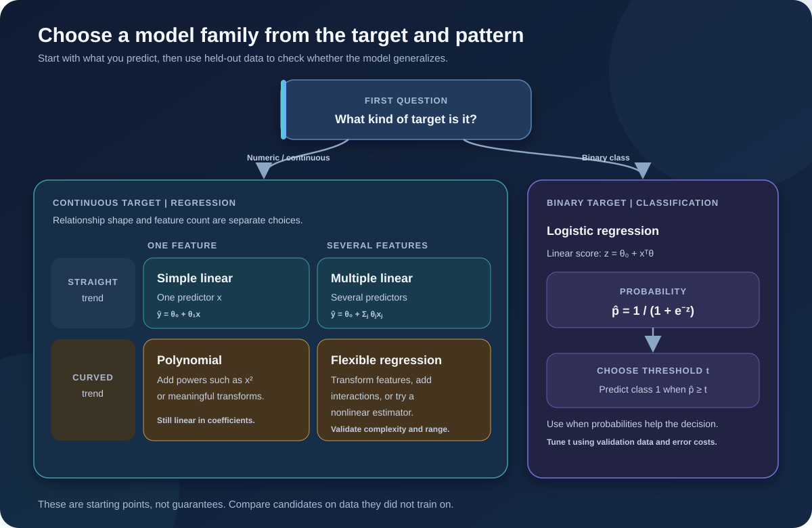

# Introduction to Regression

## Learning goals

- Recognize regression as supervised learning for a **numeric, continuous target**.
- Distinguish the number of predictors from the shape of their relationship with the target.
- Select a sensible first model and identify where it may fail.

## The core idea

A regression model learns a rule from examples whose outcomes are known. Each row has explanatory features, **X**, and a response or target, **y**. After fitting, the model estimates a target for a new row, written **ŷ**. For example, car engine size, cylinder count, and fuel use can help estimate CO₂ emissions.

A regression prediction is a numerical estimate; it is not automatically a causal explanation. A strong association in historical data does not prove that changing one feature will cause the outcome to change.

## Core model

For training row *i*, write **yᵢ = f(xᵢ) + εᵢ**; after fitting, the model predicts **ŷ = f(x)** for a new feature vector. A linear model is **ŷ = θ₀ + Σⱼ θⱼxⱼ**. Ordinary least squares (OLS) commonly fits its coefficients by minimizing **MSE = (1/n) Σᵢ(yᵢ − ŷᵢ)²**.

## Choose by target, predictors, and relationship

“Simple” versus “multiple” describes the **number of input features**. “Linear” versus “nonlinear” describes the **form of the modeled relationship**. These are separate choices.

| Family | Inputs and shape | Useful when |
| --- | --- | --- |
| Simple linear regression | One predictor; straight-line change in the expected target | A single feature has an approximately linear trend |
| Multiple linear regression | Several predictors; additive linear combination of features | Several measured factors jointly help explain or predict the target |
| Polynomial regression | Powers/interactions of features; curved trend, while coefficients remain linear | A smooth curve is needed and a low-degree polynomial is adequate |
| Other nonlinear or flexible regressors | Curves or interactions learned through a chosen function/model | The pattern is not well represented by a straight line or a modest polynomial |

The same ideas appear in applications such as house-price estimation, sales forecasting, rainfall prediction, equipment-maintenance planning, and estimating emissions. The target type and the costs of errors should guide model and metric choice.



*Start with the target type, then check whether the relationship looks approximately straight or curved. Validate choices on held-out data.*

## Small example

Suppose past cars have engine sizes 1.6, 2.0, and 2.4 L and recorded emissions 170, 190, and 205 g/km. A fitted regression can estimate emissions for an unobserved 2.2 L car. The estimate is useful only to the extent that this car resembles the training data and the relationship remains stable.

## Scikit-learn pattern

For a continuous target, split examples before fitting so evaluation uses unseen rows:

```python
from sklearn.linear_model import LinearRegression
from sklearn.model_selection import train_test_split

X = cars[["ENGINESIZE"]]
y = cars["CO2EMISSIONS"]
X_train, X_test, y_train, y_test = train_test_split(
    X, y, test_size=0.2, random_state=42
)
model = LinearRegression().fit(X_train, y_train)
prediction = model.predict(X_test)
```

For a first evaluation, compare mean absolute error (MAE) or root mean squared error (RMSE) with a simple baseline such as predicting the training-set mean.

## Assumptions and common pitfalls

- The target is quantitative. A binary class such as churn is usually handled as classification, even though its labels may be encoded 0 and 1.
- Assumptions depend on the model family. For classical OLS coefficient inference, a linear conditional mean and independent errors with roughly constant variance are common assumptions; normal residuals support small-sample tests. Violations affect inference and may also reveal predictive problems.
- The relationship need not be causal just because a predictor is useful.
- A line can underfit a curved pattern; a very flexible model can overfit noise.
- Training error alone is not evidence of useful generalization. Keep a test set or use cross-validation for model selection.
- Predictions far outside the feature range are extrapolations and may be unreliable.
- Avoid target leakage: information unavailable at prediction time must not enter the features.

## Active recall

1. What does the target type tell you about whether regression is appropriate?
2. How are “multiple” and “nonlinear” different descriptions of a model?
3. Why can a model with low training error still make poor predictions for new cases?