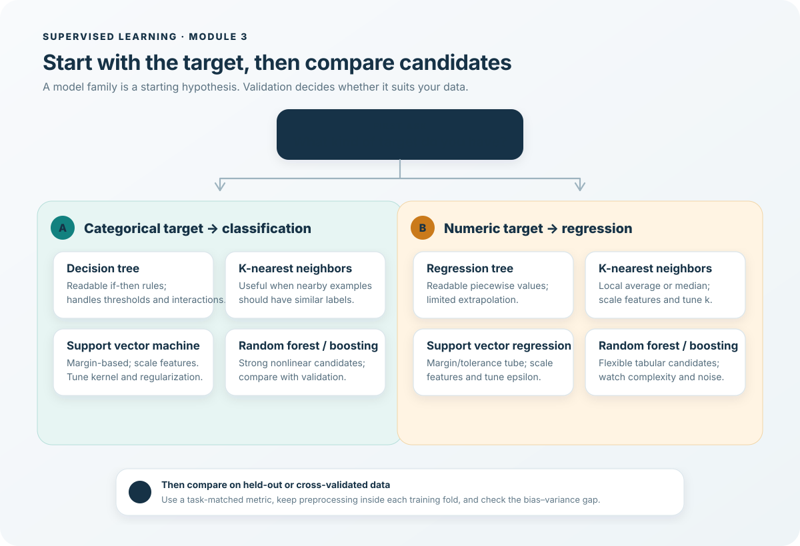

# Cheat Sheet: Building Supervised Learning Models

Use this as a quick comparison after defining the target and validation metric. It suggests candidate models; it is not a ranking that replaces measurement.

## Fast choice by problem shape

| Situation | Start with | Why / what to check |
| --- | --- | --- |
| Need a small, readable set of decision rules | Shallow decision tree / regression tree | Direct feature thresholds; constrain depth and leaf size. |
| Neighboring cases should have similar outcomes | KNN classifier / regressor | Local voting or averaging; scale features and tune `k`. |
| Many features and a useful margin boundary | Linear SVM | Often effective in high dimensions; scale and tune `C`. |
| Moderate dataset with a curved separation pattern | RBF SVM or a tree ensemble | Compare validation quality against fit time and complexity. |
| Need a strong nonlinear tabular baseline | Random forest | Averages randomized trees and usually reduces single-tree variance. |
| Need a more flexible additive predictor | Gradient boosting | Sequential learners can reduce bias; control depth, learning rate, and stages. |
| Need a smooth tolerance band for numeric prediction | SVR | Tune `epsilon`, `C`, and kernel; scale inputs. |

## Model comparison table

| Family | Predicts | What it learns | Important controls | Scale features? | Typical tradeoff |
| --- | --- | --- | --- | --- | --- |
| Decision tree | Classes | Greedy splits that reduce class impurity; leaf class vote. | `criterion`, `max_depth`, `min_samples_leaf`, `ccp_alpha` | Usually no | Interpretable; one tree may overfit or vary across samples. |
| Regression tree | Numbers | Splits that reduce weighted target error; leaf mean or median by criterion. | `criterion`, `max_depth`, `min_samples_leaf`, `ccp_alpha` | Usually no | Captures thresholds; piecewise constant and poor at extrapolation. |
| SVM / SVR | Classes / numbers | Margin boundary or epsilon-insensitive function; optional kernel. | `kernel`, `C`, `gamma`, `degree`, `epsilon` (SVR) | Yes | Strong boundaries; kernel fit cost can grow with sample count. |
| KNN | Classes / numbers | Nearest examples vote or aggregate targets. | `n_neighbors`, `weights`, `metric`, `p` | Yes | Simple local behavior; prediction can be slow, distance weak in high dimensions. |
| Random forest | Classes / numbers | Average/vote across bootstrap samples and feature-randomized trees. | `n_estimators`, `max_features`, `max_depth`, `min_samples_leaf` | Usually no | Usually stable, flexible tabular baseline; less interpretable. |
| Boosting | Classes / numbers | Sequential additive weak learners optimize a loss. | `learning_rate`, `n_estimators`, tree depth/leaf size | Usually no | Can reach strong accuracy; tune carefully and watch noise. |

## Hyperparameter reminders

- **Trees:** increased `max_depth` allows more interactions but increases variance; `min_samples_leaf` regularizes leaves; `ccp_alpha` penalizes larger trees.
- **KNN:** small `n_neighbors` makes predictions local and variable; large values smooth more. Scale numeric columns before distances.
- **SVM:** `C` trades margin softness against training errors. For the RBF kernel, high `gamma` makes influence local and boundaries intricate. Scale features. In scikit-learn `SVC`, the default kernel is RBF.
- **SVR:** `epsilon` determines the no-penalty tube width; `C` controls fit tolerance; kernel and gamma control function shape.
- **Random forest:** more trees improve averaging stability until diminishing returns; `max_features` and leaf size affect tree diversity and complexity.
- **Boosting:** lower `learning_rate` generally calls for more stages; deeper base trees create stronger interactions and can overfit.

## Validation and diagnosis

1. Split data to match the use case. Preserve class proportions with stratification where suitable; respect time or group boundaries when rows are related.
2. Put learned preprocessing and model fitting into a `Pipeline`. This prevents the validation fold from influencing scaling or encoding.
3. Compare candidates with the same folds and an appropriate metric. Use class-wise precision/recall for imbalanced classification; use MAE/RMSE for numeric outcomes as the use case requires.
4. If training and validation are both weak, check the target, features, and whether the model is too constrained. If training is strong and validation is weak, constrain the model, gather better data, or reduce noise sensitivity.
5. Tune on validation data or cross-validation; keep the final test set for a final, unbiased check.

## One-sentence recall

- **Classification:** predict a discrete label.
- **Regression:** predict a numeric value.
- **Bagging:** parallel variation plus aggregation primarily reduces variance.
- **Boosting:** sequential correction often reduces bias, but needs careful regularization.
- **Generalization:** performance on new examples matters more than a perfect training score.

## Related notes

- [Module 3 summary](1-module-3-summary-and-highlights.md)
- [Classification](../1%20Classification%20and%20Regression/1-classification.md)
- [Classification decision trees](../1%20Classification%20and%20Regression/2-decision-trees.md)
- [Regression trees](../1%20Classification%20and%20Regression/3-regression-trees.md)
- [Support vector machines](../2%20Other%20Supervised%20Learning%20Models/4-supervised-learning-with-svms.md)
- [K-nearest neighbors](../2%20Other%20Supervised%20Learning%20Models/5-supervised-learning-with-knn.md)
- [Bias, variance, and ensembles](../2%20Other%20Supervised%20Learning%20Models/6-bias-variance-and-ensemble-models.md)
