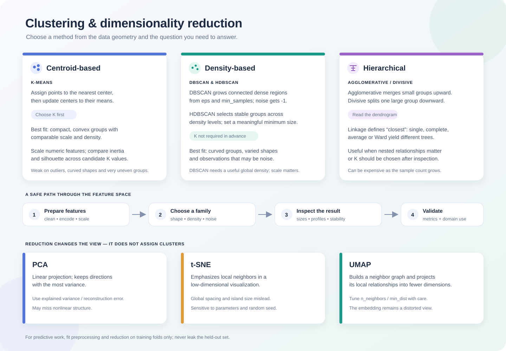

# Clustering Strategies and Real-World Applications

## What clustering does

Clustering is an **unsupervised** task: the input has features but no target labels, and an algorithm groups observations by a chosen notion of similarity. A cluster ID is only a group identifier; cluster 0 is not inherently “better” or “customer type A.”

Classification learns to predict known labels from labeled examples. Clustering explores structure without using those labels. A loan-default column, for example, must be excluded if the task is to discover customer segments without using default status. Labels can be kept aside for later external evaluation.

Clustering is useful for exploratory analysis, customer or document segmentation, image segmentation, anomaly triage, data summarization, and discovering redundant features. These are hypotheses for investigation: a discovered cluster does not by itself explain why its members are similar or prove a causal relationship.

## Main clustering families

| Family | How groups are formed | Useful when | Watch for |
| --- | --- | --- | --- |
| Centroid / partition based (for example, K-Means) | Assign each point to one of a fixed number of centers, then update the centers. | Groups are compact, roughly convex, and separated in the scaled feature space. | Requires K; distance and scale matter; every point is assigned. |
| Density based (DBSCAN, HDBSCAN) | Connect locally dense neighborhoods; points outside dense regions may be noise. | Groups have curved or irregular shapes, outliers matter, and K is unknown. | Neighborhood settings and distance scale matter; DBSCAN is difficult when cluster densities differ greatly. |
| Hierarchical (agglomerative or divisive) | Build nested groups and represent their merges or splits as a tree. | A nested view is meaningful or K should be chosen after inspecting the hierarchy. | Linkage and distance choices change the tree; memory and runtime can be costly as sample count grows. |

### Hierarchical clustering

- **Agglomerative (bottom up):** start with one cluster per observation; repeatedly merge the closest pair until the stopping rule is met.
- **Divisive (top down):** start with all observations together; repeatedly split a cluster.
- A **dendrogram** records the merge order and distance. Cutting it at a height or selecting a number of clusters yields a flat partition.
- “Closest clusters” depends on the linkage: single uses the nearest pair of members, complete the farthest pair, average the average pairwise distance, and Ward chooses merges that minimally increase within-cluster variance (with Euclidean geometry).

For a tiny example with six cities, a distance matrix might first merge the closest pair, such as Montreal and Ottawa. The linkage rule determines how the new group’s distance to Toronto is calculated; it is not always the midpoint distance. The tree reveals the sequence of merges, not a guaranteed ground-truth taxonomy.

## A practical selection workflow

1. Define what “similar” means for the task, choose useful features, and remove identifiers or information unavailable at prediction time.
2. Handle missing values and encode categorical features appropriately. Scale numeric features whenever the chosen distance is scale-sensitive.
3. Inspect pairwise plots and distributions; use domain knowledge to set plausible distance and cluster-size expectations.
4. Fit a small number of candidate methods. Evaluate them with internal metrics, stability across resamples, visual inspection, and domain usefulness.
5. Describe each resulting group using original features. Check whether the groups are actionable and repeatable before using them downstream.

K-Means tends to divide interlocking half-moons with straight Voronoi boundaries; DBSCAN can recover the curved shapes but may mark sparse points as noise or split an isolated pocket into another cluster. On blob-shaped data, K-Means is often a simpler fit. Neither result should be accepted just because it looks colorful.

## scikit-learn patterns

    from sklearn.cluster import AgglomerativeClustering, DBSCAN, KMeans

    km_labels = KMeans(n_clusters=3, n_init=10, random_state=42).fit_predict(X_scaled)
    density_labels = DBSCAN(eps=0.35, min_samples=5).fit_predict(X_scaled)
    tree_labels = AgglomerativeClustering(n_clusters=3, linkage="ward").fit_predict(X_scaled)

Use the same documented preprocessing and distance representation when comparing methods. Density algorithms commonly use -1 for noise; K-Means and flat agglomerative clustering assign every sample to a group.

## Pitfalls to remember

- A cluster is a description of geometry under chosen features and distance, not a discovered natural law.
- Adding or removing features changes distances and can change the partition.
- A 2D projection is only a view; it can hide or invent apparent separation.
- Fit feature selection, scaling, and dimensionality reduction using training data only when evaluating a downstream predictive model.

## Recall questions

1. How does unsupervised clustering differ from classification?
2. Why might DBSCAN separate two moons while K-Means does not?
3. What does a dendrogram show, and how do linkage choices affect it?
4. What checks would make a customer segmentation useful beyond a scatter plot?