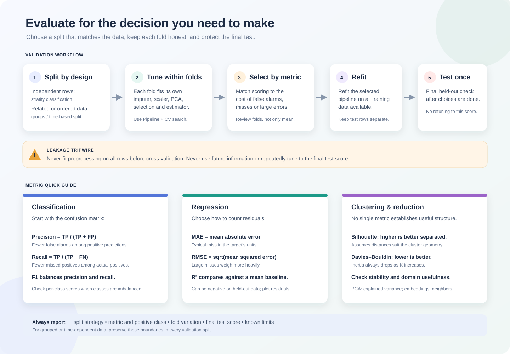

# Data Leakage and Other Modeling Pitfalls

## Data leakage

Leakage occurs when training or model selection uses information that would not legitimately be available at prediction time. It can make validation scores look strong even though the deployed model cannot reproduce them.

**Example:** predicting house prices with a feature computed as the average actual price over the entire dataset. If that average includes test homes or future sales, the model has indirect access to held-out outcomes.

Other leakage sources include:

- Features that encode the target or are recorded only after the outcome.
- Global imputation, scaling, PCA, feature selection, or target encoding before splitting.
- Duplicate people/devices appearing in both train and validation sets.
- Future observations used to predict the past.
- Repeatedly trying models or thresholds against the final test set.

## Safe validation workflow

1. Define the real prediction time and what information exists then.
2. Split by the correct unit: stratified for independent imbalanced labels, by group for repeated entities, and chronologically for time-dependent data.
3. Put learned preprocessing, feature selection, and the estimator in one pipeline so each CV training fold fits its own transformations.
4. Use validation/CV for choices; reserve a test set for one final estimate.
5. Before deployment, verify that production can compute every feature in the same way and at the same time.

    from sklearn.model_selection import GridSearchCV, TimeSeriesSplit
    from sklearn.pipeline import Pipeline
    from sklearn.preprocessing import StandardScaler
    from sklearn.decomposition import PCA
    from sklearn.neighbors import KNeighborsClassifier

    pipe = Pipeline([
        ("scale", StandardScaler()),
        ("pca", PCA()),
        ("model", KNeighborsClassifier()),
    ])
    search = GridSearchCV(
        pipe,
        {"pca__n_components": [2, 3], "model__n_neighbors": [3, 5]},
        cv=TimeSeriesSplit(n_splits=4),
    )
    search.fit(X_train, y_train)

Use TimeSeriesSplit only when rows are in the intended chronological order and the feature construction also respects time. For grouped data, use a group-aware splitter. Pipeline protects learned transformations, but it cannot repair a feature that already contains future information.

## Feature importance is not causality

Importance scores describe how a fitted model uses information under a particular dataset, feature set, and method:

- Correlated or redundant predictors may share importance or substitute for one another.
- Linear coefficients depend on feature scaling and model assumptions.
- Tree-based importance can favor variables with many possible split points.
- Single-feature rankings may miss interactions.
- A high importance score indicates predictive association, not that changing the feature causes the outcome.

Use domain knowledge and validation to assess importance. Permutation importance on held-out data can estimate how much a model’s score depends on a feature, but correlated features may substitute for each other. Causal “what if” claims require a valid causal design, not only predictive importance.

## Other common pitfalls

- Choosing a metric that does not reflect the cost of errors.
- Ignoring class imbalance, changing prevalence, or subgroup performance.
- Selecting features on the full dataset before cross-validation.
- Treating automated model selection as a substitute for understanding the data.
- Making hypothetical intervention claims from a model trained only on associations.

## Leakage checklist

Before trusting a score, ask: Could this feature exist at prediction time? Was any transformation fit using validation/test rows? Can related samples cross a split? Did the test score affect a later choice? Would the production process reproduce the same feature values?

## Recall questions

1. Why can a test set fail to detect a global-average leakage feature?
2. What work does a pipeline do inside cross-validation?
3. Why is feature importance not a causal effect?
4. Which split strategy fits temporal or repeated-entity data?