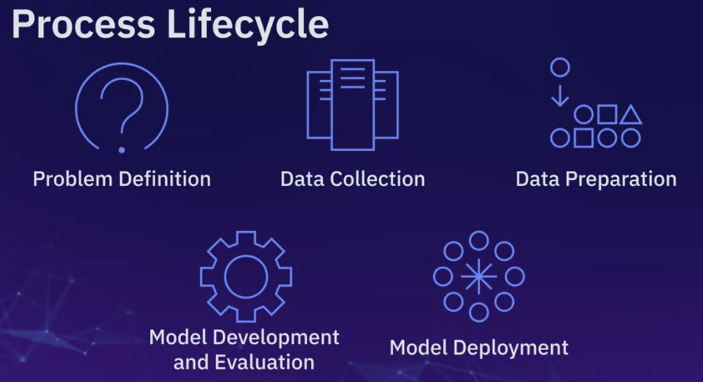

# Course Wrap-Up: A Practical Review of Machine Learning

## What this review is for

Use this page to connect the course methods into one decision process. The goal is not to memorize every algorithm name; it is to identify the target, select a suitable model, evaluate it with a matching metric, and keep the final test data independent from model selection.

## The course in one picture

A reliable project moves through these steps:

1. **Frame the decision.** Define the prediction target, who will use it, when the prediction is needed, and what a useful result means.
2. **Collect representative data.** Confirm that each row is an observation and that the data covers the conditions expected after deployment.
3. **Prepare features.** Inspect types and missingness, encode categories, scale when required, and prevent future information from entering the feature set.
4. **Train and compare candidates.** Start with a simple baseline, then fit models that match the target and data.
5. **Validate and select.** Use validation or cross-validation for choices; reserve the test set for the final estimate.
6. **Deploy and monitor.** Track data quality and performance after the model begins seeing new observations.

## Match the target to the task

| Question | Target | Common starting point | Example |
| --- | --- | --- | --- |
| Which category should this observation receive? | Discrete class | Logistic regression, KNN, decision tree, SVM | Will it rain tomorrow? |
| What numeric amount should be predicted? | Continuous number | Linear regression or regression tree | How much rain is expected? |
| Which observations form similar groups? | No supplied target | K-Means or density-based clustering | Which customers have similar behavior? |
| How can many variables be summarized? | No supplied target | PCA for a linear low-dimensional representation | Can correlated measurements be represented with fewer components? |

The dataset and the decision matter as much as the algorithm. Also consider sample size, class balance, nonlinear patterns, feature scales, interpretability, training cost, and the cost of different mistakes.

## Connect the core model families

| Method | What it learns | Useful when | Watch for |
| --- | --- | --- | --- |
| Linear regression | A weighted additive relationship for a numeric target | A transparent numeric baseline is valuable | Nonlinearity, outliers, correlated predictors |
| Logistic regression | Class probabilities through a linear decision function | A fast, interpretable classification baseline is useful | Scaling, nonlinear boundaries, probability calibration |
| KNN | Labels or values from nearby training examples | Similarity in a meaningful feature space predicts the outcome | Scaling, large datasets, irrelevant features |
| Decision tree | A sequence of feature-based splits | Rules and nonlinear interactions are useful | Deep trees can memorize training data |
| SVM | A maximum-margin boundary, optionally using a kernel | A high-dimensional boundary or a flexible nonlinear boundary is needed | Scaling and computational cost |
| K-Means | Centroids that minimize within-cluster squared distance | Compact, roughly round groups are plausible | Initialization, scale, outliers, chosen cluster count |
| DBSCAN / HDBSCAN | Dense regions separated by sparse regions | Clusters may have irregular shapes and noise points matter | Density settings and varying density |

These are starting points, not universal rankings. Compare candidates with the same data split, preprocessing rules, and evaluation goal.

## Choose an evaluation measure that matches the cost of errors

### Classification

A confusion matrix separates true positives, false positives, true negatives, and false negatives.

- **Accuracy** is the fraction of correct predictions. It is easy to interpret but can hide poor minority-class performance.
- **Precision** asks: among predicted positives, how many were positive? Use it when false alarms are costly.
- **Recall** asks: among actual positives, how many were found? Use it when missed positives are costly.
- **F1** balances precision and recall through their harmonic mean; it does not account for true negatives.
- **Log loss** evaluates the quality of predicted probabilities and penalizes confident wrong predictions.
- **Jaccard** measures overlap between predicted and actual positive sets; it can expose positive-class errors that accuracy masks when positives are rare.

### Regression

- **MAE** is the average absolute error in the target's units and is less sensitive to large errors than MSE.
- **MSE** squares residuals, so large misses receive more weight; its units are squared.
- **RMSE** is the square root of MSE and returns to the target's units.
- **R²** compares the model with a constant mean predictor on the evaluated data. It can be negative when the model is worse than that baseline; it is not a percentage of predictions that are correct.

### Clustering

There is no ground-truth label in ordinary unsupervised clustering. Inspect whether assignments are stable and useful for the intended decision. Inertia is useful for comparing K-Means fits with the same feature representation, but it always falls as more clusters are added. A silhouette score can summarize separation and cohesion, but it should be interpreted alongside plots, domain knowledge, and cluster size.

## Validation without contaminating the final estimate

1. Split data into training and test portions before repeated modeling decisions.
2. Fit preprocessing only on each training portion; use a Scikit-learn Pipeline or ColumnTransformer to keep this rule intact.
3. Use a validation set or cross-validation on the training portion to choose models and hyperparameters.
4. Select the metric before comparing candidates, based on the real cost of errors.
5. Evaluate the chosen workflow on the held-out test portion once near the end.
6. If the data is ordered in time, train on the past and validate on later periods instead of shuffling future observations into the past.

Looking at test results repeatedly and changing the model in response turns the test set into part of the tuning process. The reported score then becomes optimistic.

## Final-project connection: rainfall prediction

The course project asks for two different target types from weather observations:

- A **classifier** predicts whether rain occurs. Compare the requested classification methods with suitable classification metrics.
- A **regressor** predicts a rainfall amount. Use regression metrics such as MAE, MSE/RMSE, and R².

Treat these as separate prediction tasks. The best model for one target need not be best for the other. Before fitting, verify that every feature would be known at the time the forecast is made. A feature calculated from the future outcome would leak the answer into training.

## Common assessment traps

- A continuous target suggests regression even when it has only a few observed values; the meaning and measurement process of the target matter.
- A classifier can return probabilities as well as class labels. The threshold converts probabilities to labels and changes the precision-recall trade-off.
- A higher training score does not prove better generalization.
- Scaling affects distance- and margin-based models such as KNN and SVM; tree splits usually do not depend on scale.
- PCA is unsupervised and changes the representation. Its components are combinations of the original features, not the original columns.
- A clustering algorithm always produces an assignment only if its design does so; density methods can label sparse points as noise.
- Cross-validation is for model selection, not a reason to reuse the final test set.
- Correlation or feature importance alone does not prove that changing a feature will cause the target to change.

## Short study routine

1. State the target and task in one sentence.
2. Explain why a chosen model family fits the shape and constraints of the problem.
3. Name one baseline and one plausible alternative.
4. Choose a metric and explain which errors it emphasizes.
5. Describe how preprocessing and validation prevent leakage.
6. Explain one limitation and a follow-up check.

## Active-recall questions

1. Which data split should influence hyperparameter selection, and which split should provide the final estimate?
2. Why can accuracy be a poor measure for an imbalanced classification task?
3. When would MAE be easier to explain than MSE?
4. Which preprocessing steps must be fitted separately inside each cross-validation fold?
5. What makes a weather feature unavailable or leaky at forecast time?

## Review the module notes

- [Linear and logistic regression](<../../Module 2 Linear and Logistic Regression/3 Module Summary, Cheat Sheet & Evaluation/1-module-2-summary-and-highlights.md>)
- [Supervised learning models](<../../Module 3 Building Supervised Learning Models/3 Module Summary, Cheat Sheet & Evaluation/1-module-3-summary-and-highlights.md>)
- [Unsupervised learning models](<../../Module 4 Building Unsupervised Learning Models/3 Module Summary, Cheat Sheet & Evaluation/1-module-4-summary-and-highlights.md>)
- [Evaluation and validation](<../../Module 5 Evaluating and Validating Machine Learning Models/3 Module Summary, Cheat Sheet & Evaluation/1-module-5-summary-and-highlights.md>)
