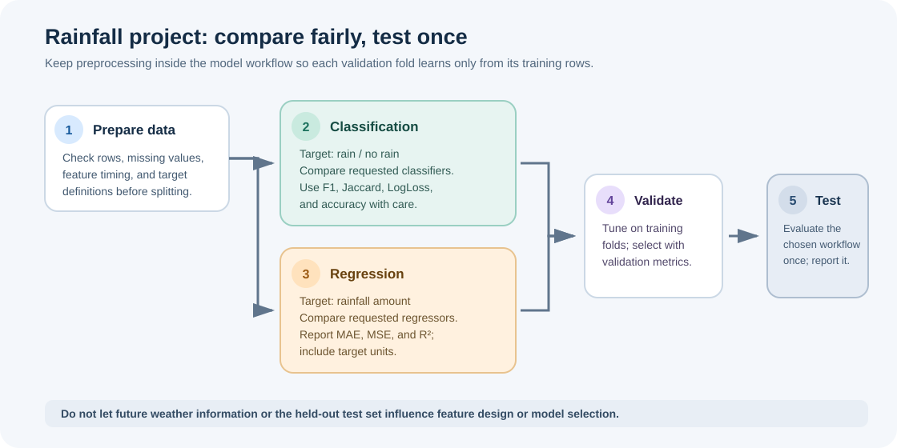

# Final Project: Rainfall Prediction and Peer Submission

> This guide adds study notes to the course-provided assignment. The Watson Studio steps below describe the original hosted workflow; the local project also includes a runnable [rainfall prediction notebook](02-final-project-rainfall-prediction.ipynb).

## The two prediction tasks

The project uses historical weather data for two different targets:

| Task | Target type | Model families in the assignment | Metrics named in the assignment |
| --- | --- | --- | --- |
| Predict whether it will rain | Classification | K-Nearest Neighbors, decision tree, SVM, logistic regression | Accuracy, Jaccard, F1, LogLoss |
| Predict how much it will rain | Regression | Linear regression | MAE, MSE, R² |

A metric is meaningful only for the task it evaluates. Classification metrics compare labels or probabilities; regression metrics compare numeric predictions with measured values. State the target and metric beside each result so scores from different tasks are not confused.

## A safe model-comparison workflow

1. **Define the prediction moment.** List which weather measurements would truly be available then. Remove features recorded only after the event being predicted.
2. **Inspect and prepare the data.** Check column types, missing values, unusual values, and class balance. Use the training data to learn imputation, encoding, or scaling values.
3. **Create a held-out test set.** If the data has a meaningful time order, preserve that order so later observations do not leak into earlier predictions.
4. **Build separate classification and regression workflows.** Each target needs its own estimator and appropriate preprocessing.
5. **Compare candidates using training-only validation or cross-validation.** Fit preprocessing inside each fold, ideally with a Pipeline. Select the model and decision metric before using the test set.
6. **Evaluate the selected workflow on the test set once.** Report the metric, the comparison baseline, and any important limitations.
7. **Make the notebook reproducible.** Keep the data path and random seed clear, explain decisions, and remove credentials or private information before sharing.

For classification, accuracy alone can hide missed rain events if the classes are imbalanced. Include precision/recall trade-offs or F1/Jaccard as required by the assignment; use LogLoss only when valid probability estimates are available. For regression, MAE is expressed in the target's units, MSE penalizes large errors more heavily and has squared units, and R² compares performance with a mean-only baseline.

## What to include in your report

- The target definition and the prediction-time feature set.
- How the data was split and how missing or categorical values were handled.
- Which candidate models were compared and how their parameters were chosen.
- A compact results table with the metric name and its interpretation.
- A short explanation of the selected model, its weaknesses, and the next check you would run.
- Evidence that the final test results did not guide repeated tuning.

## Original course assignment

**Estimated effort:** 20 minutes for the hosted import and submission steps, in addition to building and evaluating the models.

### Objectives

After completing the assignment, you should be able to:

- Import a notebook into Watson Studio.
- Solve a classification problem.
- Solve a regression problem.

### Assignment

Build a classifier to predict whether it will rain and a regressor to predict the amount of rainfall. Load and clean historical weather data, then compare the requested classification algorithms. Report the applicable metrics listed in the table above.

### Original hosted submission steps

These directions refer to the course's Watson Studio workflow. The service interface can change; follow the current course page if a button or option has moved.

1. Sign in to [IBM Cloud](https://cloud.ibm.com/login).
2. Create an empty project in Watson Studio. If the project will be shared with peers, review the project's collaboration access settings.
3. Add a notebook from a URL and use the course notebook URL:
   <https://cf-courses-data.s3.us.cloud-object-storage.appdomain.cloud/IBMDeveloperSkillsNetwork-ML0101EN-SkillsNetwork/labs/FinalAssesment/Assignment.ipynb>
4. Complete and run the notebook according to its prompts.
5. Use the notebook's share controls to create the peer-review link required by the course. Review the notebook for credentials, tokens, or private data before sharing.

Submit the notebook link in the course's peer-review form.

### Author and source

Joseph Santarcangelo. IBM Corporation. The original lab was published for the IBM Machine Learning with Python course; this local version retains its objective and submission context while adding study guidance.
