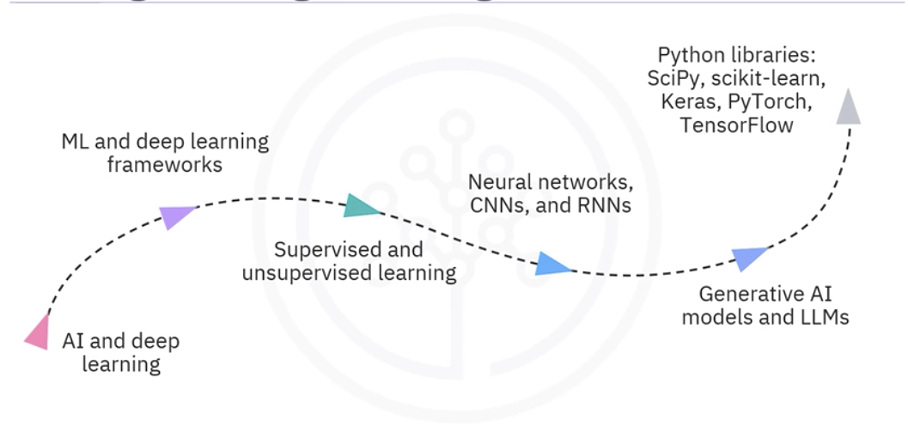

# Course Orientation and Learning Path

## Course purpose

**Machine Learning with Python** is an intermediate applied course. It uses Python and open-source libraries to develop practical understanding of the machine learning lifecycle and of classical modeling techniques. The main focus is not only how an algorithm works, but how a real ML problem moves from data to a validated and usable model.

The course combines instructional material, hands-on labs, quizzes, reference material, and a final project. The recurring technical stack is:

- Python for implementation.
- NumPy for numerical arrays and computation.
- Pandas for tabular data preparation and analysis.
- Scikit-learn for classical machine learning workflows.

## Recommended prerequisites

You should be comfortable with:

- Core Python syntax and data structures.
- NumPy arrays and numerical operations.
- Pandas DataFrames, data loading, filtering, and cleaning.
- Basic exploratory data analysis.
- High-school-level mathematics.

Prior machine learning experience is useful but not required. A learner with strong Python and data preparation skills already possesses much of the foundation needed for ML: loading data, checking types, cleaning records, creating features, and converting data into numerical structures.

## How existing Python skills connect to ML

| Existing skill | Connection to the ML pipeline |
|---|---|
| Reading CSV, JSON, SQL, or other data | Data collection and ingestion |
| Building DataFrames | Organizing observations and features |
| Handling missing or invalid values | Data cleaning and preprocessing |
| Joining and aggregating tables | Data wrangling and feature engineering |
| NumPy vector operations | Efficient numerical representation and computation |
| Plotting and summary statistics | Exploratory data analysis and validation |
| Writing reusable functions | Reproducible preprocessing and modeling workflows |

The key conceptual shift from traditional programming is this:

```text
Traditional programming: rules + data → answers
Machine learning: data + known answers/examples → learned rules/model
Learned model + new data → predictions
```

## Course-level objectives

By the end of the full course, learners are expected to:

- Describe how machine learning supports different career paths.
- Explain the stages of the machine learning lifecycle.
- Discuss how important machine learning models work.
- Implement models with Python and Scikit-learn.
- Solve data-related problems using appropriate ML methods.
- Train, assess, validate, and improve models.

## Six-module course map

### Module 1: Introduction to Machine Learning

- Foundational ML concepts.
- The iterative model lifecycle.
- Daily work of a machine learning engineer.
- Open-source ML tools.
- The Scikit-learn ecosystem and basic workflow.

### Module 2: Linear and Logistic Regression

- Linear regression for continuous numerical prediction.
- Logistic regression as a classifier.
- Implementation, interpretation, and limitations of classical linear models.

### Module 3: Building Supervised Learning Models

- Binary and multiclass classification.
- Decision trees and regression trees.
- K-nearest neighbors and support vector machines.
- Bias, variance, and the bias-variance tradeoff.
- Strategies for controlling underfitting and overfitting.

### Module 4: Building Unsupervised Learning Models

- Hierarchical clustering, k-means, DBSCAN, and HDBSCAN.
- Comparing clustering algorithms.
- Dimensionality reduction with PCA, t-SNE, and UMAP.
- Combining unsupervised methods with feature engineering.

### Module 5: Evaluating and Validating Models

- Metrics for classification and regression.
- Performance on unseen data.
- Cross-validation and hyperparameter tuning.
- Overfitting prevention and regularization.

### Module 6: Final Exam and Project

- Course review and final assessment.
- An applied rain-prediction project using Australian weather data.
- Peer review and next learning steps.

## Related IBM learning paths

This course belongs to both the IBM Data Science Professional Certificate and the IBM AI Engineering Professional Certificate.

### Data Science path

The data science path emphasizes:

- Data cleaning and analysis.
- SQL, Python, Pandas, and NumPy.
- Statistical and predictive modeling.
- Portfolio projects.

It is positioned as beginner-friendly and can lead naturally into the more engineering-focused AI program.

### AI Engineering path

The AI engineering path expands from classical ML into:

- Neural networks, CNNs, and RNNs.
- TensorFlow, Keras, and PyTorch.
- Transformers, GPT, and BERT.
- Generative models, including GANs, VAEs, and diffusion models.
- Transformer adaptation with PEFT, LoRA, and QLoRA.
- Human-feedback approaches such as RLHF, PPO, and DPO.
- Retrieval-augmented generation, prompt engineering, and LangChain.
- Applied systems using vector databases, document loaders, QA bots, and user interfaces.



The recommended progression is therefore:

```text
Python and data analysis
        ↓
Classical machine learning
        ↓
Deep learning frameworks and neural networks
        ↓
Generative AI and foundation models
        ↓
Adaptation, RAG, alignment, and deployed AI systems
```

## Practical learning strategy

- Watch or read the conceptual lesson first.
- Reproduce the lab without copying code blindly.
- Explain the problem type, target, features, split strategy, and metric in plain language.
- Change one meaningful part of the lab and observe the result.
- Record mistakes and the reason for each correction.
- Before moving on, connect the lab to a lifecycle stage.

## Source pages

- [Course Introduction](https://app.notion.com/p/34c0060838be835986380104d5c84247)
- [Course Overview](https://app.notion.com/p/3810060838be804d9611ce335b90afab)
- [IBM AI Engineering PC Overview](https://app.notion.com/p/3810060838be808db142ec27c617afef)
- [Connecting Your Past Skills to Your ML Future](https://app.notion.com/p/3810060838be807eb4fde3558e7bb96c)
