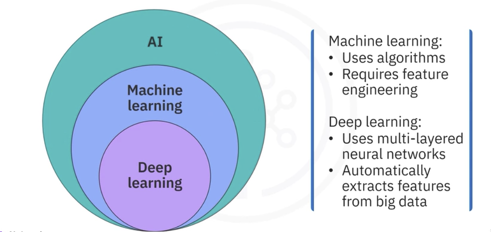
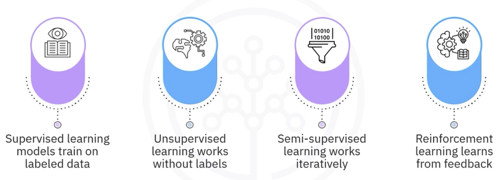
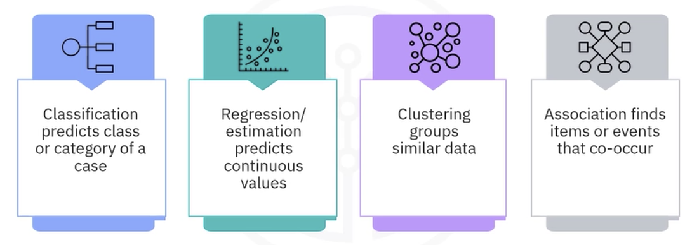
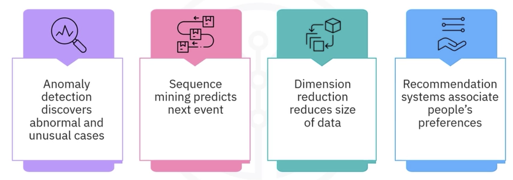

# Machine Learning Foundations

## 1. AI, machine learning, and deep learning

**Artificial intelligence (AI)** is the broad field of building systems that simulate capabilities associated with human intelligence. Its applications include computer vision, natural language processing, generative AI, machine learning, and deep learning.

**Machine learning (ML)** is a subset of AI. Instead of relying only on explicitly programmed rules, an ML system uses computational methods to learn patterns from data and apply them to new observations. Classical ML usually depends on practitioners to select, clean, transform, and engineer informative features.

**Deep learning (DL)** is a subset of ML based on multi-layer neural networks. Deep learning is especially valuable for large, complex, unstructured data such as images, audio, video, and text because networks can learn useful representations automatically.



The nesting is important:

```text
Artificial Intelligence
└── Machine Learning
    └── Deep Learning
```

## 2. What a model learns

A dataset typically contains:

- **Observations or samples:** the rows, cases, or individual examples.
- **Features:** measured or derived input variables used by the model.
- **Target or label:** the outcome to predict in supervised learning.
- **Model parameters:** values learned from the training data.
- **Hyperparameters:** settings selected before or around training, often tuned through validation.

Training searches for model parameters that capture useful relationships in the training data. Generalization is the model's ability to use those learned relationships on unseen data. A model that memorizes training-specific noise may score well during training but perform poorly after deployment; this is overfitting.

## 3. Learning paradigms



### Supervised learning

Supervised learning uses labeled examples. The model learns a mapping from features \(X\) to a known target \(y\), then predicts the target for new observations.

Main supervised tasks:

- **Classification:** predict a discrete class.
- **Regression:** predict a continuous numerical value.

Examples include predicting whether a tumor is malignant, whether a customer will churn, the price of a house, or vehicle emissions.

### Unsupervised learning

Unsupervised learning uses data without target labels. The goal is to discover structure, similarity, latent dimensions, or unusual observations.

Examples include:

- Customer segmentation.
- Grouping similar patients.
- Dimensionality reduction.
- Detecting structure in high-dimensional data.

### Semi-supervised learning

Semi-supervised learning combines a small labeled subset with a larger unlabeled dataset. A model may assign pseudo-labels to high-confidence cases and iteratively retrain. The approach is useful when labeling is expensive but unlabeled data is abundant.

### Reinforcement learning

Reinforcement learning models an agent interacting with an environment. The agent selects actions and learns from rewards or other feedback. The objective is to learn a policy that maximizes long-term reward rather than to predict labels from a fixed dataset.

## 4. Selecting a machine learning technique

Technique selection depends on four questions:

1. What problem must be solved?
2. What data and labels are available?
3. What resources and constraints apply?
4. What output or business outcome is required?

Do not select an algorithm merely because it is popular. First identify the decision, prediction, or structure the project needs.

### Core techniques



| Technique | Output | Learning setting | Typical question | Example |
|---|---|---|---|---|
| Classification | Discrete class or probability | Supervised | Which category does this case belong to? | Benign vs malignant cell |
| Regression | Continuous number | Supervised | What numerical value should be expected? | House price or CO2 emissions |
| Clustering | Group membership or cluster structure | Unsupervised | Which observations are similar? | Customer segments |
| Association | Co-occurring items or events | Usually unsupervised | What commonly appears together? | Market-basket patterns |



| Technique | Purpose | Example |
|---|---|---|
| Anomaly detection | Identify rare or abnormal cases | Credit-card fraud |
| Sequence mining | Model ordered behavior or predict the next event | Website clickstream |
| Dimensionality reduction | Represent data with fewer features while preserving useful structure | PCA before modeling or visualization |
| Recommendation systems | Rank relevant items using content, preferences, or similar users | Books, movies, or products |

## 5. Classification versus regression

Both classification and regression are supervised because training examples include known targets. Their target types differ.

### Classification

- Target is categorical.
- Output may be a class label, a probability, or both.
- Evaluation may use a confusion matrix, accuracy, precision, recall, F1 score, or ROC-AUC, depending on the decision and class balance.

Example: a cell sample has features such as clump thickness, uniformity of cell size, and marginal adhesion. The model learns from previously labeled samples and predicts whether a new sample is benign or malignant.

### Regression

- Target is continuous and numerical.
- Output is an estimated value.
- Evaluation may use MAE, MSE, RMSE, or \(R^2\), depending on how errors should be interpreted.

Example: estimate house price from floor area, location, age, rooms, and other characteristics.

### Decision rule

Ask what the target represents:

- A category such as yes/no, churn/stay, or disease type → classification.
- A quantity such as price, temperature, revenue, or emissions → regression.

## 6. Clustering and noise

Clustering groups observations that are similar according to their feature representation and a chosen similarity or distance concept. It does not require known labels.

Important points:

- A cluster is a structure discovered by an algorithm, not automatically a meaningful business segment.
- Feature scale and representation strongly affect similarity.
- Some clustering methods assign every point to a group; density-based methods may label low-density points as noise.
- Domain knowledge is needed to interpret and validate discovered groups.

## 7. Representative applications

### Medical classification

1. Collect labeled cell samples.
2. Clean the data and inspect feature quality.
3. Select a classification algorithm.
4. Train on known benign and malignant cases.
5. Evaluate on unseen samples.
6. Use predictions to support, not replace, clinical judgment.

### Recommendations

Retail and streaming platforms use purchase, viewing, rating, item, and interaction data to rank content likely to interest a user. Recommendation can combine item similarity, user similarity, contextual information, and business constraints.

### Loan decisions

A bank may estimate probability of default and use it as an input to approval decisions. Human oversight remains important because decisions can affect individuals and may require explanation, fairness review, and regulatory compliance.

### Customer churn

A telecommunications company can use demographic, account, service-usage, and behavioral data to predict which customers may unsubscribe. The output supports retention actions, but success should ultimately be measured by business outcomes, not only predictive accuracy.

### Computer vision

Rule-based image systems require people to specify many visual rules and tend to generalize poorly. A learned vision system uses examples to infer discriminating patterns, such as shapes, textures, edges, or higher-level features. Deep learning reduces the need to hand-design every feature.

## 8. Human responsibility

Machine learning automates pattern recognition, not accountability. People remain responsible for:

- Defining the right problem.
- Checking whether data is representative and lawful to use.
- Selecting acceptable error tradeoffs.
- Investigating bias and failure modes.
- Explaining or reviewing high-impact decisions.
- Monitoring performance after deployment.
- Providing escalation paths when automated output is uncertain or harmful.

## 9. High-yield distinctions

- **AI vs ML:** AI is the broad field; ML is a data-driven subset.
- **ML vs deep learning:** classical ML often relies more heavily on engineered features; deep learning learns representations through multi-layer networks.
- **Supervised vs unsupervised:** supervised learning has targets; unsupervised learning discovers structure without target labels.
- **Classification vs regression:** classification predicts categories; regression predicts continuous values.
- **Clustering vs classification:** clustering discovers groups without labels; classification learns predefined classes from labeled examples.
- **Model output vs business decision:** a prediction is evidence used by a decision process, not necessarily the final decision.

## Source pages

- [An Overview of Machine Learning](https://app.notion.com/p/3810060838be80feb327e9834a791f44)
- [Module 1 Summary and Highlights](https://app.notion.com/p/3960060838be8049bcade6d36e3d2962)
