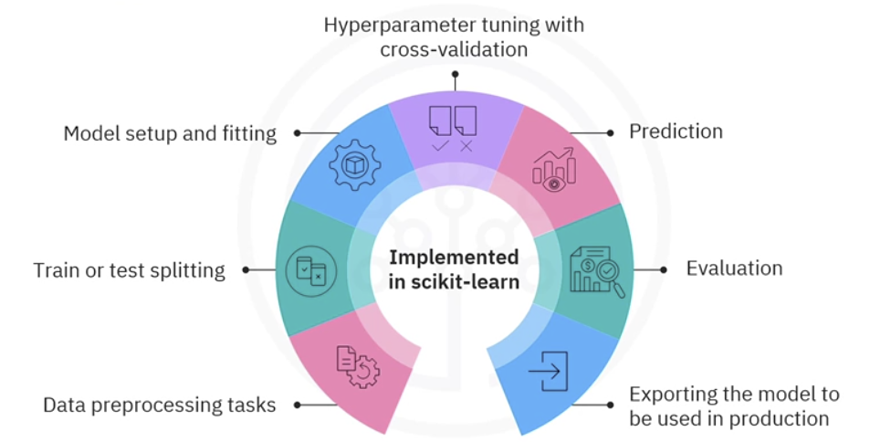

# Tools, Ecosystem, and Scikit-learn

## 1. Data is the foundation

Data is a collection of recorded facts, measurements, events, or other information. ML algorithms depend on data to discover patterns and make predictions. Data quality therefore places a practical limit on model quality.

“Garbage in, garbage out” means that biased, incomplete, incorrectly labeled, stale, or leaked input data can produce misleading output even when the algorithm is implemented correctly.

## 2. What an ML ecosystem contains

The **machine learning ecosystem** is the connected set of:

- Data sources and storage systems.
- Programming languages.
- Processing and visualization libraries.
- Modeling frameworks.
- Development platforms.
- Deployment infrastructure.
- Monitoring processes.

Together they support collection, preprocessing, training, evaluation, deployment, and model management.

## 3. Programming languages

| Language | Common emphasis in the source material |
|---|---|
| Python | Broad ML and data ecosystem; accessible model development |
| R | Statistics, exploration, and visualization |
| Julia | High-performance numerical, parallel, and distributed computing |
| Scala | Scalable data processing and big-data pipelines |
| Java | Production applications and enterprise systems |
| JavaScript | Client-side or browser-based ML applications |

Python is the focus of this course because NumPy, Pandas, SciPy, Matplotlib, and Scikit-learn form a mature, interoperable stack.

## 4. Tool categories

### Data processing, storage, and streaming

| Tool | Main purpose |
|---|---|
| PostgreSQL | Open-source object-relational SQL database for storing and querying structured data |
| Hadoop | Distributed, disk-based storage and batch processing for very large datasets |
| Spark | Distributed processing with in-memory execution, DataFrames, and SQL; supports batch and streaming workloads |
| Apache Kafka | Distributed event-streaming platform for pipelines and real-time analytics |
| Pandas | DataFrames for exploration, cleaning, transformation, joins, aggregation, and analysis |
| NumPy | Efficient multidimensional arrays, numerical routines, random sampling, and linear algebra |

High-yield comparison: Hadoop emphasizes distributed storage and batch processing; Spark provides a higher-level in-memory processing engine and supports DataFrames and SQL; Kafka moves and retains event streams rather than serving as a general model-training library.

### Visualization

| Tool | Main purpose |
|---|---|
| Matplotlib | Foundational, highly customizable Python plotting library |
| Seaborn | Higher-level statistical graphics built on Matplotlib |
| ggplot2 | Layered grammar-of-graphics visualization in R |
| Tableau | Interactive business-intelligence dashboards |

Visualization helps identify distributions, errors, outliers, relationships, class imbalance, and changes over time.

### Classical machine learning and scientific Python

| Library | Main purpose |
|---|---|
| NumPy | Numerical arrays and vectorized computation |
| Pandas | Data analysis and tabular preparation |
| SciPy | Scientific routines such as optimization, integration, and statistics |
| Scikit-learn | Classical classification, regression, clustering, dimensionality reduction, preprocessing, model selection, and evaluation |

### Deep learning

| Framework | Main purpose |
|---|---|
| TensorFlow | Numerical computation and large-scale machine learning |
| Keras | High-level interface for defining and training neural networks |
| Theano | Historical framework for defining and optimizing array-based mathematical expressions |
| PyTorch | Flexible tensor and neural-network framework widely used in research and production |

### Computer vision

| Tool | Main purpose |
|---|---|
| OpenCV | Real-time image/video processing, detection, classical vision, and augmented-reality operations |
| scikit-image | Image-processing algorithms, filters, segmentation, morphology, and feature extraction |
| TorchVision | PyTorch datasets, model architectures, image transforms, and utilities |

Typical tasks include object detection, image classification, facial recognition, and segmentation.

### Natural language processing

| Tool | Main purpose |
|---|---|
| NLTK | Tokenization, stemming, and broad educational/classical NLP utilities |
| TextBlob | Simple tagging, noun-phrase extraction, sentiment analysis, and translation-oriented interfaces |
| Stanza | Stanford NLP models for tagging, named-entity recognition, dependency parsing, and related tasks |

### Generative AI

| Tool | Main purpose |
|---|---|
| Hugging Face Transformers | Pre-trained transformer models and utilities for generation, translation, classification, and other tasks |
| ChatGPT | Language-model interface for conversational generation and assistance |
| DALL-E | Image generation from textual descriptions |
| PyTorch | Framework used to implement and train transformers, GANs, and other generative models |

Generative AI creates new text, images, music, code, or other media from prompts or input data. NLP is broader: many NLP tasks analyze, label, retrieve, or transform language without necessarily generating new content.

## 5. Data wrangling versus preprocessing

The terms overlap, but a useful distinction is:

### Data wrangling

Makes raw data coherent for analysis and business logic:

- Merge and join sources.
- Reshape wide and long tables.
- Filter rows and select columns.
- Aggregate events into summaries.
- Enrich records with derived fields.

### Data preprocessing

Transforms data into a representation suitable for an algorithm:

- Impute or encode missing values.
- Encode categorical variables.
- Scale or normalize numerical variables.
- Treat outliers according to the problem.
- Select or extract features.
- Reduce dimensionality.

Neither activity is necessarily a one-time manual step. Both should be reproducible, and transformations that learn from data must be fitted only on training data to prevent leakage.

## 6. Scikit-learn in the ecosystem

Scikit-learn is a free Python library for classical machine learning. It is built on NumPy, SciPy, and Matplotlib and is known for consistent interfaces, extensive documentation, and a large contributor community.

It supports:

- Classification.
- Regression.
- Clustering.
- Dimensionality reduction.
- Preprocessing and feature transformation.
- Train/test splitting and cross-validation.
- Model fitting and prediction.
- Hyperparameter search.
- Metrics and evaluation.
- Pipelines and model composition.



## 7. Motivating example: music streaming

A music app records:

- Which songs users play.
- Listening duration.
- Which songs are skipped.
- Playlist and download behavior.

Before modeling, the team checks inconsistent records, missing values, and outliers. The example shows that ML tools are needed throughout the lifecycle, not only during training.

## 8. Basic Scikit-learn workflow from the lesson

Assume feature matrix `X` and target vector `y` are NumPy-compatible arrays.

### Step 1: scale features

The lesson demonstrates standardization:

```python
from sklearn import preprocessing

X_scaled = preprocessing.StandardScaler().fit(X).transform(X)
```

Standardization centers and scales numerical features. It is especially relevant for distance-based models and models whose optimization depends on feature magnitude.

### Step 2: split train and test data

```python
from sklearn.model_selection import train_test_split

X_train, X_test, y_train, y_test = train_test_split(
    X_scaled,
    y,
    test_size=0.33,
)
```

The example reserves 33% for testing. The training set fits the model; the test set estimates performance on unseen data.

### Step 3: create a classifier

```python
from sklearn import svm

clf = svm.SVC(gamma=0.001, C=100.0)
```

`gamma` and `C` are SVC hyperparameters. They are configured rather than learned directly by calling `fit`.

### Step 4: fit the model

```python
clf.fit(X_train, y_train)
```

### Step 5: predict

```python
y_pred = clf.predict(X_test)
```

### Step 6: evaluate

```python
from sklearn.metrics import confusion_matrix

print(confusion_matrix(y_test, y_pred, labels=[1, 0]))
```

A confusion matrix counts actual versus predicted classes. It is the basis for metrics such as precision and recall.

### Step 7: serialize the model

```python
import pickle

serialized_model = pickle.dumps(clf)
```

Serialization allows a fitted object to be saved and loaded later. Never load a pickle from an untrusted source because deserialization can execute arbitrary code. Production systems also need dependency and artifact versioning.

## 9. Leakage-safe workflow with a Pipeline

The lesson scales the entire `X` before splitting. For real work, fit the scaler only on training data. A Scikit-learn `Pipeline` handles this correctly during training and cross-validation.

```python
from sklearn.metrics import classification_report, confusion_matrix
from sklearn.model_selection import train_test_split
from sklearn.pipeline import make_pipeline
from sklearn.preprocessing import StandardScaler
from sklearn.svm import SVC

X_train, X_test, y_train, y_test = train_test_split(
    X,
    y,
    test_size=0.33,
    random_state=42,
    stratify=y,
)

model = make_pipeline(
    StandardScaler(),
    SVC(gamma=0.001, C=100.0),
)

model.fit(X_train, y_train)
y_pred = model.predict(X_test)

print(confusion_matrix(y_test, y_pred))
print(classification_report(y_test, y_pred))
```

Why this is safer:

- `StandardScaler` learns means and standard deviations only from training data.
- The exact preprocessing sequence is preserved with the classifier.
- Cross-validation can refit preprocessing within each fold.
- The same pipeline can process future inputs consistently.

`stratify=y` helps preserve class proportions in a classification split. It is not appropriate for every problem; time-ordered data, grouped observations, or repeated users may require temporal or group-aware splitting instead.

## 10. Hyperparameter tuning

Do not choose `gamma=0.001` and `C=100` merely because they appear in an example. Search candidate settings using cross-validation on the training data, then evaluate the final selected configuration once on the test set.

```python
from sklearn.model_selection import GridSearchCV

search = GridSearchCV(
    model,
    param_grid={
        "svc__C": [0.1, 1, 10, 100],
        "svc__gamma": ["scale", 0.01, 0.001],
    },
    scoring="f1",
    cv=5,
)

search.fit(X_train, y_train)
best_model = search.best_estimator_
```

The scoring metric should reflect the problem and error costs.

## 11. From saved model to production

The assessment dialogue introduces a high-level MLOps path:

1. **Package the model:** save the fitted preprocessing and model artifact with `joblib` or `pickle`, plus code and dependency versions.
2. **Expose an interface:** build an API with Flask, FastAPI, Django, or another serving framework.
3. **Containerize:** package the application and dependencies with Docker for consistent execution.
4. **Deploy and scale:** use infrastructure such as Kubernetes, AWS SageMaker, or Google Cloud's AI/ML services.
5. **Monitor:** track system health, input drift, output drift, ground-truth performance, and business impact.
6. **Retrain or roll back:** respond when data or performance changes.

Evaluation occurs before deployment on controlled data; monitoring observes behavior after deployment in the real environment.

## 12. Tool-selection cues

- Use **Pandas** to inspect, join, and clean tabular data.
- Use **NumPy** for efficient array and numerical operations.
- Use **Matplotlib/Seaborn** to understand data and results visually.
- Use **SciPy** for scientific and numerical routines.
- Use **Scikit-learn** for classical ML pipelines.
- Use **TensorFlow/PyTorch/Keras** when neural networks are appropriate.
- Use **Spark** when one-machine data processing is insufficient.
- Use **Kafka** when the system must ingest or distribute continuous event streams.
- Use a database such as **PostgreSQL** for durable structured storage and querying.

## Source pages

- [Tools for Machine Learning](https://app.notion.com/p/3960060838be80a0a8a5e47212a0b67b)
- [Scikit-learn Machine Learning Ecosystem](https://app.notion.com/p/3960060838be8001b978eb76991865e6)
- [Connecting the Dots: Prepare for Your Assessment](https://app.notion.com/p/3960060838be80f2a66aef8c76bd5b2d)
